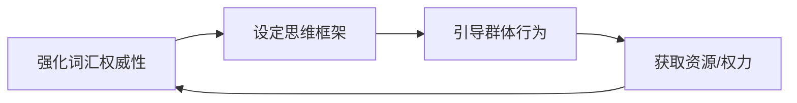

# 2025.7.16

来自破局洋哥的思考：

1.任何红利都有时效性，不存在永远的风口，但可以有永远追风口的人。

2.短期赚钱和长期值钱要找到合理的平衡点，没有平衡可能就没有未来了。

3.普通人逆袭最好的方式是自建生态，或大或小，因为它才是老板夺不走的资产。

4.新时代的新钱往往牺牲的是旧时代的old money，这个世界就是很残酷，过时了就真的过时了。

4.目前AI和个人IP的红利期相对会比较长，5-10年，问题不大，抓紧入局或许能逆天改命。

​

Al+IP+私域，大浪淘沙，带领自己的死忠粉丝穿越周期

​

\#今日思考

赚自己该赚的钱，过自己该过的生活

别人赚再多，过再好，与我无关，也无法复制

看到朋友圈有一位朋友，做TikTok视频项目，一个视频3000美刀

确实很多，但我依旧走老路，做我的Ai大方向的业务

秉持雷总那句：志存高远，脚踏实地

​

人对了，事就成了

最好的项目，不是私域，不是A1，不是跨境电商，不是本地生活。

而是关系网的建立与维护

你能取得多少人的绝对信任，是10个，还是100个，还是1000个。

你取得什么样的人的信任支持，是潜力股大学生，还是创业者老板，亦或是风险投资

​

# 2025.7.17

要去有鱼的池塘钓鱼。

多想想你的目标客户会经常出现在什么地方。

你想找潜力股大学生，他们不会在酒吧里面玩物丧志

而是在非常多的大学成长社群里面学习。

你想找创业者老板，他们不会在大学成长社群里面玩

而是在xxx地区资源对接圈，各种商业思维学院里上课。

你想找风险投资人，他们不会在一线业务里面干活

而是出没各种高端养生，高端健身房里面强身健体，修身养性。

接下来怎么做，就靠大家的硬条件和软实力吸引了。

祝好。

韦俊国IVC孵化.ing

​

给大家推荐一个ai音乐平台，可以自己写歌，[https://app.fireverseai.com/Generator](https://app.fireverseai.com/Generator)​

​

可以打标签。

比自己厉害的人，分组

比自己能量低的人，分组。

要不停地发朋友圈让低能量的人看见，去触达成交他们。

他们的金钱和注意力成本投入到你身上了，双方才会有更深层次的链接。

从而不断筛选自己的忠实粉丝，坚定跟随自己的人，否则他们只是一个无效的客资。

喜欢自己的人，不论你发的东西有多烂，多营销，多硬广，他们都会认可你

讨厌自己的人，不论你发的东西有多好，多生活感，都有厌恶你

对的，但如何产生“喜欢自己的人”呢？这就是IP的魅力所在了

多输出价值吧

所以要分组，更细致地分组，分等级S，A，B，，C，D，E

S（多次复购的客户）

A（买过一次课程的）

B（咨询过多次，犹豫的）

C（朋友圈有互动的）

E（完全没有触达路径的，态度不好的，垃圾用户）

对于同一个产品，不同标签，也发不同的朋友圈

私域管理 这么做确实不错，学到了

那会再往下吗？比如 S 的你再编个号，把他喜好和关键点记录在案，在日后再沟通不是更有黏性？

一般是放在备注

方便快速检索

名字，业务，资源，其他特点，付费次数

​

\#今日收获

让生活变好的为前提：

写下有一个美好的愿景，愿景得包括五感官，让人一听到就像打鸡血一样

根据愿景制定目标，愿景可以模糊，但目标一定是具体，清晰，可落地的

清晰是可实现的前提

​

今天学习时间管理的收获和思考：

进入觉知状态，有3个方法：

①关掉手机5分钟

想娱乐，想刷视频、玩游戏的时候，关掉手机5分钟，冷静一下，“我在干什么，我一会要做什么，现在几点了，我今天有没有事情要做？”

②345呼吸法

多巴胺阈值升高怎么办？用345呼吸法，吸气3秒钟，憋气4秒钟，呼气5秒钟。

③记录时间

像记账一样，记录今天每一笔时间分别花在了哪里。记录时间的时候，思考上一段时间做了什么，审视上一段时间，审视当下的行为，思考接下来的一段路该怎么走。

​

记录时间具体的方法：

要开始一个新事情的时候，在纸上或者在表上写下这件事开始的时间，然后写下这件事情，就可以计算每件事情中间隔了多久。

不需要记录的精美或者多好，最重要的是一直在记录，要保证这个东西一直在我手边，随手就能拿到，随时都能打开。

时间分类：

学业（工作之后改成“主业”）

事业（商业、赚钱方面额外探索）

学习（提升能力，兴趣）

生活娱乐（吃饭睡觉和休息）

人际交往（社交）

自我迭代（锻炼自律等内在提升）

​

AI时代，推荐的岗位方向：

①产品经理：

连接用户需求、技术与商业

②解决方案工程师：

关键作用：

在当前AI产品不成熟时期，深度对接客户痛点，反向推动产品迭代

对于第一个，说白了就是做出能解决需求的产品，比如用AI开发一些工具，能够解决我们生活和工作中的卡点和痛点，有人有需求，愿意付费，就能商业化，这也是做AI编程和智能体要干的事情

对于第二个，就是第一种人的流量端，掌握渠道，对接客户和需求

一个是掌握交付，提供解决方案，一个是掌握流量和渠道，做撮合，把有需求的和能解决需求的双方撮合起来

​

# 2025.7.18

今天学习时间管理中的做规划，收获和思考：

做规划是有必要的，可以让我们在非理性的时候，也能按照在理性时规划好的正确方向，无脑的执行。

做规划有六种方法：

执行意图法，清单，计划，三只青蛙法，时间投注法，三级任务法。

执行意图法：

知道该做什么，但是动不起来，明确写下“在什么时间，什么地点，做什么事情”。

清单：

有很多事情想做，不知道从何开始的时候，一条条列出所有事情。

计划：

时间很碎，事情很多，就将一天划分为三部分，在「清单」的基础上，上午/下午/晚上分别要做什么，塞进任务，列出具体的时间。

三只青蛙法：

一直在做事，但做的好像不重要，就找出这一天最重要的三件事情，在一开始就努力做完这三件。

时间投注法：

每天有很多新的事情，就不用一定完成什么指标，只需要在对应时间内，做对应的事情，能做多少是多少。

三级任务法：

状态不稳定，把任务分成三层次，基础任务（最重要，必须完成），常规任务（正常状态），超越任务（状态非常好，超额任务）。

自己的思路整合起来：

1.每天把所有要做的事情一条条列出来，列成清单，挑出最重要的3件事情，排出优先级。

2.把任务划分为3个层次，基础任务、常规任务、超额任务，根据状态完成对应的任务量。

3.把一天划分为3部分，将需要做的事情，按照优先级，分别塞进上午、下午、晚上。

​

# 2025.7.20

Holly关于AI相关软件的介绍与探讨

Holly介绍财务背景后，重点阐述AIEO软件在营销环节的优势、布局及收费，演示智能体系统操作，探讨成本定价与合作推广方式。

·个人背景与业务：Holly财务出身，现做企业咨询项目，熟悉企业痛点，从战略财务转型到AI领域，可提供财税、融资等方面咨询。

·AIEO软件：

·背景：用户消费习惯改变，从社媒转向AI助手，品牌商需抢占AI推荐先机。

·优势：相比传统方式，品牌曝光率提升40%，成交翻倍，成本降低60%。

·布局方法：针对不同大模型，在其相关主流平台布局信息，通过搜索生成内容并全媒体分发影响搜索结果。

·收费模式：先排名后收费，三个月19,800元，一次布局长期有效，可补录。

·智能体系统：

·操作演示：由15个智能体组合，输入主题，经IP分析、复刻风格生成文案，匹配语音、数字人形象及素材生成视频。

·素材来源：可内置或在线找，音乐可自动配或自选，字幕部分有添加。

·成本与定价：内测阶段，一条视频成本几块钱，商业化定价1,499元/月，含两个声音形象及相关使用时长，超时有额外收费。

·合作推广：与协会、商会合作拓展客户，也可利用自身资源。

​

AI 创业及相关业务经验分享

本次分享围绕 AI 创业展开，涵盖业务模式、项目合作、产品开发运营、技术选择及创业心态等方面经验。

·业务模式与发展：公司主要做企业服务，通过培训和系统帮助企业，砍掉老板决策与执行环节，形成闭环，业绩持续增长。

·项目合作与市场选择：

·合作思路：与有实力的行业伙伴深度绑定，为其提供 AI 服务，能提高盈利和成功率。

·市场选择：选对市场和项目很关键，卖产品利润有限，服务高价值行业收益更高。

·产品开发与运营：

·开发要点：开发不是核心竞争力，市场反馈才重要，产品要给客户提供价值，否则难以存活。

·运营技巧：做好 AI 获客，除提示词外还需插件；网兜是公转私统称，其链路随平台政策变化；转化线下到互联网语言要提炼需求。

·系统功能与应用：

·系统功能：系统适用于全行业，通过采集客户信息助力 AI 了解客户，进而提供服务。

·应用案例：以建材、家居等行业为例，系统通过立项和信息采集为客户服务，有培训和软件服务，客单价较高。

·技术选择与成本考量：

·模型选择：建议初创团队先用通用大模型，通过微调满足业务，垂类问题可通过知识库实现。

·算力选择：创业先聚焦应用层，算力选择要考虑稳定性，前期不过多考虑成本。

·产品迭代与分发：

·产品迭代：系统迭代由用户和市场决定，收集用户需求，注重细节，先完成再完美。

·内容分发：分发形式有二维码、网络插件等，要注意 IP 限制问题。

·产品服务与销售：

·服务方式：产品服务包括培训、工具和指导，保量保结果类似代运营，难做且可能表明产品不佳。

·销售技巧：好产品无需保证，讲清产品、工具和服务方案更能获客户信任。

·创业心态与成长：创业要果断执行，避免内耗，要承受压力，与伙伴共同成长，承担社会责任。

​

# 2025.7.29

视频讲述了成为讲故事高手的六个技巧，能大幅提升内容质量，具体如下：

\- \*\*“舞蹈”技巧：情境与冲突的交替\*\*：优秀故事是情境与冲突之间的“舞蹈”，先提供一点情境，出现冲突后再补充情境，角色解决冲突继续前进又遇新冲突，这种模式能抓住观众注意力。《南方公园》创作者提出，节点间用“因此”“但”而非“然后”，可形成开放冲突循环，避免内容枯燥。

\- \*\*节奏：句子长度的多样搭配\*\*：自然的节奏和韵律让人脑舒适，可通过调整句子长度创造。连续使用同长度句子会单调，长短句结合能让文字有活力、节奏悦耳。写脚本时，句子单独成行呈锯齿状，体现长度多样性。

\- \*\*语气：自然的对话感\*\*：成功创作者具备自然对话语气，像面对面交流，能打破观众身份意识屏障。提升方法包括多次练习，写稿和拍摄时像与亲密朋友对话，如对着朋友照片拍摄，写脚本如发短信或语音备忘录。

\- \*\*方向感：从结局倒推内容\*\*：写故事从结局开始，确定最终结果后倒推。剧本最后一句要深刻，能让观众愿意分享，且为开头铺垫。构思脚本时明确终点和想让观众记住的内容，再构建中间部分，诺兰电影就是如此。

\- \*\*故事棱镜：独特视角\*\*：这是提升社交媒体内容独特性的方法，指对故事的独特视角或解读。面对相同话题，找到独特角度能脱颖而出，如泰勒·斯威夫特参加超级碗时，选择讨论其商业影响这一少见角度，可能获得高关注度。

\- \*\*钩子部分：简洁有力且结合视觉\*\*：钩子很重要，观众在此流失则其他内容无意义。提升方法一是第一句话简洁有力，体现剧情核心，避免模糊开场；二是视觉钩子效果远强于音频，屏幕配合视觉内容能有效留住观众。

​

# **2025.8.15**

### **第一步：明确目标与概念（Concept）**

**核心问题**：输出型的人如何通过语言定义世界，进而掌握权力？

**关键概念**：

1. **语言框架**（维特根斯坦理论）：语言是思维的边界，定义语言即定义认知范围。&\#x20;
   * 例：若社会只讨论“效率”“增长”，而忽略“福利”“生态”，大众思维会趋向功利化。
2. **叙事权**：输出者通过创造词汇（如“内卷”“996”）设定社会议题，决定哪些思想被接纳或边缘化。
3. **权力本质**：控制语言框架 → 控制群体认知 → 影响行为决策 → 掌握资源分配权。

***

### **第二步：以教促学，简化表达（Teach）**

假设向小学生解释该理论：

> “想象一群人玩积木游戏，输出型的人是设计图纸的人。他们规定‘红色积木只能搭屋顶’，于是所有人只会用红积木搭屋顶，忘了红积木还能搭桥或花园。
>
> 比如‘996’这个词，设计者说‘这是福报’，大家就只讨论‘如何更努力’，而非‘是否合理’。输出者通过设计词汇规则，悄悄控制了所有人的游戏方式。”

**简化逻辑链**：

```
创造新词（如“内卷”）→ 设定讨论方向（竞争必要性）→ 压制其他视角（如合作价值）→ 主导群体行为（拼命内卷）→ 巩固自身权力  
```

***

### **第三步：查漏补缺，定位模糊点（Review）**

**暴露的认知盲区及修正**：

1. **盲区1**：语言如何具体限制思维？&\#x20;
   * **修正**：根据维特根斯坦理论，人无法思考语言之外的事物。&\#x20;
     * 例：若语言中无“生态正义”一词，人们难以系统性批判污染问题。
2. **盲区2**：输出者如何确保新词汇被广泛接受？&\#x20;
   * **修正**：通过重复传播、权威背书（如媒体、专家）、情感绑定（如“不996=不奋斗”）。&\#x20;
     * 案例：资本家将“裁员”包装为“优化”，淡化道德争议，转移焦点至“效率提升”。
3. **盲区3**：被边缘化的群体如何反抗？&\#x20;
   * **修正**：创造反叙事词汇（如“躺平”对抗“内卷”），争夺语言框架定义权。

***

### **第四步：简化模型，构建知识体系（Simplify）**

#### **1. 核心模型：语言-权力循环**



#### **2. 现实应用案例**

| **输出者** | **创造的词汇** | **设定的框架** | **边缘化的视角** |
| ------- | --------- | --------- | ---------- |
| 资本集团    | “996是福报”  | 奋斗=成功     | 劳动保障、心理健康  |
| 环保组织    | “气候紧急”    | 减排=生存责任   | 经济发展成本     |
| 女性主义运动  | “同工同酬”    | 性别平等=经济正义 | 文化结构性歧视    |

#### **3. 个体行动策略**

* **主动输出**：在社交中重新定义词汇（如将“成功”扩展为“健康+自由+创造”）。
* **质疑框架**：当听到新概念时问：“谁定义了它？哪些视角被隐藏了？”
* **创造反叙事**：用比喻简化对抗性概念（如用“社畜觉醒”解构“职场忠诚”）。

***

### **为何费曼学习法有效？**

* **暴露盲区**：试图向“外行”解释时，语言漏洞暴露认知短板（如无法说清“框架如何压制边缘声音”）。
* **深化记忆**：用“积木游戏”类比抽象的权力理论，符合费曼“生活化比喻”原则。
* **系统内化**：通过“语言-权力循环”模型，将碎片化观点整合为可迁移的分析工具。

***

### **总结**

输出型人的权力本质是**语言框架的垄断权**。费曼学习法通过“以教代学”迫使你解构复杂理论，最终内化为两类能力：

1. **解构权力**：识别他人如何通过词汇操控你的思维；
2. **建构权力**：通过主动输出新叙事，争夺定义世界的资格。
   &\#x20;正如费曼所言：“如果你不能用简单的话解释它，说明你没真正理解”——当你能向孩子讲清“内卷如何被发明”，你就已夺回部分话语权。

​

# 2025.9.7

视频围绕身高160cm-170cm的矮个子男生能否找到高个子女生谈恋爱、女生是否在意男生身高展开，分析了身高在择偶中的影响及矮个子男生的应对策略，具体如下：

\- \*\*女生对男生身高的重视程度\*\*：视频认为女性非常在意男生身高，在身高、长相、金钱三个择偶指标中，身高占比最高，180cm以上的男生即便不帅没钱，稍作打扮也易有气质；声称身高不重要、矮个子男生能轻松撩妹的说法多是“割韭菜”，不少矮个子撩妹高手会使用增高垫，如提到童锦程增高垫7cm起步。

\- \*\*矮个子男生恋爱的初期困难\*\*：矮个子男生恋爱并非彻底没戏，但初期需更长时间培养感情以避免见光死，例如身高不足1米6的同行，面对170左右女生需聊1-2个月甚至更久才见面，而身高有优势者可能几天就能约会见面。

\- \*\*身高自卑的负面影响及金钱无法解决身高情感问题\*\*：很多矮个子男生从高中大学就因身高自卑甚至自暴自弃，认为有钱就能解决身高问题，但事实是身高问题即便有几百万、上千万也难解决，年入百万身高160cm的男生可能被年入10万身高185cm的男生碾压；且矮个子男生若因身高自卑，恋爱中易过度付出，可能被女生“捞钱”，甚至遭遇“性制裁”，即作为男女朋友却极少发生性关系但需持续付出金钱。

\- \*\*身高在择偶中的核心逻辑\*\*：从生物基因角度，身高代表基因优势，是难以作弊的“防伪标志”，车房钱、朋友圈可包装，容貌可整容美颜，唯独身高无法作弊，且全球对高大男性更认可；从安全感角度，男女身高差带来的视觉感受不同，女生抬头、平视或低头看男生，产生的心理感受和压力差异明显；从社会现实角度，身高是女生第一秒可感知的直观条件，女生对身高需求分“有点在意”和“极其在意”两类，声称身高不重要的视频多为“割韭菜”话术。

\- \*\*矮个子男生应对身高劣势的“总分竞争制”策略\*\*：核心公式为择偶总分=身高分+其他价值分，其他价值分包含三大加分项。一是心理博弈，建议矮个子男生初期隐藏身高缺陷（如使用增高垫），后续逐步暴露，即便女生发现身高真相，也可能因相处融洽而接受，若女生因此离开，可尝试挽留或寻找下一个；二是资源运用，强调金钱应作为“品牌溢价和社交符号的投资”，用于打造自身形象（“人靠金装，马靠鞍”），而非直接给女生花，且晒资源时不要急于拉近关系，避免被索要财物沦为“供养者”；三是情感链接，这是权重最高的加分项，一方面通过长期相处，带女生体验新奇约会项目、创造更多“第一次”共同经历，建立不可替代的羁绊，让女生对男生产生“滤镜”；另一方面要具备真实自我暴露与矛盾化解能力，如主动坦诚使用增高垫的原因，将其解释为在乎女生、为女生顾及面子，以此拿捏女生心理。

\- \*\*矮个子男生的择偶人群筛选\*\*：建议矮个子男生坚决规避极其在意身高的女生群体，专注攻略“有点在意身高”的理性择偶者；并指出越没谈过高个子男朋友的矮个子女生越在意身高，越没谈过帅哥的普通女生越在意颜值，反之则对身高、颜值关注度降低，例如168cm的学员曾追求极其在意身高的158cm女生无果，后与165cm且不介意其身高的女生恋爱。

\- \*\*解决身高自卑及提升综合价值的重要性\*\*：个子矮本身负面影响有限，真正大的影响是身高带来的自卑及一系列并发症，如自我价值否定、过度付出（舔狗行为），进而导致恋爱关系崩塌，形成恶性循环；矮个子男生需正视身高劣势，解决自卑问题，提升综合价值，优质女性择偶会考虑综合收益，身高是强筛选器但非一票否决，择偶本质是多维度价值博弈，应用主观努力覆盖客观身高劣势，而非企图用钱直接弥补。

\- \*\*终极择偶公式及视频福利\*\*：视频给出终极择偶公式，即优质的关系=基因接受度×（情感深度+资源效用）；同时提到，有问题可咨询作者，作者还准备了女性心理全分析、约会完整流程、聊天案例解析、辨别女生类型的思维导图、相亲相关资料，想要的观众评论“666”可免费获取，且呼吁观众一键三连或点赞支持。

​

# 2025.9.9

视频讲述了当前消费趋势下，如何开拓高端市场、赚取高净值人群财富的方法，包括市场现状分析、高端盈利方向、客户服务步骤及获客策略等，具体如下：

\- \*\*当前消费趋势与普通行业困境\*\*：疫情后餐厅、花店、健身房等行业衰退快，如健身房因年轻人更愿居家锻炼、消费降级下会员费成削减项而经营困难；餐饮、奶茶店也受选址、租金、定价及团购平台规则影响生存艰难。同时消费呈现极端分化，普通人消费降级（如从优衣库转向拼多多），富人仍青睐奢侈品，中端市场受冲击严重。

\- \*\*高端市场优势\*\*：一是竞争远少于普通市场，以上海餐厅为例，同行业竞争者众多，但米其林餐厅尤其是三星餐厅数量极少；二是服务高净值客户更轻松，富人对价格敏感度低，更关注问题能否解决，沟通成本低、利润天花板高，且会主动推荐新客户并长期复购。

\- \*\*高端市场盈利方向\*\*：包括五类，一是“时间折叠”服务，如私人助理（月费3000 - 5000美元，年入易超百万）、高端家庭管家（月薪2 - 8万）、商业代理服务（单笔利润数万至数十万）；二是高端健康养生，如私人医疗顾问（年费10 - 50万）、个性化 wellness 方案（年费30 - 100万）、富人心理疗愈（单次服务数千至数万）；三是富人形象管理，如私人买手、社交媒体形象管理（年付20万雇私人摄影师）；四是儿童教育，如高端留学规划（年费数万至百万以上）、海外生活管家、私人教育顾问；五是资产配置，如私人财富顾问（顶级者年入超千万）、家族信托服务、海外资产配置。

\- \*\*服务高端客户关键步骤\*\*：第一步是精准筛选目标客户，聚焦特定职业圈层或身份，利用价格、内容定位等方式筛选，如高价抗衰精华瞄准30 + 一二线城市爱美女性，通过特定内容吸引高认知、有创业意愿人群；第二步是打造稀缺性与挖掘深层需求，避免仅展示专业知识，结合高端客户特权心理，提供极致个性化、专业化服务，满足其情感、健康、面子等潜在需求；第三步是建立个人品牌让客户记住，展示多维度自我（包括专业、价值观、生活态度等），建立信任与情感连接；第四步是不主动降低价值，避免过度服务低端客户，防止自身价值被稀释。

\- \*\*高端客户获取策略\*\*：一是从身边挖掘，关注老板、同事、朋友的朋友等潜在高净值人群；二是通过内容营销，产出优质内容展示专业与价值观，低成本吸引目标客户；三是社区渗透，进入高端社区、行业协会、商业活动等圈子，以建立连接和信任为目的，而非直接销售。

\- \*\*认知提升的重要性\*\*：强调个人认知水平决定服务客户层次，需持续学习提升认知，建立正确商业思维与认知框架，才能理解高端客户真实需求、抓住机遇，从商业效率角度看，服务高端客户是更优选择。
