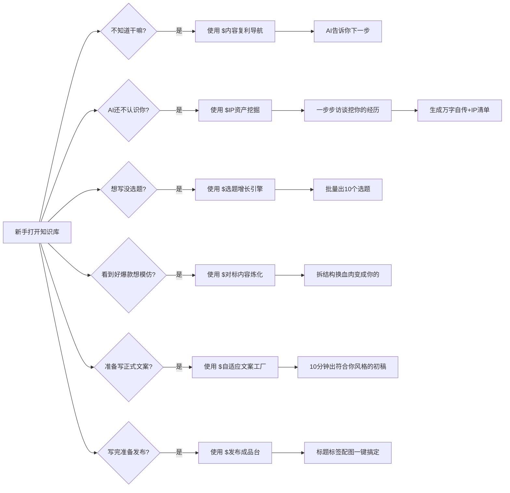
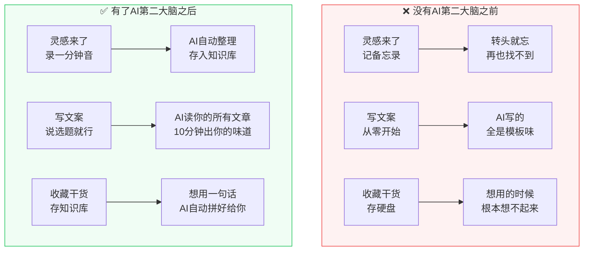

# 🎁 免费领取：为什么你需要一个AI第二大脑？

> 作者：林总 | 05后AI一人公司实践者

你好，我是林总，一个正在把自己从校园绩优生升级成AI时代超级个体的05后实践者。

说真的，我做内容这大半年，踩过的坑比你吃过的米饭还多。

最开始我跟你一样，就是打开网页版ChatGPT，想到什么让AI写什么。结果呢？AI写出来东西看着挺通顺，就是不对劲。像是在看一篇官方通稿，谁写都是这个味儿，读者一眼就能看出来是AI搞的，根本记不住你。

有时候写完了，你想改一改，下次再开对话，AI连你上次说过什么都忘了，又得重新说一遍，浪费好多时间。

后来我慢慢发现，问题根本不在AI，在于**AI根本不认识你**。

你每次重新开对话，都得重新告诉它你是谁、你做什么、你的粉丝喜欢什么、你说话是什么味儿。光这开场白，每次都要写几百字，烦都烦死了。

而且你脑子里那些想法、那些跟朋友聊天聊出来的观点、那些刷手机刷到的好案例，转头就忘了。等你想用的时候，翻遍手机备忘录、聊天记录、收藏夹，就是找不到。那些闪着光的好想法，就这么烂在了你的肚子里，再也没见过天日。

今天这篇文章，我想掏心窝子跟你聊透这件事。**为什么普通人用AI，和真正会玩AI的高手，差的就是这一个本地知识库。**讲清楚了，你拿走就能用。

## 我先问你三个问题，看看你中了几个

### 第一个问题：灵感很多，但转头就烂在肚子里

你有没有过这种经历：走路突然蹦出来一个好想法，当时觉得卧槽这太牛了，赶紧掏出手机记在备忘录里，然后...就没有然后了。

半年后你突然想到这个点子，想找出来用，翻遍手机聊天记录、备忘录、收藏夹、小红书点赞，就是找不到。那个闪着光的好想法，就这么烂在了你的肚子里，再也没见过天日。

我之前就是这样。现在想想，真的太可惜了。

那些灵光一现的东西，往往是你最真实、最有生命力的思考。那是你当时当刻独特的感受，是你脑子里面长出来的东西，不是书上抄来的。就这么没了，真的可惜。

### 第二个问题：AI写出来总是不对味，读者一眼就认出是AI写的

让AI帮你写文案，出来就是标准模板腔，你自己读着都觉得没意思，读者一眼就能看出来是AI写的。

不是说AI不好使，是你没喂对东西。AI不知道你是谁，不知道你经历过什么，不知道你说话什么风格，它只能给你放之四海而皆准的模板。

可读者关注你，是想看**你**，不是想看标准答案。

### 第三个问题：存了一大堆干货，真要用的时候一片空白

你收藏了一百多篇干货文章，买了几十个G的课程，真要解决问题，你脑子还是一片空白。

我见过很多朋友，包括我自己之前也这样。看到好文章就点收藏，看到好课程就买下来，感觉存了就是学会了。结果真要用的时候，根本想不起来自己存过什么，就算想起来了，也懒得翻出来，更别说把里面的东西变成自己的内容。

输入是水库，输出是漏水的筛子。存了一大堆，就是用不起来。

<callout emoji="💡">
如果你中了哪怕一个，相信我，你真的需要一个**能被AI直接调用的个人知识库**。
</callout>

## 为什么网页版GPT/在线AI就是不好用？五大痛点

很多人跟我说，不就是写个文案吗？我打开chat.com直接写不行吗？为什么非要折腾什么本地知识库？

我用了大半年，给你数五条网页版AI天生的痛点，你看看是不是这么回事：

| 痛点 | ❌ 网页版GPT | ✅ 本地AI知识库 |
|-|-|-|
| **上下文窗口有限** | 每次都要粘个人信息，占一半上下文空间，真正写内容的地方都没了 | 本地markdown文件，想读多少读多少，按需读取，不浪费上下文 |
| **每次重开就忘** | 新开对话又是一张白纸，每次都得重新自我介绍一遍，烦死了 | AI启动自动读你的记忆文件，永远忘不了你，来了直接干活 |
| **知识散落各处** | 备忘录、聊天记录、网盘、Notion...你自己找自己粘，折腾半小时灵感都没了 | 所有知识分类存储在一个地方，AI自动检索拼接，不用你管 |
| **隐私不安全** | 商业想法、客户信息、未公开计划，全告诉AI了，隐私安全全靠信任 | 所有数据在你自己硬盘上，外人根本拿不走，核心资产永远在你手里 |
| **token重复浪费** | 每次喂相同的背景信息，花冤枉钱，积少成多其实真不少 | 喂一次AI记一辈子，以后只用算写内容的token，省钱又高效 |

这五个痛点，都是网页版GPT天生带的，根本解决不了。你用本地知识库，一下子全解决了。

我再给你掰碎了说，为什么这五个痛点是死穴，为什么本地知识库是唯一解。

第一个痛点，上下文窗口这个事，真的是硬伤。你想想，GPT4现在是128K上下文，听起来很大对不对？但是你要让AI认识你，你得给它喂你的自传吧？几千字。你得给它喂你的写作风格吧？又是几千字。你得给它喂你之前写过的几篇文章吧？又是几万字。这还没开始写内容呢，一半上下文就没了。剩下那一半，你写长一点的文章都不够用。

本地知识库就不一样了。你的所有东西都存在本地markdown文件里，Claude Code它是真的能读你电脑上的文件，不是把整个文件都塞到上下文里去，它是按需读。你让它写一篇关于"大学生做IP"的文章，它自动去你知识库里面找你之前写过的相关内容，找出来拼好，用到的才占token，不用的不占。这才是真的高效。

第二个痛点，每次重新开对话AI就把你忘了，这个事我刚开始用的时候真的烦死了。我记得有一次，我跟AI聊了一下午，把我的IP定位、用户画像、写作风格都聊透了，写出来的东西真的就是我的味道。结果第二天我再开新对话，AI又是一张白纸，我又得重头说一遍，你说烦不烦？

有了本地知识库之后，这种事再也没发生过。因为你的所有信息都存在文件里，AI每次启动，第一件事就是读那几个核心记忆文件，它一上来就认识你，不用你废话。就好像你雇了一个助理，第一天上班你跟它说清楚你是谁你要什么，从此以后它就记住了，不用你每天上班都重新自我介绍一遍。

第三个痛点，知识散落各处，这个真的是所有人的通病。我之前就是这样，灵感记在苹果备忘录里，课程笔记存在Notion里，好文章收藏在微信里，聊天记录里面有好多跟朋友聊出来的好观点，还有一堆PDF存在硬盘里。真要用的时候，你根本想不起来在哪，就算想起来了，你还得一个个打开找，找到了还得复制粘贴到AI对话框里。折腾半小时，灵感都没了。

本地知识库就是解决这个问题的。所有东西都在一个地方，分类放好。AI想找什么，它自己去读，不用你管。你只要说一句"帮我写一篇关于大学生做IP的文章"，AI自己去你知识库里面找你之前说过什么，找出来拼好，十分钟就给你出稿。这才是真的生产力。

第四个痛点，隐私安全这个事，很多人没当回事，但我觉得特别重要。你做IP做商业，你肯定有很多商业想法、客户信息、未公开的计划，这些东西你全都告诉网页版AI了，等于把你肚子里的东西全给了别人。虽然人家说不训练，但是你放心吗？

本地知识库就不一样了。所有东西都在你自己电脑上，只有你自己能看。Claude Code读文件也是在你本地读，不会把你的文件上传到服务器上去（除了正常的API调用需要传的内容）。你的核心资产永远在你手里，这才是最安全的。

第五个痛点，token浪费这个事，虽然钱不多，但是冤枉钱花着就是不舒服。你用网页版，每次开新对话，你都得把你的个人信息、背景知识重新喂一遍，这些都算token，都得花钱。其实这些内容你喂一次就行了，但是网页版它记不住，你就得每次都喂，每次都花钱。

本地知识库呢，你喂一次，AI一辈子记得。以后每次写内容，它已经认识你了，只用算写内容的token，省下来的钱，积少成多，真的不少。

这五个痛点加在一起，你就明白了：网页版AI它就是个工具，你得费劲去用它。本地AI知识库，它是你的第二大脑，它帮你干活，它认识你，它用你的脑子帮你干活。这本质上就不是一个东西。

## 什么是AI知识库？一句话给你讲明白

我用最简单的话给你说清楚：

| 普通笔记软件 | AI知识库 |
|-|-|
| **你找东西**，文件存在那，你自己搜，自己翻，自己整理 | **AI找东西**，你想到什么，AI直接从你所有知识里给你拼出答案 |

传统的笔记App就是个电子版图书馆。你想找一本书，得自己进去检索，自己翻，自己整理。

AI知识库不一样，它是**你的私人助理**。你说你想要什么，它直接从你存进去的所有知识里，帮你把素材拼好，直接给你出成品。

我给你举一个我天天在用的例子你就明白了。

前几天我想写一篇"为什么普通人做IP，一定要做第二大脑"，就是你现在看的这篇。

放在一年前，我得自己翻以前记的笔记，找案例，想结构，一字一句写，至少折腾两个小时。

现在有了AI知识库呢？

我打开Claude Code，只需要说一句话：
> "参考我知识库中关于AI知识库、第二大脑痛点的所有内容，帮我写一篇3000字的公众号文章，要我的风格"

然后...**10秒钟，稿子出来了**。

而且真的就是**我的语气、我的案例、我的方法论**。根本不需要大改，我读一遍改几个词，就能发。

这就是区别。这就是为什么高手用AI能一天出好几条内容，你折腾一天还出不了一篇。

## 我用了大半年的这套系统，到底长什么样

很多朋友一听到"知识库"三个字，就觉得好复杂，是不是要懂编程才能玩？

真不是。我给你看看我现在用的这套框架，你clone下来就能直接用，配置我都给你写好了。

整个知识库其实就是一堆markdown文件放在你自己电脑上，分类放好。

```mermaid
graph TD
    Root[你的数字分身知识库] --> Config[🔧 核心配置层]
    Root --> Memory[🧠 记忆系统层]
    Root --> Input[📥 输入中心层]
    Root --> Content[✍️ 内容底盘层]
    Root --> Create[🏭 创作工厂层]
    Root --> Output[📤 输出中心层]
    Root --> Review[📈 复盘增长层]
    Root --> Skills[⚡ 技能层]

    Config --> C1[CLAUDE.md
AI行为准则]
    Config --> C2[AGENTS.md
技能路由]
    Config --> C3[current-truth.md
你现在在忙什么]

    Memory --> M1[长期记忆
你的身份、经历]
    Memory --> M2[每日动态
最新思考]
    Memory --> M3[用户画像
你服务的人]

    Input --> I1[日常灵感
手机录音导入]
    Input --> I2[对标爆款
看到好内容存这]

    Content --> Ct1[个人信息
自传、背景]
    Content --> Ct2[IP资产
故事、方法论]
    Content --> Ct3[风格萃取
你的表达方式]

    Create --> Cr1[选题池
待写的选题]
    Create --> Cr2[创作中
正在写的草稿]
    Create --> Cr3[已发布
成品存档]

    Skills --> S1[内容复利导航]
    Skills --> S2[IP资产挖掘]
    Skills --> S3[选题增长引擎]
    Skills --> S4[对标内容炼化]
    Skills --> S5[自适应文案工厂]
    Skills --> S6[发布成品台]
```

核心其实就一句话：**你的所有知识、经历、风格，都变成markdown文件存在你自己电脑上，Claude Code每次干活前自动全读一遍，所以它写出来的东西，就是你的东西。**

这不是什么黑科技，就是把思路理顺了，把该存的东西存对地方。

## 我为什么选这几个工具组合，给你掏掏心窝子

很多朋友问我，到底用什么工具组合最合适？我这大半年试了不下十种方案，最后稳定在这套组合，都是免费或低成本，普通人完全扛得住。我给你一个个说，为什么选它们：

### 第一个：Obsidian — 本地知识库最好的容器

为什么选它？原因很简单：

第一，**纯本地文件**，所有数据都在你自己电脑上，不会丢，也不会哪天服务商跑路你东西全没了。这点太重要了，你的知识资产是一辈子的事，放在别人服务器上，我不放心。

第二，**双链功能真的好用**，能把你不同笔记之间连起来，你写着写着想到之前说过一个观点，直接链过去，越用你的知识网络越密，越用越好使。

第三，**免费版就够用**，你不追求插件，免费版完全能打。想要支持开发者，买个商用授权一年也就八十多块钱，一杯奶茶钱，真的不贵。

去官网下载，一路下一步安装就行，没什么难度。

### 第二个：Claude Code — 目前最强的本地AI大脑

Anthropic出的这个 Claude Code 真的是目前最强的能读本地文件的AI Agent。

它能直接读你电脑上所有文件，能帮你写能帮你改，理解上下文能力真的没话说。

而且它是按token收费，不用不花钱，我做内容这么多，一天写个两三篇，一个月五六十块钱顶天了，普通人完全负担得起。

去官网注册，配好API Key就能用，门槛真的不高。

### 第三个：牛马AI — 国内就能用的技能生态超市

这个真的省你好多事。

国内就能用，一堆现成的skill都做好了，开箱就能用，不用你自己从零造轮子。

很多常用功能，比如帮你填个人信息、帮你挖IP线索、帮你生成选题，全都做好了，开箱就能用。

基础使用免费，真的很香。按照牛马AI官方指引安装配置好就行，不难。

### 第四个：Get笔记 — 手机录灵感神器

你出门在外，突然有灵感，掏出手机点开就能录，自动给你转写成文字，整理得干干净净。

不用你自己打字，想到什么张嘴就说，录完导入知识库就行。

免费版完全够用，想开更多功能一年159，也不贵。

这套组合拳我用了快半年，**真的比纯在线AI好用十倍**。

为什么？因为你的知识存在你自己电脑上，AI想怎么读就怎么读，不受上下文长度限制。这就是本地AI知识库最大的优势。

## 开箱就能用的8个核心技能，我都给你配置好了

很多朋友担心，我不会配置怎么办？

放心，我给你的模板里，**8个核心生产技能全都配置好了**，拿到就能用。我给你一个个说，你心里有数：

| 技能 | 什么时候用 | 启动口令 | 效果 |
|------|-----------|---------|------|
| 内容复利导航 | 刚打开知识库，不知道下一步该干嘛 | `使用 $内容复利导航，带我完成第一次配置` | AI告诉你下一步走哪里，不会让你懵 |
| IP资产挖掘 | 第一次搭建必用，帮你整理定位 | `使用 $IP资产挖掘，帮我整理个人IP定位和内容资产` | 像访谈一样一步步问你，挖你的经历 |
| 个人表达建模 | 填完信息，帮AI分析你的风格 | `帮我做个人表达建模` | 总结你的用词习惯，AI写出来更像你 |
| 选题增长引擎 | 坐在那想不出更什么选题 | `基于我的定位，帮我生成10个选题` | 一会儿就给你出10个，够用好久 |
| 对标内容炼化 | 看到好爆款想改成你自己的 | `帮我炼化这篇爆款，换成我的经历和观点` | 拆结构换血肉，变成你自己的原创内容 |
| 自适应文案工厂 | 准备写正式文案了 | `帮我生成一篇[教知识/聊观点/讲故事]文案` | 自动读你的信息和风格，10分钟出初稿 |
| 发布成品台 | 文案写完准备发了 | `帮我做发布前优化` | 标题、标签、配图一键搞定 |
| 内容进化复盘 | 内容发出去有数据了 | `帮我复盘这篇内容的数据` | 分析数据给建议，越做越好 |

这些技能全都配置好了，你clone我的模板过去，直接就能用，不用你自己折腾配置。真的开箱即用。

## 搭好这套系统，你最后能得到什么

说实话，搭完这套AI知识库，改变真的不止一点点。我自己用了快半年，那种感受是全方位的，不是说单纯写东西快了，而是整个思考方式都变了。

首先最直观的，你的第二大脑真正活了。你大脑里那些模糊的想法、零散的经验、跟朋友聊天聊出来的观点、刷手机刷到的好案例，以前它们都是散的，就像一堆散落的拼图，你知道它们在那，但你要用的时候就是拼不起来。

现在有了AI知识库，这些东西全都被蒸馏成了结构化的知识，AI随时能调用。相当于你把自己"备份"了一份给AI。以后你想什么东西，不用你自己从零开始想，你只要说一句"我之前说过关于XX的什么来着？帮我整理一下"，AI就去你知识库里面给你找，把相关的都找出来，拼好给你。

我给你举个真实的例子。上个月我跟一个做外贸的老板吃饭，他问我"大学生做IP，刚开始应该怎么做"，我当时跟他聊了半个多小时，聊了很多我的观点。聊完我就把录音导出来，转成文字，存进了我的知识库。

过了大概两个星期，有个粉丝在微信上问我一模一样的问题："林总，我是大三的，我想做IP，刚开始应该怎么做？"

放在以前，我就得自己重新想，从零开始组织语言，至少得写20分钟。现在呢？我打开Claude Code，只说了一句话："参考我知识库里面那次跟外贸老板聊天的内容，帮我写一个给大学生的回答，口语化一点，不要太正式。"

30秒，回答出来了。我看了一眼，就是我当时说的那个意思，而且语气就是我平时跟粉丝说话的语气，我直接复制粘贴就发出去了。

你说这是什么感觉？这就是你的第二大脑真的活了。那些你说过的话，你想过的事，它都帮你记着，你要用的时候，它马上给你拼好。你脑子负责想方向，拼素材这种脏活累活，AI干了。

然后第二个改变，内容创作效率至少翻五倍。做IP的朋友最懂这个，写东西真的太费时间了。以前写一篇公众号文章，从想选题到找素材到想结构到写完，折腾一下午是常事，写完你自己都不想看第二遍。

现在呢？你坐在那，告诉AI你要写什么选题，AI自动读你的自传、你的风格、你之前写过的类似文章、你存过的相关素材，十分钟初稿就出来了。你要做的是什么？就是通读一遍，改改语气，调整几个例子，加一点你最新的想法，完事。

而且最关键的是，因为AI认识你，写出来就是你的味道，AI味至少减少八成。读者看不出来是AI写的，还觉得就是你说话那个味儿，这不香吗？

我现在写一篇公众号文章，从选题到定稿，平均一个小时。放在以前，没有半天根本搞不定。这多出来的时间，你干嘛不行？你多去认识两个人，多谈两个合作，多花点时间陪女朋友，不比坐在那憋稿子强？

第三个改变，你的知识真正能用起来了。以前你是不是这样？看到一篇好文章，点收藏；看到一个好课程，买下来存硬盘；听别人分享一个好观点，截图存相册。然后呢？然后就没有然后了。那些东西就躺在那落灰，你再也没看过第二遍，真要用的时候，你根本想不起来自己存过。

输入是水库，输出是漏水的筛子。存了一大堆，就是用不起来。

现在存在AI知识库里面的知识是"活"的。你要用的时候，你不用自己找，AI自动给你找出来，自动给你组合好，直接给你成品。收藏→消化→产出，真的形成正向循环了。

我现在看到好文章，我就存进知识库。听到好观点，我就存进知识库。跟别人聊天聊出来好想法，我录个音，转成文字存进知识库。这些东西存进去，就没白存，以后我写东西的时候，AI自动就给我用上了。

你不再是囤积癖，你是真的在用知识。这才是学习真正的意义。

第四个改变，也是最让我惊喜的，它是活的，越长越聪明。你每天用，每天往里加新东西，AI对你的认知越来越深刻，产出质量越来越高。

你刚开始用的时候，可能AI写出来还有点生，还需要你改得比较多。但是你用一个月，你往里加了二十篇你自己写的文章，加了几十个灵感碎片，加了几次你跟别人的聊天记录，你再让AI写，你会发现，它写出来的东西，真的越来越像你。

这不是一个死模板，这是一个**跟着你一起成长的活系统**。你越用它越聪明，它越聪明你越好用，正向循环就起来了。

我现在用了快半年，AI写出来的东西，我需要改的地方越来越少。很多时候它写出来，我读一遍，觉得"对，这就是我想说的"，直接就能发。这种感觉，真的只有用过的人才能懂。

## 我自己踩过的五个坑，告诉你怎么避开

我玩了大半年，踩了无数坑，五个最深的坑告诉你，你别再踩了：

### 坑一：追求完美，一开始就想把所有东西都整理得井井有条

很多朋友一开始，非要把所有旧资料都整理完了才开始用，结果整理了一个月，还没整理完，就放弃了。

真没必要。**框架搭好了，你用一点加一点，慢慢就丰满了**。

你就是现在开始用，用一次涨一次，比你坐着整理强一万倍。

### 坑二：什么都往里塞，最后知识库变成垃圾堆

你别什么东西都往里存，存进去你也不会用。只存你真正觉得有用的，没用的及时清掉，保持干净，AI读得也快，你找得也快。

### 坑三：不更新个人信息，AI永远认识不了你

你自己在成长，你的业务在变化，记得每个月更新一次你的个人信息，让AI知道你现在在忙什么，变成什么样了。

它越了解你，输出越准。

### 坑四：不敢用，觉得自己不会配置

我模板都给你配置好了，你clone下来，跟着SOP走，十五分钟就搭好了，真的不难。

你看完这篇文章，再跟着SOP走，肯定能成。

### 坑五：觉得本地知识库一定很贵

真不贵。Obsidian免费，牛马AI基础版免费，Claude Code按token算，我这样天天用，一个月五六十。一杯奶茶钱，买你效率翻五倍，不值吗？

## 【深度加餐】为什么绝大多数人的AI都用错了？

这一部分我本来想放在付费课里讲的，但是想了想，还是放出来给你看。因为这是我用了一年多AI，花了至少几千块token费，踩了无数坑之后，才想明白的最底层的认知。

你先问自己一个问题：你现在用AI，是不是还是这种模式？

- 想到什么需求，打开ChatGPT
- 搜一下有没有什么"牛逼prompt"
- 把prompt粘进去，等AI出结果
- 不满意，再改改prompt，重新生成
- 折腾半小时，结果还是差强人意

如果是，那你跟99%的人一样，都在用"一次性工具"的方式用AI。这种方式的天花板非常低，你再怎么优化prompt，也就那样了。

### 真正的高手，用的是"上下文蒸馏"模式

什么意思？我给你打个比方你就懂了。

你雇了一个助理，第一天上班，你跟它说："帮我写一篇朋友圈文案，卖我那个99块的训练营。"你觉得这个助理能写好吗？

肯定不能啊。

它不知道你是谁，不知道你的训练营教什么，不知道你的用户是谁，不知道你平时说话什么风格，不知道你之前卖过什么产品，不知道你之前写过什么文案。

它就是一张白纸，你让它怎么写？

但是如果这个助理已经跟了你一年了呢？

它听过你所有的分享，看过你所有的文案，知道你跟用户怎么说话，知道你的产品解决什么问题，知道你经历过什么故事。这时候你再跟它说："帮我写一篇朋友圈文案，卖我那个99块的训练营。"

它十分钟写出来的东西，比你自己憋一下午写的还好。

这就是区别。

<callout emoji="💥">
**核心认知：AI的产出质量，80%不取决于你的prompt，取决于你给它喂了多少高质量的"你"。**
</callout>

这就是为什么同样是用GPT，有人写出来的东西一看就是AI，有人写出来的东西比本人还像本人。

不是prompt牛逼，是人家喂的上下文牛逼。

你每天花半小时研究怎么写prompt，不如花半小时整理你自己的知识资产。后者的ROI是前者的十倍以上。

### 本地知识库，本质上是在给AI"喂你的灵魂"

现在你懂了为什么我这么推荐你搭本地知识库了吧？

这不是什么"整理笔记"，这不是什么"提高效率的小工具"，这是在做一件非常非常有长期价值的事：

**你在把你这个人，蒸馏成AI能理解的格式，然后让它成为你的数字分身。**

这件事的价值，会随着时间指数级增长。

- 你用一个月，AI写出来的东西大概有你30%的味道；
- 你用三个月，AI写出来的东西大概有你60%的味道；
- 你用一年，AI写出来的东西，可能你自己都分不出来是你写的还是它写的。

到那个时候，你就真的拥有了一个第二大脑。你想什么，它都能帮你延伸；你说一半，它能接另一半；你只要给个方向，它就能把内容长出来。

这才是AI真正的威力。不是帮你省时间，是帮你放大你这个人。

### 我自己亲测的效率提升数据

说再多不如看数据，我给你算一笔账你就懂了。

**搭知识库之前：**

- 写一篇公众号长文：3-4小时
- 写10条朋友圈：1小时
- 做一次分享的逐字稿：半天
- 回粉丝常见问题：每条5-10分钟

**搭知识库之后：**

- 写一篇公众号长文：30-45分钟（AI出初稿，我改一遍）
- 写10条朋友圈：5分钟
- 做一次分享的逐字稿：1小时
- 回粉丝常见问题：30秒（AI生成，我看一眼就发）

效率提升了多少？平均**5-10倍**。

最关键的是，**质量没有下降，甚至比我自己写的还稳定**。因为AI不会累，不会没灵感，不会状态不好。它每天都是100%的水平输出。

省下来的时间干嘛？

去见人，去谈合作，去思考战略，去谈恋爱，去做那些只有你能做的事。

### 这个事的时间窗口最多还有一年

我跟你说句掏心窝子的话：现在做这件事，就跟2012年开公众号，2018年做抖音一样，是有时间窗口的红利的。

现在99%的人还没意识到这件事的重要性，还在到处找prompt，还在比哪个AI模型更聪明。

你现在开始搭，半年之后，你就拥有了一个别人抄不走的核心竞争力：**一个懂你的AI数字分身。**

别人想抄你，他不是差一个prompt，不是差一个工具，他是差那半年时间每天往知识库里喂的东西。那个东西抄不走。

再过一年，所有人都反应过来了，都开始搭了，那时候你已经领先了一整年，这个差距就很难追了。

<callout emoji="⏰">
**所以别等，今天就开始。**
不用追求完美，不用等所有资料都整理完，先搭起来，用一次，加一次，慢慢就长起来了。
种一棵树最好的时间是十年前，其次是现在。搭你的数字分身知识库最好的时间是半年前，其次是今天。
</callout>

### 不同人群，给你不同的启动建议

看到这里，可能有人会说："林总，我是零基础，能直接上手吗？"或者"我已经做IP一段时间了，这个系统对我还有用吗？"

我给不同阶段的人，都准备了启动建议：

#### 如果你是纯新手，从来没接触过AI知识库

别慌，这个模板就是给你准备的。所有配置都做好了，你只要clone下来，跟着SOP一步步走，十五分钟就能跑通。

先做到"能用"，再追求"好用"。不用一开始就把所有资料都导进来，先填完个人信息，跑通一次从选题到发布的完整流程，比什么都重要。

#### 如果你已经做IP一段时间了，有不少内容

那太好了，你正好把你已经写过的内容导进来，3-5篇你最满意的，AI马上就能学会你的风格。然后你就能感受到，效率提升立竿见影。

我自己就是这么过来的，我导完我之前写的二十多篇文章，AI写出来的东西，味道马上就对了。

#### 如果你是老板，想用来放大自己的业务

那这个系统对你价值更大。你那些经验、认知、客户案例，都在你脑子里，以前只有你能讲出来，现在你把它们蒸馏进知识库，你的助理就能写出你的味道，你就能解放出来，去做更重要的事。

很多老板做IP，自己写太累，别人写又不对味。这个问题，AI知识库直接解决。

## 🎁 怎么拿到我这套开箱即用的模板？

我把自己用了大半年的这套知识库框架整理好了，**你clone下来就能直接用**，所有配置我都给你写好了：

✅ 目录结构已经帮你建好
✅ CLAUDE.md和AGENTS.md都配置完成
✅ 八个核心skill路由全都设置好了
✅ 配套使用说明写得清清楚楚
✅ 你只需要填自己的个人信息就能开工

<callout emoji="📌">
**关注我的公众号「林总说IP」，回复「知识库」免费领取。**
温馨提示：需要你自己有 Claude Code 权限和牛马AI环境，模板只是框架配置，不包这些工具的账号哦。
</callout>

如果你觉得自己看教程还是搞不定，想有人带你手把手两天跑通，我跟苏州兔掌门（资深IP操盘手）一起开了一个小范围的**「数字分身训练营MVP」**。

两天直播，我们带你从0到1把整个系统跑通，最后产出你的第一篇内容。

模式很简单：**99块钱押金，只要你完整参加课程提交作业，押金全额退**，相当于免费学。我们就是想筛掉那些只想白嫖不想动手的人，把时间留给真正想做的朋友。

名额有限，领完模板看公众号里报名方式。

---

这真的是我踩了无数坑之后一点点攒出来的一套方法。

我从一个只会考试的绩优生，靠这套系统一边沉淀知识一边做内容，现在已经链接到了很多线下资源，也跑通了商业闭环。

我最深的感受就是：**以前AI是外面的工具，你得费劲去用它。现在AI变成你的第二大脑，它帮你干活，它认识你，它用你的脑子帮你干活**。

如果你也想让AI真正成为你的第二大脑，而不是天天到处瞎聊浪费时间，这套模板能帮你少走至少半年弯路。

赶紧拿去用，有问题随时找我交流。

---

✍️ 林总  
05后AI一人公司实践者  
关注我，看我如何从校园绩优生进化成AI时代超级个体
