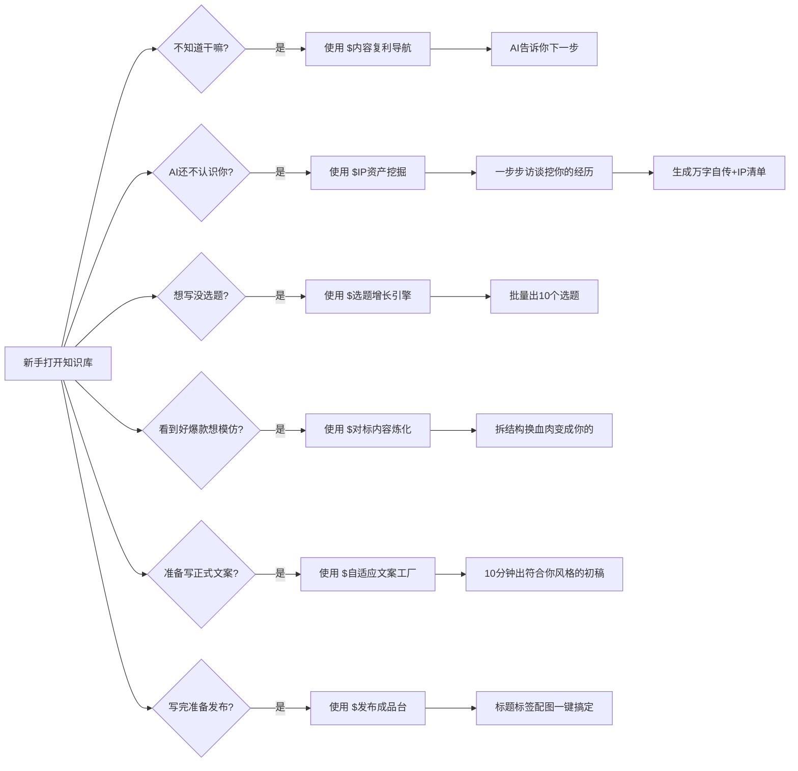

# 📚 AI第二大脑 · 知识库搭建标准操作流程

## 前言：这篇SOP写给谁？

如果你是：

- 做IP的内容创作者，天天写稿写到头秃
- 想把自己的经验沉淀下来，但不知道怎么系统化
- 用AI写东西总觉得不对味，想让AI真正懂你
- 知识散落各处，备忘录、聊天记录、网盘到处都是

那这篇SOP就是写给你的。

我自己用了大半年，把效率至少翻了五倍。现在把每一步都拆给你，照着做，十五分钟就能搭好。

## 前置检查：工具准备

开始之前，你需要准备好这四个工具，都是免费或低成本：

| 工具 | 用途 | 成本 |
|-|-|-|
| Obsidian | 本地知识库容器 | 免费（商用授权一年80多） |
| Claude Code | 本地AI大脑，读文件写内容 | 按token收费，普通用户一个月几十块 |
| 牛马AI | 国内技能生态，开箱即用 | 基础版免费 |
| Get笔记 | 手机录灵感，自动转文字 | 免费版够用，高级版一年159 |

<callout emoji="💡">
别纠结用不用别的工具，先把这四个装上跑通，以后你想换再说。先完成，再完美。
</callout>

## 为什么我选这个组合？对比过十几种方案后的真心话

我玩了大半年AI知识库，前后试了不下十种组合，最后稳定在这套。给你说句掏心窝子的话，为什么是它们：

### Obsidian vs Notion vs 语雀 vs 其他在线笔记

我为什么最后选了Obsidian？

第一，**纯本地文件**，所有数据都在你自己硬盘上。这点太重要了——你的知识资产是一辈子的事，放在别人服务器上，哪天服务商跑路，你东西全没了。在线笔记虽然方便，但所有权不在你手里。

第二，**双链功能真的好用**，能把你不同笔记之间连起来，你写着写着想到之前说过一个观点，直接链过去，越用你的知识网络越密，越用越好使。这是Obsidian的灵魂，别的笔记软件做不到这个味道。

第三，**免费版就够用**，你不追求插件，免费版完全能打。想要支持开发者，买个商用授权一年也就八十多块钱，一杯奶茶钱，真的不贵。

我也用过Notion，Notion很好看，同步也方便，但加载慢，而且国内网络时不时抽风，最重要的是——数据不在你手里。我需要的是一个能让AI直接读本地文件的容器，Notion满足不了。

### Claude Code vs ChatGPT vs Claude网页版 vs 其他AI

Claude Code是目前最强的能读本地文件的AI Agent，没有之一。

它能直接读你电脑上所有文件，能帮你写能帮你改，理解上下文能力真的没话说。而且它是按token收费，不用不花钱，我做内容这么多，一天写个两三篇，一个月五六十块钱顶天了，普通人完全负担得起。

网页版ChatGPT你用着爽，但它读不了你本地文件啊！你每次都得复制粘贴，太麻烦了。而且它上下文窗口就那么大，你知识库有几百篇文章，它根本读不完。

Claude网页版能读文件，但每次都要你上传，而且读完就忘，下次还要重新传。Claude Code不一样，它直接读你硬盘上的文件，想用哪个读哪个，用完就放回去，根本不占你的token。

### 牛马AI为什么一定要加？

这个真的省你好多事。国内就能用，一堆现成的skill都做好了，开箱就能用，不用你自己从零造轮子。

很多常用功能，比如帮你填个人信息、帮你挖IP线索、帮你生成选题，全都做好了，开箱就能用。基础使用免费，真的很香。

如果你自己从零开始配置，光skill路由这一块你就得折腾好几天，还不一定能配对。牛马AI已经帮你把生态搭好了，直接用就行。

这套组合拳我用了快半年，真的比纯在线AI好用十倍。为什么？因为你的知识存在你自己电脑上，AI想怎么读就怎么读，不受上下文长度限制。这就是本地AI知识库最大的优势。

## 第一步：Clone我的模板仓库

不用你自己从零建目录结构，我都给你搭好了。

打开终端，进到你想放知识库的文件夹，执行：

```bash
git clone https://github.com/你的仓库地址/ai-knowledge-base.git
cd ai-knowledge-base
```

这个仓库里已经包含了：

- 完整的目录结构
- 配置好的CLAUDE.md和AGENTS.md
- 8个核心技能的路由配置
- 每一步的使用说明

你不用改任何配置，直接就能用。

## 第二步：用Obsidian打开这个文件夹

打开Obsidian，选择"打开文件夹作为库"，选中你刚clone下来的那个文件夹。

打开之后你会看到这样的目录结构：

```mermaid
graph TD
    Root[你的数字分身知识库] --> Config[🔧 核心配置层]
    Root --> Memory[🧠 记忆系统层]
    Root --> Input[📥 输入中心层]
    Root --> Content[✍️ 内容底盘层]
    Root --> Create[🏭 创作工厂层]
    Root --> Output[📤 输出中心层]
    Root --> Review[📈 复盘增长层]
    Root --> Skills[⚡ 技能层]

    Config --> C1[CLAUDE.md
AI行为准则]
    Config --> C2[AGENTS.md
技能路由]
    Config --> C3[current-truth.md
你现在在忙什么]

    Memory --> M1[长期记忆
你的身份、经历]
    Memory --> M2[每日动态
最新思考]
    Memory --> M3[用户画像
你服务的人]

    Input --> I1[日常灵感
手机录音导入]
    Input --> I2[对标爆款
看到好内容存这]

    Content --> Ct1[个人信息
自传、背景]
    Content --> Ct2[IP资产
故事、方法论]
    Content --> Ct3[风格萃取
你的表达方式]

    Create --> Cr1[选题池
待写的选题]
    Create --> Cr2[创作中
正在写的草稿]
    Create --> Cr3[已发布
成品存档]

    Skills --> S1[内容复利导航]
    Skills --> S2[IP资产挖掘]
    Skills --> S3[选题增长引擎]
    Skills --> S4[对标内容炼化]
    Skills --> S5[自适应文案工厂]
    Skills --> S6[发布成品台]
```



<callout emoji="💡">
**为什么这么设计目录？**因为人的大脑就是这么工作的。
记忆分三层：当下正在做的事、短期动态、长期不变的经历。AI读的时候，它知道哪些是最新的，哪些是底色。
内容创作系统是你的生产流水线，从素材到成品一条龙。
</callout>

## 第三步：填写你的个人信息（最关键的一步）

这一步是整个系统的灵魂，一定要认真填。AI认不认识你，全看这个。

### 快速版（10分钟填完）

打开 **02-内容创作系统/🔧我的档案/个人自传（持续更新）.md**，照着模板填：

- 你是谁？叫什么名字？做什么的？
- 你的核心定位是什么？
- 你的目标用户是谁？
- 你平时说话是什么风格？
- 你有哪些代表性的经历？
- 你有哪些核心观点？

想到什么写什么，不用写得特别完美，以后慢慢补。

### 深度挖掘版（强烈推荐）

填完快速版，在Claude Code里运行：

```bash
使用 $IP资产挖掘，帮我整理个人IP定位和内容资产
```

然后AI会像访谈一样，一步步问你问题，把你的经历、观点、故事全都挖出来，整理成结构化的文件。

这个过程大概30分钟，但是非常值。挖完之后，AI写出来的东西，真的就是你的味道。

<callout emoji="💡">
**不要跳过这一步！**很多人上来就想让AI写东西，结果写出来全是模板味，然后说AI不好用。
不是AI不好用，是你没告诉它你是谁。
</callout>

## 第四步：导入你现有的资料

如果你以前写过东西，不要浪费，都导进来：

- 你以前发过的公众号文章、短视频文案
- 你在朋友圈、知识星球发过的内容
- 你跟别人聊天聊出来的好观点
- 你收藏的觉得有用的文章

不用整理得特别整齐，随便丢进去就行。AI会自己读，自己找，自己拼。

重点：**先导入3-5篇你最满意的自己写的文章**。AI读了这些，它就知道你的写作风格了，写出来的东西就像你写的。

## 第五步：跑通第一个完整流程

现在系统搭好了，我们跑一个完整的流程，从选题到出稿，你感受一下。



### 步骤5.1：生成选题

坐在那想不出写什么？在Claude Code里说：

```text
基于我的定位，帮我生成10个适合今天发的选题
```

一会儿AI就给你出10个选题，挑一个你喜欢的就行。

### 步骤5.2：写初稿

选好选题，告诉AI：

```text
帮我写一篇关于【你选的选题】的公众号文章，参考我的风格和之前的文章
```

10分钟，初稿就出来了。而且真的就是你的味道。

### 步骤5.3：优化发布

初稿写完，你改改语气，加几个例子，然后说：

```text
帮我做发布前优化：标题改3个版本，配5个标签，加配图建议
```

然后你配上图，直接就能发了。

<callout emoji="✅">
整个流程从选题到发出去，以前你可能要折腾一下午，现在一个小时搞定。而且质量不比你自己写的差。
</callout>

## 八个核心技能逐个说透——每个技能我是怎么用的

模板里预置了8个核心技能，开箱就能用。我给你逐个说透，每个技能什么时候用，我是怎么用的：

### 1️⃣ 内容复利导航 —— 新手第一站

**什么时候用：**你刚clone完模板，打开知识库，完全不知道下一步该干嘛。

**我怎么用：**直接输入 `使用 $内容复利导航，带我完成第一次配置`，AI就会一步步告诉你下一步走哪里。不会让你懵，不会让你卡在这里。

这个技能就是为新手准备的，帮你快速走完第一次配置流程。我设计模板的时候就想好了，一定要让新人打开就能走，不用自己瞎琢磨。

### 2️⃣ IP资产挖掘 —— 整个系统的灵魂

**什么时候用：**第一次搭建必用，填完快速版个人信息后就用它。

**我怎么用：**`使用 $IP资产挖掘，帮我整理个人IP定位和内容资产`，然后它就像访谈一样一步步问你问题。从你叫什么名字，做什么的，有什么经历，服务什么用户，有什么核心观点，一个个问过来。

你实话实说就行，半个小时左右，它就把你的回答整理成结构化的文件，存在你知识库里面。以后AI写东西，直接就读这些文件。

我跟你说，这一步真的不能省。很多人搭完知识库，AI写出来不对味，就是因为这一步没做。AI根本不认识你，怎么可能写出你的味道？

### 3️⃣ 个人表达建模 —— 让AI学会你的语气

**什么时候用：**IP资产挖掘完，导入3-5篇你自己写的文章之后用。

**它干什么：**分析你那些文章的用词习惯、句子长度、开头结尾方式，总结出你的表达风格，存在知识库里面。以后AI写东西，就照着这个风格模仿。

我自己用下来，做完这一步，AI写出来的东西，相似度至少提升六成。很多时候我读一遍，只改几个词就能发，真的很准。

### 4️⃣ 选题增长引擎 —— 再也不怕没选题

**什么时候用：**坐在那想半天不知道更什么的时候用。

**我怎么用：**`基于我的定位，帮我生成10个选题`，一会儿就给你出10个，够你用好久。而且它是基于你知识库里面你的定位来生成的，不是瞎给的，都是符合你赛道的选题。

我现在选题枯竭的时候，就找它要十个，挑一个就能写，非常省脑子。

### 5️⃣ 对标内容炼化 —— 好爆款直接变成你的

**什么时候用：**刷到别人一篇爆款，你觉得写得真好，也想写一篇同主题的，但不想抄，想写成自己的。

**我怎么用：**把那篇爆款内容复制下来，丢进知识库的对标爆款文件夹，然后说 `帮我炼化这篇爆款，换成我的经历和观点`。

十分钟，你的版本就出来了。它是把结构拆出来，然后用你的经历、你的观点、你的风格重新写一遍，不是直接抄。这叫"换血肉，留骨架"，出来就是你的原创内容。

我自己常用这个方法，看到好的选题方向，直接炼化一篇，效率特别高。

### 6️⃣ 自适应文案工厂 —— 十分钟出初稿

**什么时候用：**选题选好了，准备写正式文案了。

**怎么用：**`帮我生成一篇[教知识/聊观点/讲故事]文案，主题是XXX`。它自动读你的个人信息、你的风格、你之前写过的文章，十分钟就给你出初稿。

真的，以前我写一篇三千字文章，从想结构到写完，至少折腾三个小时。现在呢，选题确定后，十几分钟初稿就出来了，我改改语气加两个例子，直接就能发。效率至少翻五倍。

### 7️⃣ 发布成品台 —— 最后一步一键搞定

**什么时候用：**文案写完，准备发布了。

**干什么：**帮你做发布前优化——标题改三个不同风格的版本，配五个标签，给你配图建议。你照着做就行，不用自己想。

我每次写完，都让它帮我想标题，它想的三个里面，我总能挑到一个满意的，比我自己想快多了。

### 8️⃣ 内容进化复盘 —— 越做越好

**什么时候用：**内容发出去有数据了，回来复盘。

**它帮你做什么：**分析数据，给你建议，哪写得好，哪可以改进，下次怎么调整。

这个技能我一周用一次，复盘完，把建议记下来，更新到AI创作规范里面，下次写得更好。这就是一个正向循环。

八个技能就是覆盖从你打开知识库到最后发布复盘的**全流程**，每个环节都有对应的技能帮你，不用你自己从零造轮子，开箱就能用。

## 第六步：日常使用高频场景

系统搭好了，平时怎么用？我给你列几个我天天用的场景：

### 场景一：灵感来了怎么办

走路、洗澡、吃饭，突然蹦出来一个好想法：

1. 掏出手机，打开Get笔记，录一分钟音，想到什么说什么
2. 自动转成文字，导出markdown
3. 丢进知识库的灵感碎片文件夹

完事。以后你写相关主题的时候，AI自动就给你用上了。

### 场景二：看到好爆款想模仿

刷到别人一篇10万+，你觉得写得真好，也想写一篇：

1. 把那篇文章的内容复制下来
2. 丢进知识库的对标爆款文件夹
3. 告诉AI："帮我炼化这篇爆款，换成我的经历和观点"

十分钟，你的版本就出来了。不是抄，是拆结构换血肉，变成你自己的原创。

### 场景三：有人问你重复的问题

粉丝天天问你同一个问题，你每次都要重新打字：

1. 第一次回答完，把回答存进知识库
2. 第二次有人问，直接让AI参考你的回答，生成一个新版本
3. 复制粘贴，发出去

第一次花20分钟，第二次花30秒。越用越省时间。

## 第七步：日常维护，让系统越长越聪明

这不是一个搭完就不管的死系统，它是一个活的第二大脑。你越用它，它越聪明。

日常要做的维护非常简单：

| 频率 | 做什么 | 花多少时间 |
|-|-|-|
| 每天 | 有灵感就录，录完就存 | 1分钟 |
| 每周 | 更新一次current-truth.md，告诉AI你这周在忙什么 | 5分钟 |
| 每月 | 更新一次long-term.md，把你这个月新的认知、方法论加进去 | 30分钟 |
| 每季度 | 清理一次没用的东西，保持知识库干净 | 10分钟 |

就这么简单。做着做着，你会发现AI写出来的东西越来越像你，需要改的地方越来越少。

## 我踩过的10个坑，你别再踩了

我玩了大半年，踩了无数坑，十个最深的坑告诉你，你别再踩了：

### 坑一：刚开始追求完美，非要把所有旧资料都整理完才开始用

很多朋友一开始，非要把所有旧资料都整理完了才开始用，结果整理了一个月，还没整理完，就放弃了。

真没必要。**框架搭好了，你用一点加一点，慢慢就丰满了**。你就是现在开始用，用一次涨一次，比你坐着整理强一万倍。

我刚开始用的时候，个人自传就写了三五百字，现在都一万多字了，不还是一点点攒出来的吗？

### 坑二：什么都往里塞，最后知识库变成垃圾堆

你别什么东西都往里存，存进去你也不会用。只存你真正觉得有用的，没用的及时清掉，保持干净，AI读得也快，你找得也快。

我现在的原则是：这个东西我三个月内会不会用到？不会用到的，删掉。别舍不得，真要用的时候你能找着，找不着说明它本来也不重要。

### 坑三：填完个人信息就再也不更新了

你自己在成长，你的业务在变化，记得每个月更新一次你的个人信息，让AI知道你现在在忙什么，变成什么样了。它越了解你，输出越准。

我自己每个月月底都会花半个小时，更新一遍个人自传和current-truth.md，加进去这个月新的经历、新的认知。你别说，更新完，下个月AI写出来的东西就是不一样。

### 坑四：不导入自己写过的文章，AI永远学不会你的风格

很多人填完个人信息就完了，忘了导入自己以前写过的文章。AI没读过你写的东西，它怎么知道你是什么风格？

一定要先导入3-5篇你最满意的自己写的文章，让AI读一遍，学习你的表达方式。这一步做了，AI写出来像你的概率直接提升八成。

### 坑五：上来就装一堆没用的插件，把Obsidian搞得卡死

Obsidian插件生态很丰富，但是新手真的别装太多。我建议你刚开始就装三个核心的就行：就是模板、日历、数据查询，这三个够用了。其他插件等到你真的需要的时候再装。

装太多插件，一是影响速度，二是容易冲突，出了问题你都不知道是哪个插件搞的。保持简洁，够用就好。

### 坑六：把知识库放C盘，重装系统丢数据

这个是新手常犯的。我强烈建议：有D盘就放D盘，不要放C盘。C盘是系统盘，哪天你重装系统，忘了备份，数据全没了，哭都来不及。

放D盘，就算重装系统，数据还在，一点事没有。这个是经验之谈，我见过好几个人吃这个亏。

### 坑七：觉得本地知识库一定很贵，用不起

真不贵。Obsidian免费，牛马AI基础版免费，Claude Code按token算，我这样天天写内容，一个月五六十块钱。一杯奶茶钱，买你效率翻五倍，不值吗？

而且它是按token收费，不用不花钱，你一个月写个几篇，可能十几块钱就够了。真的不贵，普通人完全负担得起。

### 坑八：每天打开就是为了写东西，不记录灵感

很多人用知识库，只有要写东西的时候才打开，平时有灵感也不记录。结果真要写东西了，没素材，又得从零开始。

我的习惯是：**灵感来了，不管多小，先录下来存进去**。哪怕就是一句话，也存进去。存进去了，哪天要用，AI就能给你调出来。不存，那个灵感可能就没了，太可惜了。

### 坑九：依赖AI，写完不读不改直接发

AI能给你出初稿，但是最后那一遍，一定要你自己读一遍，改改语气，加几个你自己的例子，调整一下结构。

AI给你的是骨架，你得自己填上血肉。完全不改直接发，有时候还是能看出AI味，你自己改一遍，味道就对了。

我现在平均一篇文章，AI出初稿十分钟，我改十五分钟，出来就是我的东西。

### 坑十：停留在"搭建"阶段，从来不输出

很多人搭知识库，搭了一个月，一直在调整结构、优化配置、整理资料，就是从来不输出。

结构再好，配置再完美，你不输出，它就是一堆死文件。一定要跑通从选题到发布的完整流程，哪怕第一篇写得不好，也比不写强。

**先跑通，再完美。**这句话我送给你，也送给我自己。

## 30天成长路线图——照着走，30天后你也能起飞

我给你设计了一个30天的成长路线，每天花不了多少时间，照着走，30天后你的系统就能用得很顺了：

### 第1-3天：安装与熟悉

- 第一天：跟着SOP安装好，clone模板，配置好API Key，能正常用了就算完成
- 第二天：填完快速版个人信息，会用Obsidian基础操作（新建笔记、文件夹、搜索）
- 第三天：运行IP资产挖掘，完成深度访谈，生成结构化文件

### 第4-7天：建立记录习惯

- 每天：打开Obsidian，新建每日笔记，记录至少三条内容（灵感/收获/想法）
- 第七天：第一次整理收件箱，把这一周的内容归类到正确位置

这个阶段核心就是**养成习惯**，每天都打开，每天都记录。不用追求多，每天三条就够。

### 第8-14天：输出第一篇

- 第八天：用选题增长引擎生成10个选题，挑一个你最有话可说的
- 第九天：用自适应文案工厂生成初稿
- 第十天：你自己改一遍，然后用发布成品台优化
- 第十一天到十四天：调整好，发布出去

目标：**完成从选题到发布的完整闭环**。哪怕数据不好，没关系，你先跑通一遍，比什么都重要。

### 第15-30天：建立飞轮

- 保持：每天记录，每周整理，每周至少输出一篇
- 每个月月底：更新一次个人信息和核心文件
- 复盘：发布完复盘，把学到的东西更新到知识库

到第三十天的时候，你应该达到这个状态：

- ✅ 知识库中有30篇以上每日笔记
- ✅ 个人自传超过1500字，包含关键经历和案例
- ✅ 已经发布至少4篇内容
- ✅ AI创作规范经过至少3次迭代更新
- ✅ 能独立完成"选题→写作→发布"全流程
- ✅ 遇到技术问题能自行排查解决
- ✅ 让AI写同一主题的文章，质量明显优于第一天

这时候你的AI第二大脑就真正转起来了。

## 常见问题解答

### Q：我不会写代码，能行吗？

完全可以。全程不用你写一行代码，我都给你配置好了。你只要会点鼠标会打字，就能用。

### Q：数据存在本地安全吗？

恰恰相反，存在本地才是最安全的。你的所有想法、商业计划、未公开的内容，都在你自己的电脑上，不会传到任何服务器上。

你用在线AI，等于把你的核心资产全交给别人了。

### Q：会不会很花钱？

真不贵。Obsidian免费，牛马AI基础版免费，Claude Code按token算。我这样天天写内容，一个月五六十块钱。

一杯奶茶钱，买你效率翻五倍，太值了。

### Q：我以前的笔记都在Notion/语雀，要转过来吗？

不用全部转。先把你最核心的、最能代表你的3-5篇转过来，跑通流程先。

用着觉得好，以后慢慢转。不好用，你也没损失。

### Q：Mac和Windows都能用吗？

都能用。这套工具是跨平台的。

## 最后一句话

很多人刚开始用AI，都喜欢折腾各种工具，今天试这个，明天试那个，折腾了半年，效率也没提上来。

其实不用那么复杂。你只要把这一套跑通，就足够你用了。

核心不是工具多牛逼，是你有没有把**你自己**蒸馏成AI能懂的东西。

当你的所有经历、所有观点、所有故事，都变成结构化的知识存在你的知识库⾥，AI随时能调用的时候，你就真的拥有了一个第二大脑。

那时候你会发现，原来做内容可以这么轻松。

---

<callout emoji="🎁">
**还没有拿到模板的朋友：**
关注公众号「林总说IP」，回复「知识库」免费领取。
如果觉得自己看教程还是搞不定，想有人带你手把手两天跑通，公众号里有训练营报名方式。
</callout>

✍️ 林总  
05后AI一人公司实践者  
关注我，看我如何从校园绩优生进化成AI时代超级个体
