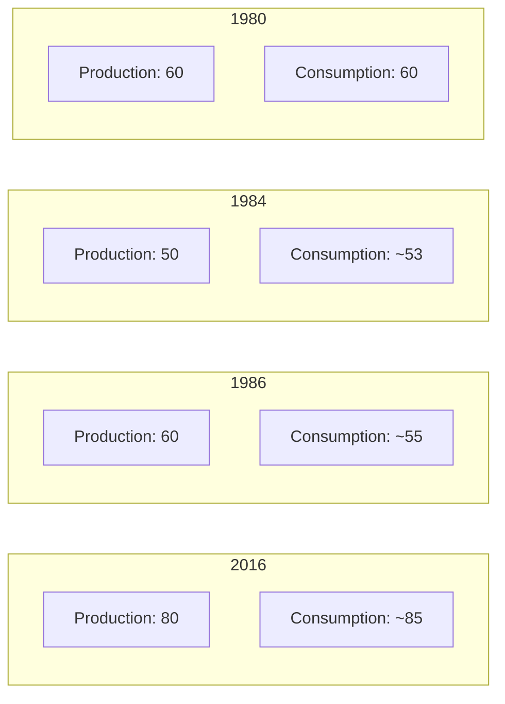
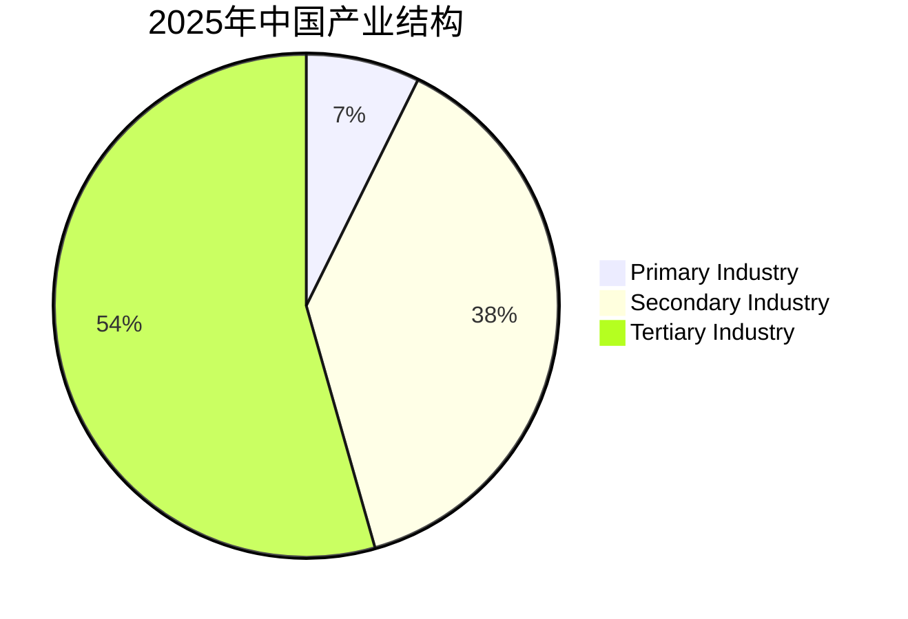

# 写作 - 图表描述完整实例（带图+逐句讲解）

## 实例：石油产量与消费量变化（就是课本原题）

### 📊 图表（折线图示例）



（实际考试折线图就是这样，X轴是年份，Y轴是产量，两条线分别代表production和consumption）

### 📝 逐句描述讲解

**第一段（Introduction）：一句话介绍图表**
```
This graph compares the production and consumption of oil from 1980 to 2016. 
```
✅ 翻译：这张图比较了1980年到2016年间石油的产量和消费量。

---

**第二段（Main Body - 描述产量变化）**
```
From the graph we can see that the production stood at 60 million barrels per day in 1980. 
```
✅ `stood at` = （数据）位于/保持在...

```
In the next four years it fell to 50 million barrels in 1984. 
```
✅ `fell to` = 下降到...

```
However, by 1986 it had returned to 60 million barrels. 
```
✅ `returned to` = 回到...

```
From that point oil production rose steadily for the next 30 years to 80 million barrels in 2016, with only one deviation from this trend, between 2010 and 2014. 
```
✅ `rose steadily` = 稳步增长  
✅ `with only one deviation from this trend` = 这期间只有一次偏离这个趋势

---

**第三段（Main Body - 描述消费量变化）**
```
Oil consumption followed a similar pattern over the same period, starting at 60 million barrels in 1980, but then falling and remaining 5-10 million barrels below production from 1986 to 1996. 
```
✅ `followed a similar pattern` = 遵循相似的趋势  
✅ `starting at` = 起点在...  
✅ `remaining ... below` = 一直保持在...之下

```
Apart from slight dips in consumption in 2000 and 2006, production and consumption remained at a similar level until 2010, when consumption started to exceed production. 
```
✅ `slight dips` = 小幅下降  
✅ `remained at a similar level` = 保持在相似水平  
✅ `started to exceed` = 开始超过

---

**第四段（Conclusion - 总结）**
```
In conclusion, this information demonstrates that oil production has been able to keep pace with demand until recently.
```
✅ `demonstrates that` = 表明...  
✅ `keep pace with demand` = 跟得上需求

---

## 第二个实例：中国GDP增长（柱状图）

### 📊 图表示意图

| 年份 | GDP（万亿美元） |
|------|---------------|
| 2010 | 6.1 |
| 2015 | 11.0 |
| 2020 | 14.7 |
| 2025 | 18.6 |

### 📝 描述：

```
This bar chart shows China's GDP from 2010 to 2025. 

As we can see, China's GDP grew steadily from 6.1 trillion US dollars in 2010 to 18.6 trillion in 2025. The growth rate averaged about 7% per year over this period. 

In conclusion, China has maintained stable and relatively fast economic growth over the past 15 years.
```

---

## 第三个实例：不同产业占GDP比重（饼状图）

### 📊 图表示意图



### 📝 描述：

```
This pie chart illustrates the structure of China's GDP in 2025. It shows the share of primary, secondary and tertiary industry.

We can see that tertiary industry (services) accounts for the largest share at 54.4%, followed by secondary industry at 38.3%. Primary industry accounts for only 7.3%.

In conclusion, the Chinese economy is now dominated by the service sector, which shows that the economic structure is continuing to upgrade.
```

---

## ✅ 描述数据常用套话汇总

| 功能 | 常用句子 |
|------|----------|
| 开头介绍 | `This graph/chart compares ... from ... to ...` |
| 开头介绍 | `This pie chart shows the share of ... in ...` |
| 数据起点 | `... stood at ... in ...` / `... started at ...` |
| 上升到 | `... rose/grew/increased steadily to ...` |
| 下降到 | `... fell/dropped/declined to ...` |
| 保持在 | `... remained at ...` / `... stayed at ...` |
| 超过 | `... started to exceed ...` |
| 占比 | `... accounts for ... percent of the total` |
| 总结 | `In conclusion, this information demonstrates that ...` |

看完这三个实例，你就会发现：其实就是把这些套话拼起来，把数据填进去，就完成了一篇合格的图表作文！

---

*整理时间：2026-06-23*
