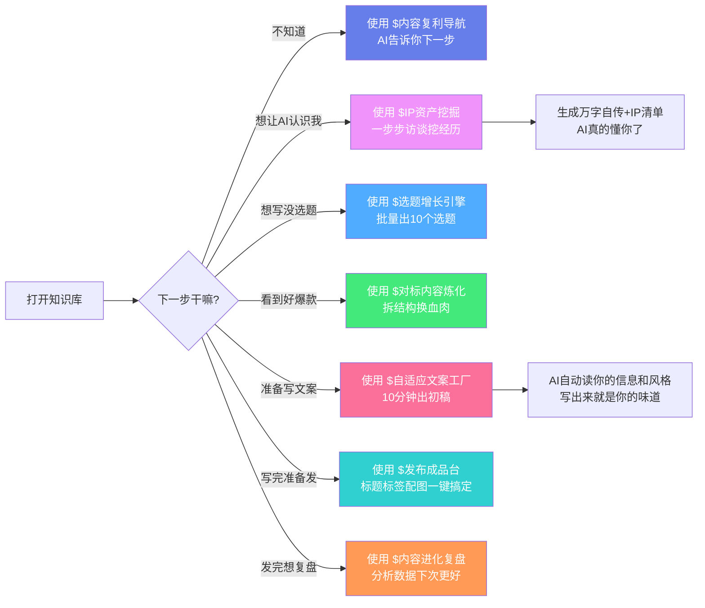

# 🧠 15分钟从0到1搭好你的AI第二大脑 — 跟着走就能成

我跟你说，搭建这个真的不难。你跟着我这篇教程一步步走，十五分钟肯定搞定。

我模板都给你准备好了，配置都写好了，你clone下来，填完个人信息就能用。

我自己就是这么用的，用了大半年，真的舒服。今天把 step by step 写出来，你跟着走就行。

---

## 先给你看看，搭完到底能有多爽

很多朋友上来就问，我费这劲搭这个，到底能得到什么？

我给你说三个我最爽的场景：

**场景一：写公众号文章**

以前：你坐在那，想选题，找素材，想结构，一字一字写，折腾一下午，写完你自己都不想看。

现在：新开一个对话，告诉你要写什么选题，AI自动读了你所有旧文章、你的风格、你的案例，十分钟出初稿，你改改语气，就能发。

**场景二：突然想到一个好点子**

以前：你掏出手机记备忘录，然后转头就忘，想用的时候找不到，好点子烂肚子里。

现在：掏出手机，打开Get笔记，录一分钟音，导出导入知识库，AI自动整理好，半年后你想用，一句话，AI就给你找出来拼好。

**场景三：让AI写文案**

以前：你得一遍一遍告诉AI你是谁，你想写什么，写完不对味，你改来改去，还是像模板。

现在：AI本来就认识你，知道你说话什么味道，知道你喜欢用什么例子，写完就是你的味儿，改几个词就能发。

这就是有第二大脑和没有的区别。真的，用过你就回不去了。

---

## 准备工作：先把三个工具装好

在开始之前，你需要先装好三个工具，都是免费或者低成本，我给你说清楚在哪里装，装完我们再继续。

### 第一个工具：Obsidian

这个就是装你知识库的容器，说白了就是一个本地markdown笔记软件，特别干净好用。

**为什么选它不选别的？**

我试过印象笔记、Notion、飞书文档，为什么最后定了Obsidian？

最重要一点就是**纯本地**，所有文件都存在你自己电脑上，就是一堆markdown文件，哪天这个软件公司跑路了，你的文件还在，一点不影响。你放云端，哪天服务商停服了，你哭都来不及。你的知识资产是一辈子的事，放在自己硬盘上最安全。

第二点就是**双链连接**，这个功能真的好用，你写着写着想到之前一个观点，直接连过去，慢慢你的知识就成网了，越用越好用。

第三点就是**便宜**，免费版完全够用，你想支持开发者，一年八十多块钱，一杯奶茶钱，真不贵。

**怎么装？**

去官网 `obsidian.md` 下载，对应你系统版本，下载完一路下一步安装，就ok了，没什么复杂的。

### 第二个工具：Claude Code

这个就是你的AI大脑，现在本地读文件最强的就是它，没有之一。

Anthropic做的，就是出Claude那个公司，他们做的这个Claude Code，真的太懂读本地文件了。

**为什么选它不用别的？**

第一，它能**直接读你电脑上所有文件**，你让它读哪个它读哪个，真的太方便了。

第二，**按token收费**，不用不花钱，你就是天天写，一个月五六十块顶天了，真不贵。比你买那种包月包便宜多了。

第三，**理解上下文能力真的强**，你让它读你好几篇文章，它都不会乱，能抓住你的要点。

**怎么装？**

去 Anthropic 官网注册，拿到你的API Key，按照官方教程装好Claude Code，就能用了。现在VS Code 里面有插件，装起来很简单。

### 第三个工具：牛马AI

这个就是你的技能超市，好多现成的技能都做好了，你直接用就行，不用自己造轮子。

国内就能用，不用翻墙，基础使用免费，真的很香。

你跟着牛马AI官方安装指引走，一下子就装好，不难。

好了，三个工具都装好了，能正常运行了，我们往下走。

---

## 第一步：把我的模板clone到你电脑

打开你电脑终端，cd 进到你想放这个知识库的文件夹，然后复制粘贴这行命令：

```bash
git clone https://github.com/[你的仓库地址]/digital-avatar-template.git
cd digital-avatar-template
```

【本地截图①：终端clone成功的截图】

这一步就是这么简单，完了打开Obsidian，点击「打开另一个文件夹」，选中你刚clone下来的这个文件夹，点打开，就进来了。

【本地截图②：Obsidian打开后看到目录结构的截图】

你现在看看左边，能看到文件夹结构，这一步就搞定了。

---

## 第二步：检查基础配置对不对

进来之后，你先看根目录下面，有两个文件：`CLAUDE.md` 和 `AGENTS.md`。

先打开 `CLAUDE.md` 看看，这个文件是给Claude Code看的"宪法"，AI每次启动，第一件事就是读这个，它就知道自己该干什么，该遵守什么规矩。

我模板里已经给你写好了核心配置：

```markdown
# 我的AI第二大脑行为准则

- 每次启动先读取 01-系统配置/current-truth.md 知道我最近在忙什么
- 再读取 03-内容底盘 下面我的个人信息，你要先认识我
- 写东西符合我的写作风格，参考 03-内容底盘/03-风格萃取 下面的萃取结果
- 所有技能调用按照 AGENTS.md 里面的路由来
```

一般你不用改，如果你有什么特殊的规矩，你自己往里面加就行，很简单。

【本地截图③：CLAUDE.md文件内容截图】

然后你再看看整个目录结构对不对，数字分身训练营标准结构长这样：

```
📁 你的数字分身知识库/
├── 📁 00-开始使用/             👉 新手入门指引放在这
├── 📁 01-系统配置/             👉 核心配置都在这
│   ├── current-truth.md      👉 你现在在忙什么，最高优先级
│   ├── daily.md             👉 你最近的动态更新在这
│   ├── long-term.md         👉 你的长期信息存在这
│   └── users.md            👉 你的目标用户画像
├── 📁 02-输入中心/             👉 平时收集的灵感和对标爆款放这
│   ├── 📁 01-日常灵感/      👉 日常出门想到什么就放这
│   └── 📁 02-对标爆款/      👉 看到好爆款想拆解，放这
├── 📁 03-内容底盘/             👉 这里存的就是"你"
│   ├── 📁 01-个人信息/      👉 你的自传、基本信息
│   ├── 📁 02-IP资产/       👉 你的故事、方法论素材
│   └── 📁 03-风格萃取/      👉 你的写作风格样本
├── 📁 04-创作工厂/             👉 真正写东西就在这
│   ├── 📁 01-选题池/       👉 想好的选题放在这等写
│   ├── 📁 02-创作中/       👉 正在写的草稿放这
│   └── 📁 03-已发布/       👉 写完发出去的存档在这
├── 📁 05-输出中心/             👉 分发到各平台的成品放在这
├── 📁 06-复盘增长/             👉 写完复盘迭代在这
├── .agents/
│   └── skills/                👉 八个核心技能都在这
├── CLAUDE.md                  👉 AI行为准则，必须有
└── AGENTS.md                  👉 技能路由，必须有
```

```mermaid
graph TD
    Root[📁 你的数字分身知识库] --> Start[📁 00-开始使用<br/>新手入门指引]
    Root --> Config[📁 01-系统配置<br/>核心配置都在这]
    Root --> Input[📁 02-输入中心<br/>灵感和对标爆款]
    Root --> Content[📁 03-内容底盘<br/>这里存的就是"你"]
    Root --> Create[📁 04-创作工厂<br/>真正写东西就在这]
    Root --> Output[📁 05-输出中心<br/>分发到各平台]
    Root --> Review[📁 06-复盘增长<br/>写完复盘迭代]
    Root --> Skills[📁 .agents/skills<br/>八个核心技能]
    Root --> C1[CLAUDE.md<br/>AI行为准则]
    Root --> C2[AGENTS.md<br/>技能路由]
    
    Config --> Cfg1[current-truth.md<br/>你现在在忙什么]
    Config --> Cfg2[daily.md<br/>你最近的动态]
    Config --> Cfg3[long-term.md<br/>你的长期信息]
    Config --> Cfg4[users.md<br/>你的目标用户画像]
    
    Input --> I1[📁 01-日常灵感<br/>出门想到什么就放这]
    Input --> I2[📁 02-对标爆款<br/>看到好爆款想拆解放这]
    
    Content --> Ct1[📁 01-个人信息<br/>你的自传、基本信息]
    Content --> Ct2[📁 02-IP资产<br/>你的故事、方法论素材]
    Content --> Ct3[📁 03-风格萃取<br/>你的写作风格样本]
    
    Create --> Cr1[📁 01-选题池<br/>想好的选题放在这等写]
    Create --> Cr2[📁 02-创作中<br/>正在写的草稿放这]
    Create --> Cr3[📁 03-已发布<br/>写完发出去的存档在这]
    
    style Root fill:#667eea,color:white
    style Config fill:#764ba2,color:white
    style Input fill:#4facfe,color:white
    style Content fill:#43e97b,color:white
    style Create fill:#fa709a,color:white
    style Output fill:#fee140,color:black
    style Review fill:#30cfd0,color:white
    style Skills fill:#ff9a56,color:white
```

如果少哪个文件夹，你自己补上就行，不麻烦。为什么目录要这么设计，而不是别的样子？我给你说说背后的逻辑，你理解了之后，以后想改也知道怎么改。

整个目录结构其实是按照"输入 → 加工 → 输出"这个完整的内容生产流水线来设计的。最左边是输入，你平时收集的灵感，看到的好爆款，都先扔进输入中心。中间是内容底盘，那就是你这个人，你的所有信息、经历、风格都存在这。然后是创作工厂，真正写东西就在这，从选题池到创作中到已发布，完整的创作流程。最后是输出中心和复盘，发出去之后复盘迭代，越做越好。

这个结构的好处是什么？它符合人做事情的自然流程。你想到一个好点子，扔到输入中心，不用管，等你想写的时候，AI自动帮你找。你想写了，去选题池挑一个选题，在创作中文件夹写，写完了移到已发布归档。整个流程特别顺，不用动脑子想文件放哪，跟着目录走就行。

而且每个文件夹的职责特别单一，一个文件夹只干一件事。这样AI读的时候也不容易乱，它知道去哪个文件夹找什么东西。你以后用久了，你也知道去哪个文件夹找什么。

好了，配置检查完，我们走第三步。

---

## 第三步：让AI真正认识你 — 填好个人信息

这一步是**整个搭建过程最重要的一步**，没有之一。AI写出来像不像你，全看这一步。

你打开Claude Code对话窗口，输入这一句话：

```
帮我填个人信息
```

【配图⑤：输入命令之后的截图】

然后AI就会像朋友聊天一样，一步步问你问题：

你叫什么名字，现在在哪里，做什么工作？
你的职业经历里，有什么关键的转折点？
你最擅长什么领域，做了多久了？
你现在在卖什么产品或者服务？
有什么拿得出手的结果？
你喜欢什么样的写作风格，讨厌什么样的AI写法？

你就实话实说就行，想到什么说什么，不用追求完美，想到什么说什么，AI反而更懂你。

你说完了，AI会自动帮你保存到三个文件：

- `03-内容底盘/01-个人信息/个人自传.md`
- `01-系统配置/users.md`
- `01-系统配置/current-truth.md`

你打开这三个文件看看，内容都在，这一步就搞定了。

就这么简单。

---

## 第四步：想要AI更懂你？做一遍深度IP线索挖掘

刚才那个个人信息引导是快速版，十五分钟搞定，适合新手。

如果你想让AI**真的懂你**，我建议你抽一两个小时，做一遍深度IP线索挖掘，值得。

怎么启动？很简单，在对话窗口输入：

```
帮我做IP线索挖掘
```

然后AI会从十一个维度，一点点跟你聊天，挖你的经历：

**第一，你的成长轨迹** —— 你从哪里来，经历过什么？
**第二，你的事业转折点** —— 哪次改变让你变成现在这样？
**第三，你经历过的至暗时刻** —— 最难的时候是什么样？
**第四，你有哪些高光时刻** —— 哪件事让你最骄傲？
**第五，你有什么反常识认知** —— 你觉得跟主流不一样的观点是什么？
**第六，你自己总结了什么方法论** —— 你靠什么做成了事？
**第七，你踩过哪些坑，有什么失败教训** —— 你吃过什么亏？
**第八，你相信什么样的价值观** —— 你坚信什么？
**第九，你有什么跨界兴趣爱好** —— 工作之外你喜欢什么？
**第十，你认识哪些有意思的人** —— 哪些人对你影响大？
**第十一，你未来想做成什么事** —— 你接下来想去哪？

就是这么一步步聊，AI一点点挖，挖完之后，会给你输出两个东西：

第一，一份**万字个人自传**，自动存在你的知识库里面；
第二，一份**IP价值清单**，把你的差异化卖点都整理出来。

我跟你说，这一步做完，**AI对你的理解，真的超过大部分你的朋友**。

你不信可以试试，真的准。

【配图⑥：IP线索挖掘完成之后输出示例】

---

## 第五步：如果你写内容，一定要做风格萃取

如果你已经写过一些文章，而且有几篇是你自己特别满意，觉得真写出你味儿了，一定要做这一步。

做完这个，AI写出来真的就是你的味道。

怎么弄？

第一步，你找出三到五篇**你自己写的、你自己真的满意**的文章，越多越准，建议五到十篇。

第二步，把它们复制粘贴到Claude Code对话窗口，然后说一句话：

```
帮我做风格萃取
```

第三步，AI分析完，会自动保存到这个路径：

`03-内容底盘/03-风格萃取/你的名字-IP写作风格指南.md`

你打开看看，有内容，就成功了。

就这么简单。以后AI写东西，就照着这个风格学，越写越像你。

---

## 第六步：检验一下 —— AI真的认识你了吗？

做完前面几步，我们来检验一下，对不对。

你在对话窗口问AI一句话：

```
你现在了解我多少？帮我总结一下
```

AI会输出它对你的理解，你对照着看：

✅ 你的职业、业务方向说对了吗？
✅ 你的目标用户描述准确吗？
✅ 你的核心优势说到了吗？

如果有错怎么办？你直接告诉AI哪里错了，它会更新记忆，刷新之后就对了。

都对了，我们往下走。

---

## 第七步：认识一下八个开箱即用的核心技能

数字分身训练营给你预置了八个生产性技能，从你打开知识库到写完发布，全覆盖了，你不用自己配置，模板里都弄好了。

我给你一个个说清楚，什么时候用，怎么启动：

### ① 内容复利导航 —— 刚来不知道干嘛，找它

**什么时候用**：你刚打开知识库，不知道下一步该干嘛，找它。

**怎么启动**：一句话
```
使用 $内容复利导航，带我完成第一次配置
```

它会告诉你下一步走哪里，不会让你懵。

### ② IP资产挖掘 —— 第一次搭建必用，帮你整理定位

**什么时候用**：第一次搭建系统，帮你挖你自己的IP资产。

**怎么启动**：一句话
```
使用 $IP资产挖掘，帮我整理个人IP定位和内容资产，每次只问1-2个问题
```

它会像访谈一样一步步问你，不会一下子把你问懵，很友好。

### ③ 个人表达建模 —— 填完信息，帮AI分析你的风格

**什么时候用**：你填完个人信息，让AI更懂你的说话风格。

**怎么启动**：一句话
```
帮我做个人表达建模
```

完了它会给你总结清楚你的用词习惯，AI写出来更像你。

### ④ 选题增长引擎 —— 想不出选题，让它批量出

**什么时候用**：你坐在那不知道更什么选题，让它给你出点子。

**怎么启动**：一句话
```
基于我的定位，帮我生成10个选题
```

一会儿就给你出10个，够用好久。

### ⑤ 对标内容炼化 —— 看到好爆款，改成你自己的

**什么时候用**：你看到别人一篇爆款写得真好，你想写一个你自己版本的，不想抄袭，就要炼化。

**怎么启动**：一句话
```
帮我炼化这篇爆款，换成我的经历和观点
```

它会帮你把结构拆了，骨架保留，换掉血肉，变成你的内容。真的好用，比你自己逐字改舒服多了。

### ⑥ 自适应文案工厂 —— 准备写正式文案，它帮你出初稿

**什么时候用**：你选题定了，要写正式文案了，让它帮你出初稿。

**怎么启动**：一句话
```
帮我生成一篇[教知识/聊观点/讲故事]文案
```

它会自动读你的信息、你的风格，直接给你出初稿，你改改就能发。

### ⑦ 发布成品台 —— 文案写完，帮你做好发布准备

**什么时候用**：你文案写完了，准备发布了，让它帮你做好标题、标签、配图标记。

**怎么启动**：一句话
```
帮我做发布前优化
```

它都给你弄好了，你直接拿走发布就行，不用你自己一件件弄。

### ⑧ 内容进化复盘 —— 内容发了，帮你复盘下次更好

**什么时候用**：你内容发出去有数据了，复盘一下，下次做得更好。

**怎么启动**：一句话
```
帮我复盘这篇内容的数据
```

它会帮你分析数据，给你建议下次怎么调整，越做越好。

我给你编了个口诀，你记不住的时候拿出来看：

- 刚来不知道干嘛 → 找**内容复利导航**
- AI还不认识你 → 找**IP资产挖掘**
- 想写东西没选题 → 找**选题增长引擎**
- 看到好爆款想模仿 → 找**对标内容炼化**
- 准备写正式文案 → 找**自适应文案工厂**
- 写完准备发布 → 找**发布成品台**



好了，八个技能都认识了。我再给你说说每个技能我实际用下来的感受，哪些是必用的，哪些可以慢慢来，省得你走弯路。

首先说必用的，三个核心技能，这三个你一定要用，不用等于白搭这个系统。

第一个必用的就是IP资产挖掘，这个真的是整个系统的灵魂。我第一次做的时候，本来以为半个小时就能做完，结果跟AI聊了两个多小时，聊完之后我自己都惊了——AI对我的理解，真的超过了大部分我的朋友。它会从十一个维度一点点挖，很多我自己都忘了的经历，被它一问，我想起来了，然后它就给我记下来，最后整理成一份万字自传，还有一份IP价值清单。

做完这个之后，AI写出来的东西，真的就跟我自己写的一模一样。因为它知道我经历过什么，知道我相信什么，知道我说话是什么味儿。这个功夫真的不能省，花两个小时，换以后AI写什么都像你，太值了。

第二个必用的是风格萃取。如果你已经写过一些文章，一定要做这个。找出三到五篇你自己写的、你自己真的满意的文章，越多越准，扔给AI，让它帮你做风格萃取。完了AI会给你总结得清清楚楚：你喜欢用什么词，你喜欢什么句式，你开头喜欢怎么写，结尾喜欢怎么收，你喜欢用什么例子，你讨厌什么样的表达。

有了这个之后，AI写出来真的就是你的味道。我第一次做完这个的时候，AI写了一篇文章，我发给我朋友看，我朋友说"这就是你写的吧"，我说"是AI写的"，我朋友说"不可能，这说话的语气就是你"。你看，就到这个程度。

第三个必用的是自适应文案工厂。前面两个做完了，这个就是你的生产机器。以后你想写什么，不用自己从零开始憋，你就告诉AI你想写什么选题，什么类型，十分钟初稿就出来了。你要做的就是改改语气，调整几个例子，加一点你最新的想法，完事。

剩下的几个技能，是加分项，看你需要用。内容复利导航适合刚上手的新手，不知道干嘛就用它。选题增长引擎适合你坐在那想不出更什么的时候，让它给你出点子。对标内容炼化真的是神器，你看到别人一篇爆款写得真好，你不用逐字抄，让它帮你把结构拆了，骨架保留，换掉血肉，换成你的经历你的观点，变成你自己的新内容。这个我用得特别多，真的省时间。

发布成品台就是写完之后帮你做好标题、标签、配图标记，不用你自己一件件弄。内容进化复盘就是发完之后有数据了，帮你分析分析，下次怎么写更好。

这八个技能，覆盖了从打开知识库到写完发布的整个流程。你用熟了，真的会觉得，以前写内容怎么那么费劲。

---

## 第八步：把你原来存的资料导进来

现在系统架子搭好了，你原来存在别的地方的资料，该导进来了。

第一步你先想清楚：你的资料都存在哪里？

- 飞书文档 → 导出成PDF
- Notion → 导出成Markdown
- Word文档 → 另存为PDF
- 手机笔记 → 导出成Markdown

导进来的时候，我给你一个最佳实践，你这么做：

把PDF拖进 `02-输入中心` 对应的主题文件夹，然后让AI帮你生成一个Markdown摘要，在摘要末尾用双链挂上原来的PDF文件：

```markdown
# 这里写你的摘要标题

AI给你提炼好的精简摘要...

原文：[[原文件名.pdf]]
```

这样做好处是什么：

平时AI读摘要就行，**快，省token**，省钱。
要是摘要不够用，AI顺着双链**能找到原文**，直接读原文，不耽误事。

完美。

你想让AI精准读某个文件，有两种方法，都很简单：

**方法一：@提及法**，你在对话框直接输入 `@文件名`，AI直接锁定这个文件，不会错。

**方法二：复制路径**，你在文件上右键，复制文件路径，粘贴到对话框，AI也能找到。

两种方法都好用，你喜欢哪个用哪个。

【配图⑧：两种方法对比截图】

---

## 第九步：日常用起来，几个高频场景给你参考

我天天这么用，几个高频场景给你参考，你可以照着来：

### 场景一：出门路上想到一个好灵感

掏出手机 → 打开Get笔记 → 录一分钟音 → 自动转写成文字 → 导出Markdown → 导入你的知识库 `02-输入中心/01-日常灵感/` 文件夹 → 让AI帮你整理一下 → 完事。

以后你想用，一句话就能调出来，不会再让好点子烂肚子里。

### 场景二：写一篇公众号文章

新开一个Claude Code对话窗口 → 告诉AI你要写什么选题 → AI自动读你的自传、你的风格、你之前写过的类似文章 → 十分钟出初稿 → 你改改语气 → 就能发。

比你自己从零开始写，快十倍。

### 场景三：粉丝问你一个问题，你拿不准怎么回答

把问题扔给AI → AI自动搜索你知识库里面你之前说过类似的话 → 输出符合你一贯风格的回答 → 你看看没问题 → 直接复制粘贴发给粉丝。

不用你自己从头想，AI帮你拼好了，效率真的高太多。

---

## 日常怎么维护，让你的第二大脑越来越聪明

这是一个活系统，你越用它越聪明，记住几件简单的事：

### 每天每周要做：

- **听到好观点学到新东西，及时存进来**，别拖着，拖着拖着就忘了
- **写完文章做完分享，及时归档**，放到对应目录，以后好找
- **每个月更新一次个人信息**，你在成长，你的定位也在变，让AI知道你现在变成什么样了

### 几个核心原则，记住能让你用得舒服：

**第一，markdown优先**：尽量用markdown存文本，AI读起来最快，最方便。
**第二，别乱堆文件**：没用的及时清，保持知识库干净，AI读得快，你找得也快。
**第三，不用追求排版完美**：AI能读懂就行，你不用花半天排版，不值得，AI帮你整理，你干更重要的事去。
**第四，持续迭代**：你往里加东西越多，它越懂你，产出越好，正向循环就起来了。

就这么简单，没什么复杂的。

---

## 我踩过的坑，告诉你怎么避开

我玩了大半年，踩了好多坑，五个最深的坑告诉你，你别再踩了：

### 坑一：一开始非要把所有旧资料都整理完才开始用

很多朋友上来就这样，我过去存了几百篇东西，我得整理完才能用，结果整理了一个月，还没整理完，然后就放弃了。

真没必要。框架搭好了，你用一点加一点，慢慢就丰满了。你用起来，你才能尝到甜头，才有动力继续。

**记住**：先搭框架，用起来，慢慢加，比坐着整理强一万倍。

### 坑二：什么都往里存，最后变成垃圾堆

你别什么都往里面扔，只存你觉得真有用的，没用的及时删掉，保持干净，大家都轻松。

### 坑三：更新完个人信息，AI还是旧认知

你更新完，你下次新开对话，AI才会读新的，你在老对话里面它还是读旧的，记得更新了要新开对话。

### 坑四：担心占空间，怕硬盘不够

都是文本文件，几十MB而已，你硬盘现在哪个不是五百G起步，完全没问题，不用担心。

### 坑五：token消耗会不会很大很贵

不会，它每次只读你规则指定的文件，不是每次读全部，你写内容的时候它已经认识你了，真的消耗很小，我天天写，一个月五六十块，真不贵。

---

## 常见问题我提前给你答了

**Q：我不用牛马AI，这个模板还能用吗？**

A：当然能用。核心的目录结构和思路是通用的，就是skill路由那部分你需要按照你自己平台调整一下，核心逻辑没变，还是「本地知识库 + AI Agent自动读上下文」，这个根本没变。

**Q：这个模板占硬盘很大吗？**

A：都是文本文件，几十MB，你完全装得下，根本不是事。

**Q：Claude Code读全部文件token会爆吗？**

A：不会，它只会读你CLAUDE.md里面指定要读的文件，不是每次启动都读全部，你写内容的时候，它已经认识你了，真的消耗很小，不用担心。

**Q：我能改目录结构吗？**

A：当然能！这是**你的**知识库，你想怎么改就怎么改，适应你的使用习惯，模板就是给你一个起点。

**Q：我是新手，真的能15分钟搭好吗？**

A：只要你三个工具提前装好了，clone完了你跟着走，真的15分钟够了，都是现成配置，你就是填几个问题，不难。

---

## 🎉 完工了！开始用吧

现在你已经拥有了一个**能被AI完全调用的第二大脑**。

从此以后：

- 你的好想法不会再丢了，存在那，AI帮你记着
- AI写出来就是你的味道，别人模仿不来
- 你收藏的知识真的能用起来了，不是躺在硬盘里落灰
- 你越用它，它越懂你，越来越聪明

就是这样，很简单，你试试看，用过你就回不去了。

有问题欢迎给我留言，我会持续更新这个教程。

---

> 我是林总，05后AI一人公司实践者。关注我，看我如何从校园绩优生进化成AI时代超级个体。
