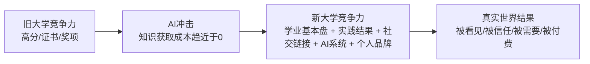
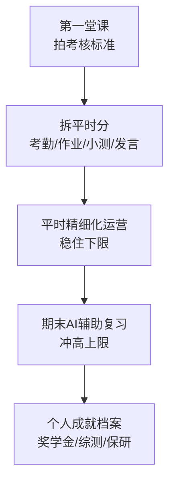
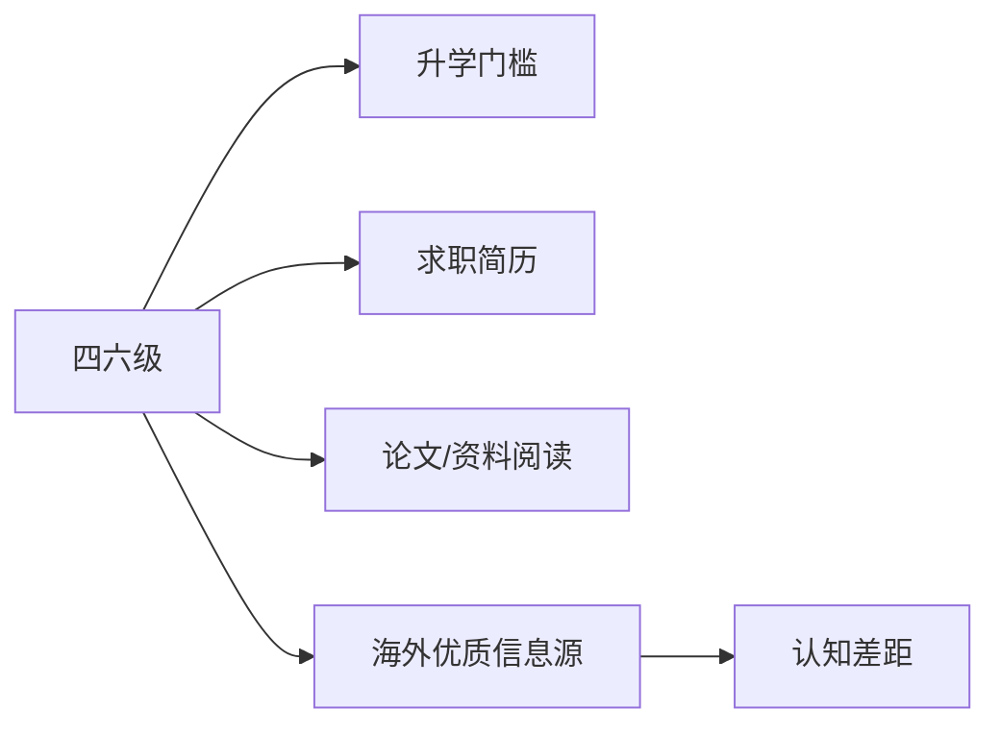
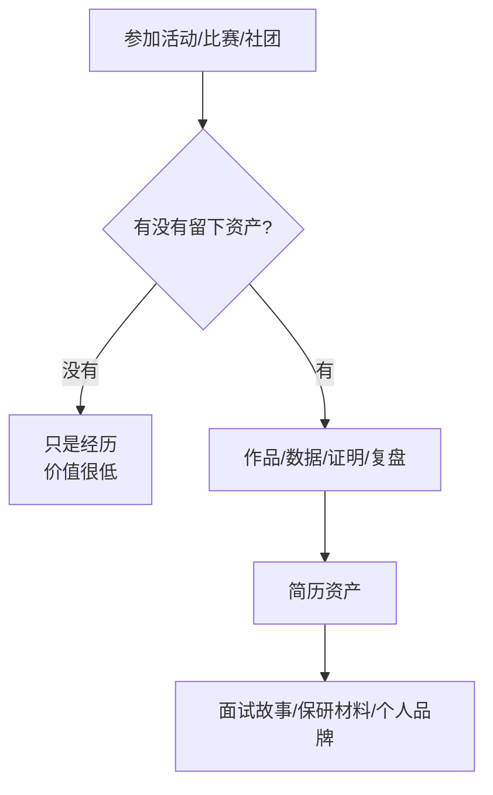
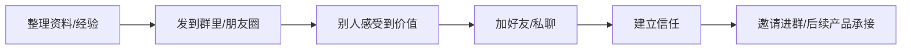
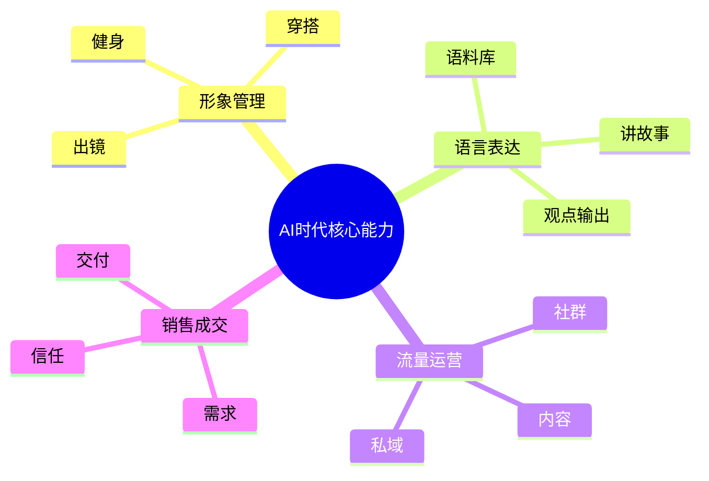
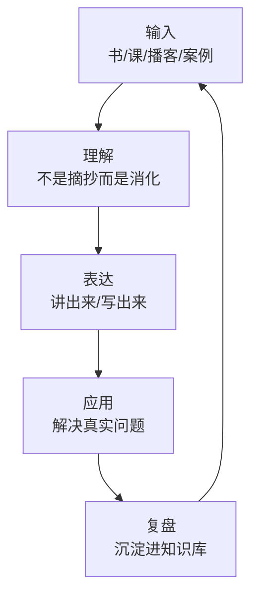
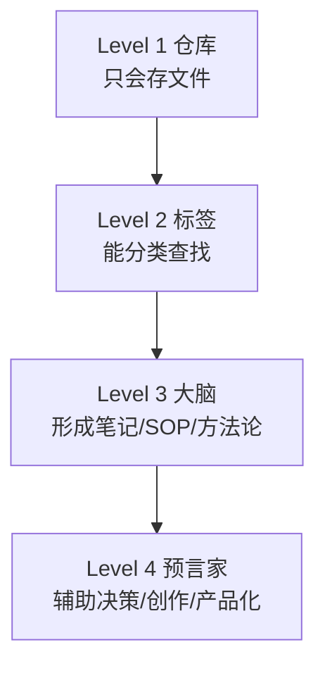
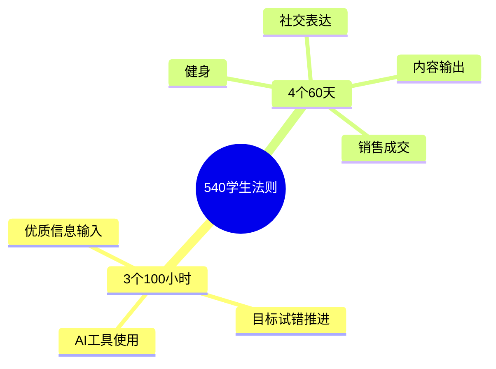
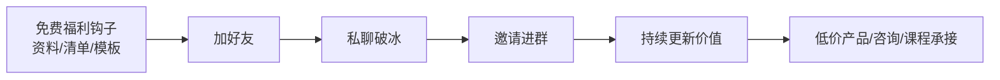

# AI时代大学生竞争力提升手册（融合增强版）

## —— 从广外出发，用AI、学业经营、社交破圈和个人系统，重新设计你的大学

> 作者：林琨奇 / 林kunki  
> 广外国贸大三｜专业第一｜SCI二区一作｜国家奖学金｜亚太AI大赛全国金奖+国际铜奖｜AI一人公司实践者  
> 这是一份写给大学生、准大学生和迷茫年轻人的免费手册。它不是鸡汤，也不是标准答案，而是我从“小镇做题家/优绩主义者”一路走到AI商业实践后，对大学四年、学业竞争力、社交破圈、AI系统和个人成长的一次完整复盘。

---

## 目录

1. 认知破局：AI时代，大学生到底靠什么竞争？
2. 学业经营：高绩点、奖学金和期末考试不是靠蛮力
3. 英语与四六级：大学生最稳的基础杠杆
4. 竞赛、社团与实践：怎么把大学经历变成简历资产
5. 社交破圈：大学最被低估的高性价比能力
6. 四种核心能力：形象管理、语言表达、流量运营、销售成交
7. AI时代的学习方式：不是背知识，而是训练大脑
8. AI知识库与第二大脑：为什么每个大学生都该搭系统
9. 分年级行动指南：大一到大四怎么走少弯路
10. 540学生法则：一套大学生成长训练地图
11. 写在最后：我为什么做这份资料
12. 附录：私域裂变与福利钩子设计

---

## 一、认知破局：AI时代，大学生到底靠什么竞争？

我相信看到这篇手册的你，或多或少都有过这样的迷茫：

每天早八起，晚十回，泡在图书馆十几个小时，看起来非常努力，可是一到考试，绩点还是不如那些看起来没那么努力的同学。

身边的人都在考证，你也跟着考，计算机二级、教师资格证、四六级，简历上写了满满一页，可是真到找实习的时候，HR扫了一眼就问：你还有什么真正能证明能力的实践经历吗？

学长学姐都在说卷保研、卷考研，你也跟着加入大军，每天早出晚归泡自习室，可是你静下来问自己：我到底为什么要考研？我真的知道研究生毕业后要干什么吗？

其实不止你一个人这样。

我刚进广外的时候，也陷入过这种“无效努力”的陷阱。

我高考失利，进入广外，一个双非一本；父母是比较传统的公务员家庭，我自己也是很典型的小镇做题家、优绩主义者。那个时候我非常相信一件事：只要我足够努力，只要我把成绩卷到极致，我就能证明自己。

所以前两年多，我确实把学校里的结果几乎拿了个遍：

- 专业排名第1；
- 绩点接近满绩；
- 拿到国家奖学金；
- 发表SCI二区论文；
- 拿到亚太AI大赛全国金奖和国际铜奖；
- 各种校内奖项、竞赛、综测结果也基本都拿过。

这些东西有没有用？当然有用。

它们给了我学历跳板、简历背书，也让我在很多场合里有一个不错的开局。

但当我真正开始接触AI、接触商业、接触线下资源、接触老板和真实市场之后，我越来越强烈地发现：

> 校内结果只能证明你在旧规则里很会考试，但它不能直接证明你能在真实世界里创造价值。

你会发现，绩点不会自动变成收入，奖学金不会自动变成商业机会，证书也不会自动帮你链接到更好的人。

AI时代的规则已经变了。

你能记住的知识，AI一秒就能检索出来；你能写的基础文章，AI一分钟可以生成十篇；你能做的基础数据分析，AI几秒钟就能帮你处理完。

那大学生到底靠什么竞争？

我现在的答案是：

> 靠“学业基本盘 + 实践结果 + 社交链接 + AI系统 + 个人品牌”的组合能力。

具体来说，有三层变化：

### 1.1 不是知识越多越厉害，而是整合知识解决问题的能力才是核心

以前我们说“知识改变命运”，那是因为信息不对称。你能获取到知识，别人获取不到，所以你就有竞争力。

但是今天，只要你有一部手机，你就能接触到全人类几乎所有的知识。AI还能帮你把这些知识整理得清清楚楚。

所以现在，单纯存储知识已经不值钱了，值钱的是你能不能用这些知识去解决一个具体的问题。

比如同样是学经济学，你能把供需理论用到直播电商选品上，帮商家判断什么产品可能会爆，这就是能力。单纯能背出供需定理，不是能力。

再比如同样是学外语，你能帮企业翻译商业文件，能和外国客户顺畅沟通，能做跨境内容，这就是能力。单纯背了很多单词，但不会用，也很难形成竞争力。

所以从大一开始，你就要养成一个习惯：

> 学到一个新知识点，多问一句：这个知识点能解决什么问题？能用在哪里？能不能变成一个作品、一次表达、一个方案、一个产品？

### 1.2 不要用战术上的勤奋掩盖战略上的懒惰

这句话我真的感触很深。

很多同学大学四年非常努力，每天忙忙碌碌，但从来没有停下来想：我现在做的这件事，到底对我的未来有没有帮助？我到底想走哪条赛道？

我见过太多同学，为了一点点综测加分，参加一堆意义不大的活动，把自己搞得很累，但真正应该花时间提高的能力没有练好。最后奖学金没拿到，找工作也没什么拿得出手的东西。

也有很多同学，看到身边的人都考研，自己也跟着考，根本没想清楚自己为什么考研，也不知道研究生毕业后想做什么。

选对赛道，真的比盲目努力重要很多。

如果你现在没有目标，也完全正常。年轻人最大的优势就是年轻，时间多，试错成本低。那你就大胆试错，去参加活动，去做项目，去实习，去做内容，去学AI，去认识人，去看看外面的世界。

但你不能一直不思考。

你要不断问自己：我到底喜欢什么？我擅长什么？市场需要什么？我能不能把我的兴趣变成技能、产品或市场上可流通的价值？

### 1.3 AI不是你的敌人，而是你最好的协作伙伴

很多同学现在一提到AI就焦虑，说AI会不会抢走我的工作。

我的判断是：真正会被AI淘汰的，不是人，而是那些不会用AI提升效率、只会做重复劳动的人。

我自己就深有体会。

大二下学期，我同时选了11门课，平时大部分时间花在AI项目探索上，分给复习的时间很少。最后期末复习，我用AI辅助突击，把每门课的复习时间压缩到了3-9小时，最后10门课都是满绩4.0。

如果不靠AI，我很难做到这个结果。

所以我的观点是：早点拥抱AI，学会用AI帮你干活，你就能在大学就领先同龄人一大截。

但我也要提醒你：AI不是替你活，AI是放大你。

你有什么样的目标、判断、输入、行动和业务，AI就放大什么。如果你自己没有方向，没有积累，没有实践，AI也很难凭空帮你逆天改命。

---

## 二、学业经营：高绩点、奖学金和期末考试不是靠蛮力

很多同学一提到提高绩点，第一反应就是：“我要更努力学习，每天泡图书馆。”

但其实，在大学评分体系下，方法比蛮力重要。

我总结一句话：

> 平时分决定你的下限，期末分决定你的上限。

只要你把学业当成一个系统来运营，而不是靠情绪和临时抱佛脚，你完全可以用更低成本拿到更高结果。

### 2.1 第一堂课，就决定这门课的成绩

绝大多数同学都忽略了第一堂课的重要性。

大家第一堂课要么迟到，要么坐在下面玩手机，等着老师点完名就走人。

但实际上，第一堂课是整个学期的“战略说明会”。老师会讲这门课的考核标准，平时分怎么算，期末占比多少，考试重点是什么。

所以我的做法是：

- 第一堂课尽量提前到，坐前排；
- 老师讲考核标准时，把PPT拍下来；
- 如果允许，就录音；
- 课后把平时分构成拆出来；
- 搞清楚这门课到底怎么拿分。

比如一门课平时分构成是：考勤20%、作业30%、小测20%、课堂参与30%。那你就知道，每个部分都不能丢，尤其是占比高的部分要重点拿。

很多人一学期上完了，还不知道这门课平时分怎么算，你说他怎么稳定拿高分？

### 2.2 平时分是最稳的提分抓手

很多大学课程平时分占比很高。也就是说，就算期末考得一般，只要平时分拿满，总成绩也不会低。反过来，如果平时分丢太多，期末就算很努力，也不一定拉得回来。

平时分怎么运营？

**第一，考勤尽量别丢。**

考勤是基础分。一次不到可能就是几分，积累下来可能就差0.1绩点。很多时候，最后奖学金、排名、保研资格，差的就是这一点点。

**第二，每一次作业都要高质量准时完成。**

不要拖到截止前随便写，也不要抄学长学姐。老师一天改几十份作业，大部分都排版混乱、逻辑一般。如果你排版清晰、结构完整、格式规范，老师天然更愿意给高分。

**第三，小测提前准备。**

很多课程的小测是拉开平时分差距的关键。提前一周复习，把重点知识点过一遍，投入不大，但收益很高。

**第四，课堂参与度要主动拿。**

有些老师会把课堂发言算进平时分。你不需要每节课都发言，一学期有5-6次高质量发言，就足够让老师记住你。

不要怕说错。很多时候，老师奖励的是你的参与意识，不是你的完美答案。

### 2.3 期末复习：用AI做超级外挂，但别完全依赖

AI在复习中能帮你做很多事：

1. **解释抽象知识点**：比如博弈论、计量经济学、宏观模型，你可以让AI用生活例子讲一遍；
2. **梳理课程框架**：把目录、课件、重点发给AI，让它帮你整理知识脉络；
3. **生成模拟题**：根据重点出题，让你提前演练；
4. **压缩复习材料**：把长课件提炼成考前速记版；
5. **查漏补缺**：把你不会的点整理成清单，逐个突破。

但我必须提醒：AI生成内容不一定完全正确。考试是你自己去考，错了还是你丢分。所以AI负责提效，你负责判断和核查。

### 2.4 期末复习的几个实用技巧

**第一，紧跟老师划的重点。**

大学很多课程，期末难度没有你想象中那么高，考的基本都是老师上课强调过的内容。不要自己乱扩展，先把老师重点吃透。

**第二，用好信息差。**

如果你的任课老师没划重点，你可以问其他班同一个老师的同学，看看有没有透漏考试范围。信息共享很多时候比你一个人瞎复习有效。

**第三，优先复习高学分课程。**

4学分课程和1学分课程，对绩点影响完全不一样。复习时间要优先给高学分核心课，性价比最高。

**第四，不同课程用不同方法。**

思政类课程：题库+大题范围+理解性记忆。  
专业核心课：概念逻辑+模型理解+题目训练。  
展示型课程：选题、PPT、表达、团队分工最重要。  
论文型课程：结构、引用、格式、问题意识最重要。

### 2.5 奖学金冲刺：建立个人成就档案

奖学金不只是看绩点，很多时候还看综测、竞赛、活动和材料完整度。

我建议你从学期初就建立一个“个人成就档案”。

里面放：

- 获奖证书；
- 竞赛报名和获奖截图；
- 活动证明；
- 志愿服务证明；
- 论文、项目、实习证明；
- 综测加分政策；
- 每个奖项对应的加分说明。

很多同学到学期末才开始找材料，手忙脚乱，还容易遗漏。你平时随手存，最后申报的时候就非常从容。

参加比赛也要有策略。不是所有比赛都值得参加。你要先看学校综测政策，哪些比赛能加分、加多少、含金量如何，再决定投入精力。

一句话：

> 绩点是底线，材料是杠杆，规则意识是放大器。

---

## 三、英语与四六级：大学生最稳的基础杠杆

英语对大学生来说，仍然是非常重要的基础能力。

它不一定直接决定你的人生上限，但它经常决定你有没有资格进入一些机会。

保研、考研、留学、外企、互联网大厂、商赛、论文、海外信息源，很多场景都绕不开英语。

### 3.1 四六级越早过越好，分数越高越好

大一如果能考四级，就尽早准备；四级过了以后，尽快准备六级。

不要等到大三大四才补，因为那个时候你会有更多重要任务：实习、保研、考研、毕业论文、项目、就业。

四六级最重要的是：持续低成本积累。

你不需要每天学五六个小时，但你可以每天做一点：

- 背30-50个单词；
- 精听一小段听力；
- 精读一篇英语文章；
- 每周做一套真题；
- 把作文模板和翻译表达整理成自己的语料库。

### 3.2 英语不是为了考试，而是为了打开信息源

很多人学英语只为了过线，这很可惜。

AI时代，英语仍然重要，因为大量高质量信息、论文、产品文档、海外案例、商业趋势，最早都是英文世界出现。

如果你英语够好，你能更快接触一手资料，而不是只看别人二手解读。

所以四六级只是最低门槛，更重要的是把英语变成你获取优质信息的工具。

---

## 四、竞赛、社团与实践：怎么把大学经历变成简历资产

大学里光学习好还不够，你一定要多实践。

但实践不是乱参加活动，而是有策略地积累能证明能力的结果。

### 4.1 两类核心竞赛：创赛和商赛

大学常见比赛大概可以分成两类。

**第一类：创新创业型比赛。**

比如中国国际大学生创新大赛、挑战杯、大创计划等。

这类比赛更适合想保研、评奖、积累项目经历的同学。它强调原创性、落地性、商业计划书、团队协作和路演表达。

如果你目标是升学、综测、奖学金，这类比赛值得重点关注。

**第二类：企业商业化比赛。**

比如欧莱雅Brandstorm、雀巢CEO挑战赛、LVMH商赛、快消/咨询/品牌类商业挑战赛等。

这类比赛更贴近就业，强调真实企业问题、市场调研、商业洞察、创意方案和PPT表达。

如果你目标是就业、快消、咨询、市场、商业分析，这类比赛含金量很高。

### 4.2 备赛的关键不是“努力”，而是团队配置

一个好的比赛团队，至少要有几类角色：

- 统筹型：负责节奏、分工、推进；
- 内容型：负责逻辑、方案、文案；
- 数据型：负责调研、分析、模型；
- 设计型：负责PPT、美观、视觉；
- 表达型：负责路演、答辩、现场表现。

很多团队失败，不是因为成员不努力，而是因为大家能力重叠、分工混乱、没人统筹。

所以找队友时，不要只找熟人，要找能力互补的人。

### 4.3 备赛三个阶段

**第一阶段：前期构思。**

收集灵感，确定主题，明确问题，画出商业模式或解决方案框架。

**第二阶段：方案完善。**

借鉴优秀案例，用AI辅助调研和润色，但核心观点必须自己判断。方案一定要落地，不要自嗨。

**第三阶段：路演打磨。**

不断模拟答辩，找老师、学长学姐、同学提意见。很多比赛最后拼的不是方案本身，而是表达和呈现。

### 4.4 社团不是越多越好，而是要能产出经历

大一很多人会加很多社团，最后每个都浅尝辄止，非常累，也没留下什么。

我的建议是：

- 加1-2个真正感兴趣的组织；
- 尽量争取一个具体岗位；
- 做出一个可以写进简历的项目；
- 留下作品、数据、截图、证明。

比如你在社团里做了一场活动策划，那你要留下：策划案、海报、现场照片、参与人数、数据反馈、个人贡献。

这样社团经历才不是一句“参加某社团”，而是一个可展示的实践项目。

### 4.5 学校资源一定要用，不用就浪费了

很多学校都提供大量免费资源，但很多同学四年都不知道。

你可以重点关注：

1. **图书馆数据库**：知网、Web of Science、行业报告；
2. **教材借阅和图书荐购**：省钱，也方便学习；
3. **实习绿色通道**：学院、老师、校友发布的岗位；
4. **企业校园大使计划**：宝洁、欧莱雅、字节、咨询、快消等；
5. **留学/交换项目**：奖学金、资助、海外交流机会；
6. **教育优惠**：数码产品、软件、交通、景区；
7. **奖学金和科研奖励**：别只看金额，它们也是简历背书；
8. **校友网络**：很多校友愿意帮学弟学妹，关键看你会不会主动。

大学资源很多，问题是你有没有主动搜索、主动链接、主动使用。

---

## 五、社交破圈：大学最被低估的高性价比能力

我现在越来越觉得，大学里最被低估的一件事，就是社交。

这里的社交，不是每天出去吃喝玩乐，也不是无意义混圈子，而是：

> 带着目的认识人，真诚建立关系，在不同场景里训练表达、链接和资源整合能力。

很多同学大学四年就活在“宿舍—教室—食堂—图书馆”的循环里。看起来安全，也很努力，但其实错过了大学最宝贵的东西：低成本认识人的机会。

在大学里，你可以认识：

- 本专业成绩很好的学长学姐；
- 已经拿到大厂实习的同学；
- 做竞赛很强的队友；
- 社团里表达能力强的人；
- 不同学院、不同专业、有不同资源的人；
- 已经开始做副业、做项目、做内容、做创业尝试的人。

这些链接，很多时候比你多上一门水课更有价值。

因为真实世界里，机会往往不是从课本里掉出来的，而是从关系、信息差和行动中长出来的。

### 5.1 社交的核心不是索取，而是先给价值

你想认识别人，不要一上来就问：“学长，能不能给我一份资料？”

更好的方式是：你先提供一点小价值。

比如：

- 整理一份四六级笔记；
- 整理一份期末复习资料；
- 整理一份实习信息渠道；
- 整理一份AI工具清单；
- 整理一份选课避坑指南；
- 整理一次讲座/活动复盘。

当你开始持续给别人提供价值，别人自然会记住你。

这就是大学生最适合的低成本个人品牌起点。

### 5.2 主动链接，不要等别人发现你

你可以从很小的动作开始：

1. 主动加一个优秀学长学姐，问他一门课怎么学；
2. 主动找高绩点同学聊聊复习方法；
3. 主动约一个做实习的同学喝咖啡；
4. 主动参加一次跨学院活动；
5. 主动在群里分享一次资料或经验；
6. 主动把你整理好的笔记发给需要的人。

很多人不是没有机会，而是不敢主动。

但你会发现，只要你真诚、有礼貌、带着具体问题，大多数人其实愿意帮你。

---

## 六、四种核心能力：形象管理、语言表达、流量运营、销售成交

如果让我把AI时代大学生最应该练的能力高度压缩，我会说是四个：

> 形象管理、语言表达、流量运营、销售成交。

这四种能力，甚至比很多传统意义上的硬技能更重要。

### 6.1 形象管理：现实中的你，就是IP的第一张名片

形象管理不是肤浅，也不是虚荣。

它本质上是提高你在线下世界里的信任效率。

你去见学长学姐，参加活动，面试，谈合作，做短视频出镜，别人第一眼看到的不是你的绩点，而是你的状态。

你的体态、穿搭、皮肤、发型、眼神、表达气场，都会影响别人对你的第一判断。

所以健身、穿搭、护肤、发型、镜头表现力，不是可有可无的小事。

它们会直接影响你的社交、自信、表达和商业信任。

### 6.2 语言表达：真实场景里，不能一边聊天一边问AI

AI可以帮你写稿，可以帮你查资料，可以帮你生成PPT。

但在真实聊天、饭局、面试、活动、合作沟通的场景里，你不可能一边和别人聊天，一边说：“等一下，我问一下AI。”

真实世界考验的是即时表达能力。

你脑子里有没有概念？有没有案例？有没有故事？有没有观点？有没有语料库？

所以你要多读、多听、多看、多讲，把知识变成自己能说出来的东西。

知识只有变成你能讲出来、用出来、连接出来的东西，才真正属于你。

### 6.3 流量运营：不会被看见，再强也容易被埋没

在AI时代，每个人都应该理解一点流量。

不一定每个人都要做网红，但每个人都应该有一点“被看见”的能力。

你会写朋友圈、会做短视频、会整理资料、会写公众号、会搭建社群、会运营私域，这些本质上都是流量运营能力。

为什么它重要？

因为未来很多机会，都会优先给那些能被看见、能持续输出、能建立信任的人。

你可以从很小的事情开始：

- 在朋友圈分享真实学习复盘；
- 在社群里发一份有用资料；
- 在小红书/视频号记录成长；
- 把一个复杂工具讲得普通人能听懂；
- 建一个小群，持续给一类人提供帮助。

流量不是玄学，它的底层是：你能不能持续提供别人想要的价值。

### 6.4 销售成交：能把价值换成钱，是成年人必须学会的能力

很多大学生对“销售”有偏见，觉得销售就是忽悠、割韭菜、骗人。

但真正好的销售不是骗人，而是：

> 理解别人的需求，把合适的解决方案交付给真正需要的人。

如果你未来要就业，你也要“销售”自己，让面试官相信你值得这个岗位。

如果你未来要自由职业，你要让客户相信你能解决问题。

如果你未来要创业，你更要让市场为你的价值付费。

销售成交不是商人的专属能力，而是每个想在真实世界拿结果的人都要学的能力。

---

## 七、AI时代的学习方式：不是背知识，而是训练大脑

AI来了以后，很多传统学习方式的价值都在下降。

背概念、抄笔记、刷标准答案、为了考试死记硬背，这些东西AI都可以做得很快。

那我们是不是不用学习了？

恰恰相反。

我们更要学习，但学习的目的变了。

以前学习是为了“记住知识”。

现在学习更重要的是：

> 训练大脑、形成判断、积累语料、理解世界，并且能把知识迁移到真实问题中。

你真正要练的不是“我能不能背出来”，而是：

- 我能不能理解这个概念背后的逻辑？
- 我能不能用自己的话讲出来？
- 我能不能把它用到真实场景里？
- 我能不能和别人讨论时提出自己的观点？
- 我能不能把它变成文章、产品、服务或解决方案？

这就是AI时代的学习。

所以我很反感“假读书”和纯应试。

很多人看起来读了很多书，其实只是做了很多摘抄；看起来学了很多课，其实只是为了完成考核；看起来很努力，其实大脑没有真正被训练。

真正有效的学习，是你找到自己感兴趣、觉得重要的东西，然后深入理解它，最后能在真实场合里大大方方分享你的观点。

这比在试卷上写出标准答案重要得多。

---

## 八、AI知识库与第二大脑：为什么每个大学生都该搭系统

讲到最后，我想把你引到一个更底层的东西：系统。

很多人用AI，只是把它当聊天机器人。

但我现在越来越觉得，AI时代真正值得投资的是：

> 搭建你的个人知识库、语料库、上下文系统，让AI越来越懂你，越来越能放大你。

你可以把它理解成你的“第二大脑”。

它里面可以放：

- 课程资料；
- 读书笔记；
- 复盘；
- 简历和作品；
- 项目资料；
- 社交记录；
- 选题库；
- 产品构思；
- 长期目标；
- 真实经历和表达风格。

### 8.1 知识库的四个阶段

**Level 1：仓库阶段。**

只是往里面塞课件、PDF、资料，不整理，最后变成垃圾场。

**Level 2：标签阶段。**

开始给文件分类和打标签，能快速找到资料。

**Level 3：大脑阶段。**

能把零散信息整理成自己的笔记、SOP、方法论，真正内化。

**Level 4：预言家阶段。**

积累足够多以后，你能用知识库辅助决策、规划和创作，看得比别人更远。

### 8.2 15分钟搭建你的第一个知识库

不要一开始就做大而全。

先从一个小问题开始：

- 管理一门课的资料；
- 管理你的英语学习；
- 管理你的社团项目；
- 管理你的实习求职资料；
- 管理你的读书笔记。

一个简单结构可以是：

- 学习库：课程资料、作业、笔记、参考资料；
- 技能库：PPT、Excel、Python、AI工具、英语；
- 事业库：社团、竞赛、实习、作品集；
- 生活库：健身、穿搭、旅行、消费记录。

每天花5分钟维护，四年下来就是非常宝贵的个人资产。

### 8.3 AI放大的永远是你自己

AI知识库能帮你更快复习考试、更快整理资料、更快生成内容、更快做项目复盘、更快把经验产品化。

但你要记住：

> AI放大的永远是你自己。

你是什么样的人，你有什么样的原能力，你有什么样的业务，你有什么样的思考，AI就会放大什么。

如果你没有输入、没有判断、没有行动、没有真实业务，AI也很难凭空帮你逆天改命。

---

## 九、分年级行动指南：大一到大四怎么走少弯路

### 9.1 大一：适应、探索、社交、打基础

大一不要急着把自己锁死。

你要做的是多试错、多认识人、多建立基础能力。

建议你做这些事：

1. 尽早过四级，顺手准备六级；
2. 学会Excel、PPT、AI工具基础用法；
3. 加入1-2个真正感兴趣的组织，不要乱加太多；
4. 主动认识优秀学长学姐；
5. 搭建一个最简单的个人知识库；
6. 开始在朋友圈或小红书记录自己的成长；
7. 多参加活动，训练表达和社交，不要一直缩在宿舍。

### 9.2 大二：聚焦、实践、拿第一个结果

大二应该开始聚焦。

你可以选择一个主方向：升学、就业、内容、副业、竞赛、科研。

然后拿一个能证明自己的结果。

比如：

- 一次高质量竞赛；
- 一份实习；
- 一个内容账号；
- 一个小项目；
- 一份高绩点成绩单；
- 一个能帮到别人的资料产品。

大二是开始拉开差距的一年。

### 9.3 大三：深化、破圈、跑真实闭环

大三是非常关键的一年。

你要开始问自己：我到底能不能在真实世界里创造价值？

如果你走升学，就把学历跳板稳住；如果你走就业，就冲实习和offer；如果你走创业/副业，就尽快拿到第一个付费用户。

不要再只停留在校园舒适圈。

你要往外走，去见真实的人，真实的项目，真实的市场。

### 9.4 大四：收尾、沉淀、进入下一阶段

大四最重要的是把大学四年沉淀成资产。

你的简历、作品集、知识库、社交关系、内容账号、项目经验，都应该被整理出来。

不要毕业时只带走一张毕业证。

你应该带走一套属于自己的系统。

---

## 十、540学生法则：一套大学生成长训练地图

我把自己这几年走过的路，压缩成一个方法论：540学生法则。

540，就是3个100小时 + 4个60天。

### 10.1 3个100小时：搭系统

**第一个100小时：AI工具使用。**

不要只收藏工具清单，要真刀真枪用AI解决问题。用AI写作、复习、做PPT、整理资料、分析数据、搭建知识库、做工作流。

**第二个100小时：目标试错与推进。**

集中打穿一个目标。比如高绩点、实习、内容号、AI项目、竞赛、个人网站、知识库系统。不要永远停留在想法层。

**第三个100小时：优质信息输入。**

持续输入高质量内容，包括书、播客、行业报告、优秀创作者、真实案例、线下交流。停止输入，就是停止进化。

### 10.2 4个60天：练能力

**60天健身：练形象管理和自律。**

身体状态会影响你的气场、表达、自信和精力。

**60天社交表达：练链接和破冰。**

主动认识人，主动表达观点，主动交换资源。

**60天内容输出：练流量和表达。**

朋友圈、公众号、视频号、小红书都可以。重点不是一开始就爆，而是形成持续输出的肌肉。

**60天销售成交：练需求洞察和商业闭环。**

从一次小额付费开始，理解别人为什么愿意为你付钱。

这套法则的本质不是让你更卷，而是让你从“只会考试的人”，升级成“能在真实世界拿结果的人”。

---

## 十一、写在最后：我为什么做这份资料

我做这份资料，不是因为我已经多成功。

恰恰相反，是因为我知道迷茫是什么感觉。

我也经历过高考失利、优绩主义、校园内卷、自我怀疑、路径焦虑，也曾经以为只要拿到校内结果就够了。

但当我开始接触AI、接触商业、接触更大的圈子之后，我才发现外面的世界真的很大。

有很多人比你更早理解规则，比你更早进入市场，比你更早训练表达、社交、销售和系统能力。

这会让人自卑，也会让人焦虑。

但最后我还是想说：继续往前走。

你只有进入新的环境，认识新的人，做新的事情，才会真正成长。

我希望这份手册能帮你少走一点弯路，早点意识到：

- 大学不是只有绩点；
- AI不是洪水猛兽；
- 社交不是浪费时间；
- 赚钱不是羞耻的事；
- 做内容不是网红专属；
- 搭系统不是老板才需要；
- 你完全可以从一个普通学生，慢慢长成一个能被市场需要的人。

如果你看完这份资料，想继续交流这些方向：

- 如何用AI提升学习效率；
- 如何搭建个人AI知识库；
- 如何做大学生个人品牌；
- 如何从0开始尝试副业和变现；
- 如何用540学生法则重新设计大学；

欢迎来找我。

我会持续在社群里更新AI工具、学习资料、大学成长方法、实习求职资源、个人系统搭建经验，也会把我自己正在做的一人公司实践持续拆给你看。

最后，祝你在AI时代，不只是成为一个更会考试的人，而是成为一个更有系统、更会表达、更能链接、更能创造价值的人。

---

## 十二、附录：私域裂变与福利钩子设计

这份手册后续可以作为私域加好友/拉群的第一份免费资料，但建议和以下钩子组合使用。

### 12.1 面向校内大学生的福利钩子

**学业钩子：**

- 英语四六级笔记；
- 期末复习资料；
- AI复习提示词；
- 高绩点运营方法；
- 选课/老师/考试经验整理。

**求职钩子：**

- 简历模板；
- 实习信息渠道；
- 面试经验整理；
- 企业校园大使信息；
- 商赛/竞赛时间表。

**副业钩子：**

- 大学生赚零花钱项目清单；
- AI工具变现案例；
- 资料整理/笔记产品/社群运营小闭环；
- 9.9元低价资料包。

### 12.2 私域裂变动作建议

1. 先发一条朋友圈，说明接下来会在社群持续更新什么；
2. 同步在学业群、吃啥群、AI实战营私域做轻宣发；
3. 加好友时不要硬卖，先发资料建立信任；
4. 聊得来的同学再邀请进群；
5. 9.9资料包可以测试“报销/返现/拉新奖励”机制；
6. 私域AI群要优化群公告、群福利和入群欢迎语，降低新人的理解成本。

### 12.3 可直接使用的社群定位

这个群不是单纯发广告的群，而是一个面向大学生和年轻人的AI成长资料群。

群里会持续更新：

- AI工具和实用教程；
- 四六级/期末/学习资料；
- 实习求职和竞赛信息；
- 大学生副业和赚零花钱方法；
- 个人知识库搭建方法；
- 林kunki自己从校园到AI商业实践的一线复盘。

核心承诺：不灌鸡汤，不割韭菜，只分享真实用过、验证过、能帮大家少走弯路的东西。
