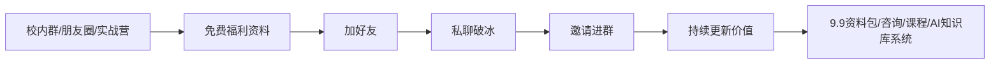

# 大学生福利钩子包使用说明

> 用途：配合《AI时代大学生竞争力提升手册》做加好友、拉群、朋友圈宣发、社群留存和低价产品承接。  
> 定位：先给价值，再建信任，最后自然承接产品，而不是一上来硬卖。

---

## 一、这套福利钩子包解决什么问题？

林总接下来要做的核心事情，不是单纯“发资料”，而是建立一套私域流量的承接系统：

大学生愿意加你，不是因为你说自己很厉害，而是因为他立刻感受到：

- 你有资料；
- 你懂他的痛点；
- 你真的能帮他少走弯路；
- 你不是上来割韭菜；
- 你后续还有持续价值。

---

## 二、福利钩子的分层设计

| 层级 | 文档/资料 | 对应人群 | 作用 |
|---|---|---|---|
| 免费破冰 | 四六级笔记、期末复习资料、AI复习提示词 | 校内大学生 | 加好友、建立第一印象 |
| 信任增强 | 高绩点运营方法、选课考试经验模板 | 想拿成绩/奖学金的人 | 证明你有结果和方法 |
| 求职承接 | 简历模板、实习渠道、面试经验 | 大二大三大四 | 拓展到就业需求 |
| 竞赛承接 | 商赛/竞赛时间表、团队分工模板 | 想丰富简历的人 | 形成项目型链接 |
| 副业承接 | 赚零花钱清单、AI变现案例 | 想赚钱的人 | 引出9.9资料包/训练营 |
| 社群留存 | 群公告、入群欢迎语、福利地图 | 已进群用户 | 提高留存和转化 |

---

## 三、推荐发放顺序

### 第一步：朋友圈预热

发一条朋友圈，告诉大家：

> 我后面会在一个小群里持续更新：AI工具、四六级/期末资料、实习求职资源、大学生副业思路、个人知识库搭建方法。想进的可以私我。

### 第二步：群内轻宣发

在学业群、吃啥群、实战营群里，不要硬广。可以这样说：

> 我最近整理了一份大学生AI时代竞争力提升手册，里面包括高绩点、四六级、竞赛、实习、AI工具和副业思路。需要的同学可以加我，我发你。

### 第三步：加好友后发第一份资料

先发《AI时代大学生竞争力提升手册》，再根据对方需求补发：

- 想考四六级 → 发四六级笔记；
- 快期末 → 发期末复习资料；
- 想找实习 → 发实习渠道和简历模板；
- 想赚钱 → 发赚零花钱清单；
- 对AI感兴趣 → 发AI工具变现案例。

### 第四步：邀请进群

私聊不要直接甩群链接。建议先问：

> 我后面会在一个小群里持续更新这些资料和AI工具，你要不要也进来？不刷屏，主要发干货。

### 第五步：低价产品承接

当群里持续有价值后，可以推出：

- 9.9元资料包；
- 19.9元AI工具包；
- 低价咨询；
- AI知识库搭建体验课；
- 后续六月中旬课程。

---

## 四、核心原则

1. **先价值，后转化**：先让别人觉得你有用，再谈产品。
2. **先免费，后低价，再高价**：不要一上来卖贵东西。
3. **先轻连接，后强关系**：加好友只是开始，持续更新才是关键。
4. **先真实，后包装**：大学生对“割韭菜”很敏感，表达要真诚。
5. **先小闭环，后规模化**：先跑通几十个人，再考虑大规模裂变。

---

## 五、建议文件命名和发放话术

| 场景 | 推荐发放 | 话术 |
|---|---|---|
| 加新同学 | 手册+四六级笔记 | “这个是我整理的一份大学生AI成长手册，还有四六级资料，先发你看看。” |
| 期末前 | 期末复习资料+AI提示词 | “这个适合期末突击，用AI辅助整理重点会快很多。” |
| 大二大三 | 简历模板+实习渠道 | “如果你最近想找实习，这两个可以先用起来。” |
| 想副业 | 赚零花钱清单+AI案例 | “这里面都是低成本试错，不建议一上来投钱。” |
| 进群后 | 群公告+福利地图 | “群里主要发这些东西，你可以按需看。” |
