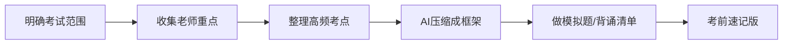

# 期末复习资料整理SOP

> 适用场景：期末周、补考、考前突击、资料共享。  
> 核心目标：用最短时间整理出“能直接复习、能分享、能建立信任”的期末资料。

---

## 一、期末复习的底层逻辑

期末复习不是“把整本书看完”，而是：



你要抓住三个关键词：

1. **范围**：考什么，不考什么；
2. **重点**：老师反复强调什么；
3. **题型**：选择、判断、简答、论述、计算、案例分析分别怎么准备。

---

## 二、资料收集清单

| 资料类型 | 来源 | 重要程度 |
|---|---|---|
| 老师PPT | 课堂/学习通/群文件 | 极高 |
| 老师划重点 | 课堂录音/同学笔记 | 极高 |
| 往年题 | 学长学姐/资料群 | 高 |
| 作业和小测 | 平时作业/测试 | 高 |
| 教材目录 | 课本 | 中 |
| 同班同学笔记 | 互换 | 中 |
| AI总结 | 自己生成 | 辅助 |

---

## 三、期末资料整理模板

每门课建议整理成以下结构：

```text
课程名称：
考试时间：
考试地点：
考试形式：闭卷/开卷/论文/展示
题型：
分值分布：
老师划重点：
必背概念：
必会题型：
高频大题：
易错点：
考前一天速记：
```

---

## 四、不同课程复习方法

| 课程类型 | 复习重点 | 推荐方法 |
|---|---|---|
| 思政/通识课 | 大题、概念、时政结合 | 背框架+关键词，不死背全文 |
| 专业理论课 | 核心概念、模型、逻辑 | 画知识框架，理解后复述 |
| 数学/计量/财务 | 题型和步骤 | 刷典型题，整理公式 |
| 案例分析课 | 理论应用 | 准备案例模板和分析框架 |
| 论文/展示课 | 结构和表达 | 提前打磨PPT和讲稿 |

---

## 五、AI整理期末资料提示词

### 1. PPT压缩成复习框架

```text
我会上传一门课的PPT内容。请你帮我整理成期末复习框架，要求包括：章节逻辑、核心概念、可能考点、适合简答题的表述、适合论述题的框架。
```

### 2. 根据老师重点生成背诵清单

```text
以下是老师划的期末重点，请你帮我整理成考前背诵清单。要求按重要程度排序，并区分“必须背”“理解即可”“可能出选择题”。
```

### 3. 生成模拟题

```text
请你根据以下课程重点，生成一套期末模拟题，包括选择题、判断题、简答题和论述题，并附参考答案。题目要贴近大学期末考试风格。
```

### 4. 生成考前一页纸

```text
请你把下面这门课的复习资料压缩成“考前一页纸速记版”，只保留最关键的概念、公式、框架和易错点。
```

---

## 六、资料分享话术

如果你想通过期末资料加好友或拉群，可以这样说：

> 我最近把这门课的期末重点整理了一版，包括老师划重点、必背概念、AI压缩框架和考前速记。需要的同学可以加我，我发你。

或者：

> 后面我会在群里持续更新期末资料、AI复习提示词和四六级资料，需要的话可以进群自取。

---

## 七、注意事项

1. 不要传播明显侵权或违规材料；
2. 不要承诺“包过”，只能说辅助复习；
3. 分享资料时可以顺便建立个人品牌，但不要太功利；
4. 资料越清晰、越结构化，越容易建立信任；
5. 每次整理完资料，都存进自己的知识库，未来可以复用。
