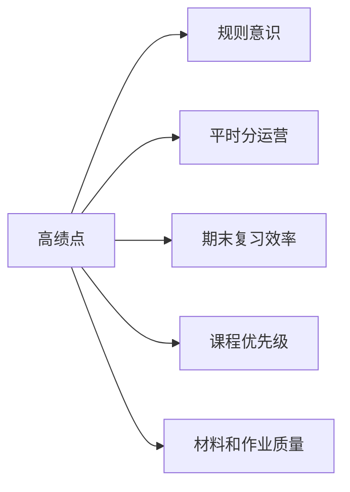

# 高绩点运营方法清单

> 核心观点：高绩点不是单纯靠努力，而是靠规则意识、平时分运营、期末策略和复盘系统。

---

## 一、高绩点公式



| 模块 | 占比感知 | 核心动作 |
|---|---|---|
| 规则意识 | 极高 | 第一堂课记录考核方式 |
| 平时分 | 极高 | 考勤、作业、小测、发言不丢 |
| 期末 | 高 | 老师重点+AI辅助+模拟题 |
| 课程优先级 | 高 | 高学分课程优先投入 |
| 作业质量 | 中高 | 排版、逻辑、提前提交 |

---

## 二、第一堂课必做清单

每门课第一堂课结束后，填这个表：

| 项目 | 内容 |
|---|---|
| 课程名称 |  |
| 老师姓名 |  |
| 平时分占比 |  |
| 期末占比 |  |
| 作业要求 |  |
| 小测/展示 |  |
| 考勤规则 |  |
| 加分机会 |  |
| 老师偏好 |  |
| 备注 |  |

第一堂课就是“战略说明会”。很多同学输，不是输在能力，而是输在一开始就没搞懂规则。

---

## 三、平时分运营清单

### 1. 考勤

- 能不缺就不缺；
- 真有事提前请假；
- 不要在小事上丢基础分；
- 注意老师是否随机点名。

### 2. 作业

高分作业四标准：

| 标准 | 说明 |
|---|---|
| 准时 | 不要卡点交 |
| 完整 | 老师要求的点都覆盖 |
| 清晰 | 标题、分点、排版舒服 |
| 有思考 | 不只是复制粘贴 |

### 3. 课堂发言

不用每节课都发言，但要让老师记住你。

可用句式：

- “老师，我想补充一个例子……”
- “我理解这个概念可以用XX来解释……”
- “这个问题是不是可以从另一个角度看……”

### 4. 小测

小测是低成本拉开差距的机会。提前3-7天准备，比考前一天突击好很多。

---

## 四、期末提分策略

| 时间 | 动作 |
|---|---|
| 考前3周 | 收集资料、确定范围 |
| 考前2周 | 整理框架、刷重点题 |
| 考前1周 | 背诵清单、模拟题 |
| 考前1天 | 一页纸速记、查漏补缺 |

复习优先级：

1. 老师明确划的重点；
2. 作业和小测出现过的题；
3. PPT反复出现的概念；
4. 往年题；
5. 教材边角内容。

---

## 五、奖学金/综测材料系统

建议建立文件夹：

```text
个人成就档案/
├── 01-成绩单与排名/
├── 02-奖学金证明/
├── 03-竞赛证书/
├── 04-活动证明/
├── 05-志愿服务/
├── 06-论文科研/
├── 07-实习实践/
└── 08-综测政策/
```

每次有证书、截图、名单、公示，立刻存进去。

---

## 六、给想拿高绩点同学的一句话

不要只问“怎么更努力”，要问：

> 这门课的得分规则是什么？我怎么用最小成本拿到关键分？

高绩点的本质，是规则意识 + 执行力 + 信息差。
