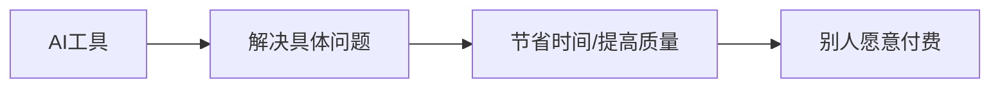

# AI工具变现案例清单

> 适用人群：想用AI提高效率、做副业、做内容或帮别人解决问题的大学生。

---

## 一、AI工具能变现的底层逻辑

AI本身不等于钱，AI解决具体问题才等于钱。

---

## 二、适合大学生的AI变现场景

| 场景 | 用户痛点 | 交付形式 |
|---|---|---|
| AI复习资料 | 期末没时间整理 | 复习框架/模拟题/速记版 |
| AI简历优化 | 不会写经历 | 简历修改+面试话术 |
| AI PPT生成 | 小组作业效率低 | PPT框架+美化建议 |
| AI论文辅助 | 不会找资料/搭框架 | 选题、提纲、文献整理 |
| AI内容创作 | 想做账号不会写 | 选题、脚本、标题 |
| AI知识库搭建 | 文件混乱 | 文件结构+SOP+提示词 |

---

## 三、具体案例

### 案例1：期末AI复习包

用户：同专业同学。  
痛点：PPT太多，不知道重点。  
交付：课程框架、必背概念、模拟题、考前一页纸。  
定价：免费版引流，完整版9.9-19.9。

### 案例2：AI简历修改

用户：找实习同学。  
痛点：经历写得流水账。  
交付：一页简历优化、经历STAR改写、面试自我介绍。  
定价：19.9诊断，49-99修改。

### 案例3：个人知识库搭建

用户：资料很多但管理混乱的同学/职场人。  
痛点：文件找不到，AI不了解自己。  
交付：文件夹结构、标签体系、常用提示词、维护SOP。  
定价：低价体验课 → 高价陪跑。

---

## 四、AI工具推荐

| 需求 | 工具 |
|---|---|
| 文案/总结/复习 | ChatGPT、Claude、DeepSeek、豆包 |
| PPT | Gamma、Canva、Kimi+PPT、WPS AI |
| 知识库 | Obsidian、飞书、多维表、ima、Notion |
| 图像 | 即梦、豆包、Canva |
| 视频 | 剪映、CapCut、闪剪 |

---

## 五、变现提醒

1. 不要包装成“躺赚”；
2. 不要承诺不现实结果；
3. 先帮别人解决一个小问题；
4. 每次交付都要留案例；
5. 案例越多，信任越强。
