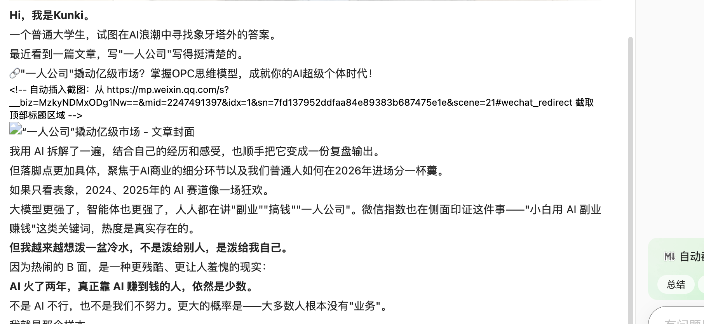

# AI火了两年，为啥大多数人还是没赚到钱？分享一个适用小白的AI商业破局之道

原文链接：https://mp.weixin.qq.com/s/s2IaPPKfIIXjqooqaziEVQ

---

**Hi，我是Kunki。**

一个普通大学生，试图在AI浪潮中寻找象牙塔外的答案。

最近看到一篇文章，写"一人公司"写得挺清楚的。

🔗"一人公司"撬动亿级市场？掌握OPC思维模型，成就你的AI超级个体时代！

<!-- 自动插入截图：从 https://mp.weixin.qq.com/s?__biz=MzkyNDMxODg1Nw==&mid=2247491397&idx=1&sn=7fd137952ddfaa84e89383b687475e1e&scene=21#wechat_redirect 截取顶部标题区域 -->

我用 AI 拆解了一遍，结合自己的经历和感受，也顺手把它变成一份复盘输出。

但落脚点更加具体，聚焦于AI商业的细分环节以及我们普通人如何在2026年进场分一杯羹。

如果只看表象，2024、2025年的 AI 赛道像一场狂欢。

大模型更强了，智能体也更强了，人人都在讲"副业""搞钱""一人公司"。微信指数也在侧面印证这件事——"小白用 AI 副业赚钱"这类关键词，热度是真实存在的。

**但我越来越想泼一盆冷水，不是泼给别人，是泼给我自己。**

因为热闹的 B 面，是一种更残酷、更让人羞愧的现实：

**AI 火了两年，真正靠 AI 赚到钱的人，依然是少数。**

不是 AI 不行，也不是我们不努力。更大的概率是——大多数人根本没有"业务"。

我就是那个样本。

我必须承认一件事：我 2025 年做 AI 自媒体，内容没少更，工具没少试，但变现的数字，远没有我的 GPA 好看。

...（后面内容省略，测试只演示截图插入）
