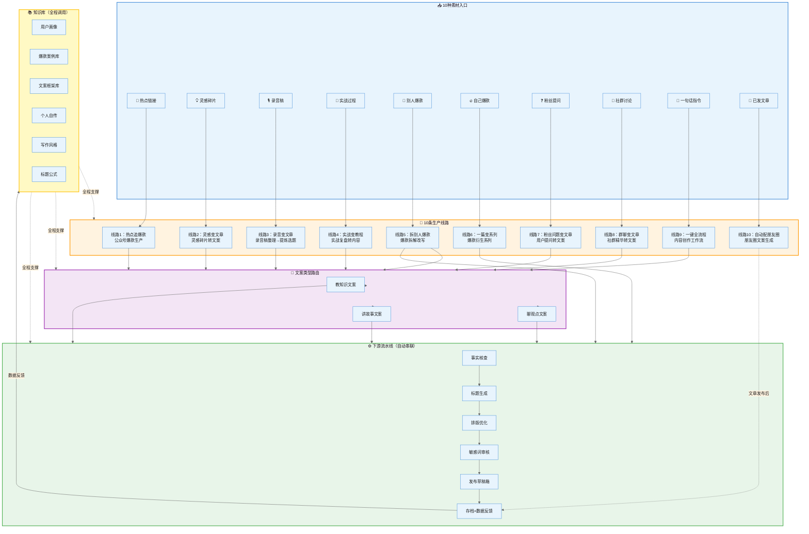

```mermaid
%%{init: {'theme': 'base', 'themeVariables': {'primaryColor': '#E8F4FD', 'primaryTextColor': '#1a1a1a', 'primaryBorderColor': '#4A90D9', 'lineColor': '#666', 'secondaryColor': '#FFF3E0', 'tertiaryColor': '#E8F5E9', 'fontSize': '14px'}}}%%

flowchart TB
    subgraph INPUT["📥 10种素材入口"]
        direction TB
        A1["🔗 热点链接"]
        A2["💡 灵感碎片"]
        A3["🎙️ 录音稿"]
        A4["🔧 实战过程"]
        A5["📄 别人爆款"]
        A6["🔥 自己爆款"]
        A7["❓ 粉丝提问"]
        A8["💬 社群讨论"]
        A9["📝 一句话指令"]
        A10["📱 已发文章"]
    end

    subgraph ROUTE["🔀 10条生产线路"]
        direction TB
        R1["线路1：热点追爆款<br/>公众号爆款生产"]
        R2["线路2：灵感变文章<br/>灵感碎片转文案"]
        R3["线路3：录音变文章<br/>录音稿整理→提炼选题"]
        R4["线路4：实战变教程<br/>实战复盘转内容"]
        R5["线路5：拆别人爆款<br/>爆款拆解改写"]
        R6["线路6：一篇变系列<br/>爆款衍生系列"]
        R7["线路7：粉丝问题变文章<br/>用户提问转文案"]
        R8["线路8：群聊变文章<br/>社群精华转文案"]
        R9["线路9：一键全流程<br/>内容创作工作流"]
        R10["线路10：自动配朋友圈<br/>朋友圈文案生成"]
    end

    subgraph TYPE["🎯 文案类型路由"]
        direction LR
        T1["教知识文案"]
        T2["聊观点文案"]
        T3["讲故事文案"]
    end

    subgraph PIPELINE["⚙️ 下游流水线（自动串联）"]
        direction LR
        P1["事实核查"] --> P2["标题生成"]
        P2 --> P3["排版优化"]
        P3 --> P4["敏感词审核"]
        P4 --> P5["发布草稿箱"]
        P5 --> P6["存档+数据反馈"]
    end

    subgraph KB["📚 知识库（全程调用）"]
        direction LR
        K1["用户画像"]
        K2["爆款案例库"]
        K3["文案框架库"]
        K4["个人自传"]
        K5["写作风格"]
        K6["标题公式"]
    end

    A1 --> R1
    A2 --> R2
    A3 --> R3
    A4 --> R4
    A5 --> R5
    A6 --> R6
    A7 --> R7
    A8 --> R8
    A9 --> R9
    A10 --> R10

    R1 --> TYPE
    R2 --> TYPE
    R3 --> TYPE
    R4 --> TYPE
    R5 --> TYPE
    R7 --> TYPE
    R8 --> TYPE
    R9 --> TYPE

    R5 --> PIPELINE
    R6 --> PIPELINE

    TYPE --> T1 & T2 & T3
    T1 & T2 & T3 --> PIPELINE

    R10 -.->|文章发布后| P6

    KB -.->|全程支撑| ROUTE
    KB -.->|全程支撑| TYPE
    KB -.->|全程支撑| PIPELINE

    P6 -->|数据反馈| KB

    style INPUT fill:#E8F4FD,stroke:#4A90D9,stroke-width:2px
    style ROUTE fill:#FFF3E0,stroke:#FF9800,stroke-width:2px
    style TYPE fill:#F3E5F5,stroke:#9C27B0,stroke-width:2px
    style PIPELINE fill:#E8F5E9,stroke:#4CAF50,stroke-width:2px
    style KB fill:#FFF9C4,stroke:#FFC107,stroke-width:2px
```
