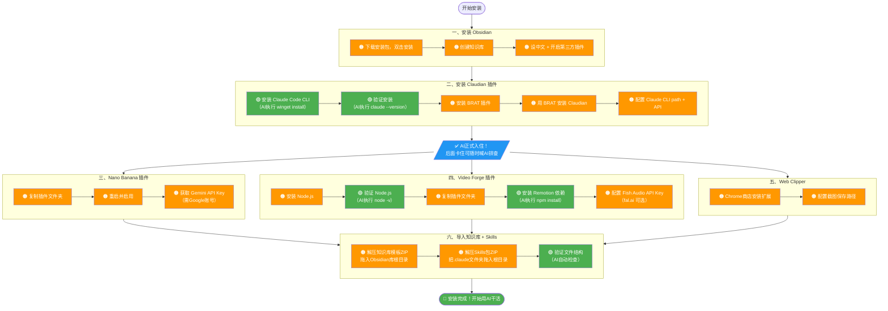

# 安装路径图：哪些AI帮你搞定，哪些需要自己来

> 🟢 绿色 = AI可执行（终端命令/自动排查）
> 🟠 橙色 = 需要你手动操作
> 安装卡住随时说"帮我安装"，AI自动排查

---

## 完整安装流程

---

## 统计

| 类型 | 数量 | 占比 |
|------|------|------|
| 🟠 必须手动 | 17步 | 77% |
| 🟢 AI可执行 | 5步 | 23% |

**安装阶段：AI核心价值 = 遇到报错时自动排查诊断**

**装完之后：写文案、剪视频、发布、数据采集 → AI全自动**

---

## 遇到问题怎么办

安装过程中任何一步卡住了，直接在Claudian聊天框里说：

> "帮我安装"

AI会自动读取安装手册，检测你当前环境，告诉你哪里出了问题、怎么解决。

*版本：v1.1 | 2026年3月7日*
