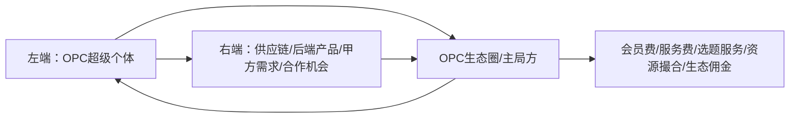

# OPC一人公司选题池重构 v1

> 项目：林总内容创作长期发展项目  
> 日期：2026-05-19  
> 来源：林总口述 + 《OPC一人公司-选题清单(1).docx》 + 初步联网检索  
> 状态：长期选题资产 / 待继续迭代

---

## 1. 林总版 OPC 定义

### 1.1 狭义 OPC：One Person Company，一人公司

OPC，即 One Person Company，一人公司。

在林总当前内容体系里，OPC 不只是传统工商意义上的“一人有限责任公司”，而是 AI 时代的一种新型个体生产方式：

> 一个普通人，如果有自己的业务、有变现能力，并且能够熟练调用 AI 工具，把过去一个团队才能完成的研发、内容、运营、交付、销售等工作压缩到自己一个人身上，那么他就具备了 OPC 的雏形。

关键词：
- 一个人
- 一套业务
- 一堆 AI 工具
- 一个盈利系统
- 能持续产出
- 能完成变现闭环

### 1.2 广义 OPC：超级个体生态圈

广义 OPC 不只是“某一个人开公司”，而是围绕超级个体形成的生态网络。

这个生态可以理解为：

左端：把一批有内容能力、AI能力、销售能力、交付能力的 OPC 超级个体聚集起来。  
右端：整合供应链、后端产品、服务、项目机会、甲方需求、合作资源。  
中间：生态主局方做撮合、培训、资源配置、服务标准、流量组织。

OPC 本人提供能力、才华、内容、信任和销售触点；右端提供产品、项目、供应链和交付机会；主局方收会员费、选题服务费、资源撮合费、分佣等。

### 1.3 林总内容里的 OPC 不是“劝人退学创业”

表达红线：
- 不是鼓励大学生退学创业
- 不是贬低大学、保研、就业或体制路径
- 不是制造“找工作没用”的极端焦虑
- 不是教人注册公司割韭菜

更准确的表达是：

> 不是让大学生逃离校园，而是让大学生在校园里提前训练真实世界的价值创造能力。

大学依然重要，但大学生不应该只把自己训练成“等待被筛选的人”。AI 时代，大学生可以更早把自己当成一个最小公司来经营：内容是市场部，AI 是员工，作品是简历，社交是渠道，产品/服务是商业闭环。

---

## 2. 为什么 OPC 现在会火

### 2.1 技术底层：AI 把个人产能放大了

过去一个人做业务，最大的问题是能力边界太窄：不会写代码、不会设计、不会营销、不会数据分析、不会自动化。

现在 AI 工具让一个普通人可以低成本调用很多“外脑”：
- AI 写作：内容、脚本、销售页、邮件
- AI 编程：网站、小工具、自动化脚本
- AI 设计：封面、海报、PPT、品牌视觉
- AI 数据：调研、竞品分析、用户画像
- AI 智能体：流程自动化、客服、线索整理、资料生成

所以 OPC 的核心不是“一个人硬扛所有工作”，而是：

> 人做判断和选择，AI 做执行和放大。

### 2.2 社会背景：就业焦虑推动替代路径出现

大学生就业难、岗位竞争强、传统职业路径不确定性变高，使得“只等一份好工作”越来越让人焦虑。

OPC 之所以有传播性，是因为它给普通人提供了一种新的想象：

> 我不一定只能等公司选择我，我也可以先训练自己创造价值、连接客户、解决问题的能力。

注意：这个表达要慎重，不说“找工作最笨”，而说“除了找工作，大学生还需要多准备一条能力路径”。

### 2.3 政策背景：多地开始布局 AI+OPC/超级个体生态

初步检索显示，全国多地正在围绕“一人公司/OPC/超级个体/AI创业社区”出台政策或建设社区，例如：北京、上海、深圳、广州、杭州、武汉、成都、南京、苏州等。

可以安全使用的表达：

> OPC 已经不是少数独立开发者的小众玩法，而是在一些城市被当作 AI 时代的新型创业形态来试点和扶持。

避免过度断言：
- 具体补贴金额、注册数量、政策细节发布前必须再次核查来源。
- 不在短视频里堆太多数字，容易被质疑；适合在长文里标注来源。

### 2.4 商业生态：超级个体需要供应链，供应链也需要超级个体

OPC 的生态意义在于：
- 供应链/后端产品需要更多有信任、有内容能力的人来分发
- 超级个体需要后端产品、项目机会、交付资源来变现
- 主局方通过撮合、服务、资源整合形成生态收益

这也解释了为什么“OPC生态圈”会出现。

---

## 3. 林总账号的 OPC 内容定位

### 3.1 三个标签

接下来 OPC 系列主要围绕三个标签：

1. AI
2. 大学生
3. OPC / 一人公司

核心定位：

> 一个 05 后大学生，如何一边在大学里拿结果，一边用 AI、内容和社交链接，把自己训练成一人公司的雏形。

### 3.2 目标受众

优先受众：
- 18-24 岁大学生
- 对 AI、赚钱、副业、自媒体、保研/就业焦虑敏感的人
- 想变强但不知道从哪里开始的人
- 不想躺平，也不想盲目卷的人

次级受众：
- 初入职场的年轻人
- 想做轻资产副业的普通人
- 对 AI 一人公司感兴趣的内容创作者/服务者

### 3.3 用户真正关心的问题

用户一开始未必关心“OPC 是什么”，他们更关心：

- 这和我有什么关系？
- 我能得到什么？
- 我不会编程能不能做？
- 我还是学生能不能做？
- 我没资源、没产品、没粉丝怎么办？
- 会不会是割韭菜？
- 会不会影响学业/保研/就业？
- 我应该从哪个最小动作开始？

所以选题不能只科普概念，要用“利益入口”包装。

---

## 4. 对原选题清单的判断

附件里的原清单有价值，尤其是完成了 OPC 的第一轮话题捕捉：
- 已经有 P0/P1/P2 节奏
- 有认知、案例、干货、政策、工具等类型
- 有“大学生才是一人公司的最佳人群”这种受众代言选题

但问题是：

1. 部分标题偏泛，像公共号选题，不够林总本人。
2. 有些表达冲突过猛，例如“找工作可能是最笨的选择”，对保研与个人风险不够友好。
3. 对用户利益讲得不够清楚，很多用户还不知道 OPC 是什么，直接讲概念容易滑走。
4. 没有充分绑定林总的人设：05后、大三、保研+AI副业双线、540学生法则、真实成长型 IP。
5. 没有区分“流量型科普”和“信任型人设”，容易变成追热点，而不是长期 IP 资产。

优化方向：

> 先用大学生的现实痛点切入，再解释 OPC；先讲“你能得到什么”，再讲“这是什么概念”；先讲“我也在路上”，再讲“你也可以开始”。

---

## 5. OPC 系列内容主线设计

### 主线A：OPC认知科普

目的：让用户知道这不是玄学，不是割韭菜，也不是单纯注册公司。

核心选题：
1. 一人公司到底是什么？为什么 AI 之后它突然火了？
2. OPC 不是自由职业，也不是副业，它真正改变的是“个人产能”
3. 为什么一个人现在能做过去一个团队的事？
4. 别被割了，真正的一人公司不是让你先交999学费
5. OPC 不是逃离就业，而是多训练一条生存能力

### 主线B：大学生为什么适合 OPC

目的：打中林总核心受众，形成“你在替我说话”的受众代言。

核心选题：
1. 大学生才是最该了解一人公司的人
2. 大学生最宝贵的不是学历，而是还输得起
3. 你不是非要创业，但你要早点学会自己创造价值
4. 不要等毕业才开始找方向，大学就是最低成本试错场
5. 如果我是大一，我会这样用 AI 训练一人公司能力

### 主线C：AI工具与一人公司

目的：承接林总 AI 工具优势，做可收藏、可转化内容。

核心选题：
1. 一个人做公司，真正需要的不是100个AI工具，而是这6类能力
2. 我现在用 AI 给自己配了哪些“虚拟员工”？
3. 用牛马AI/Claude/飞书/Notion 搭一个学生版一人公司系统
4. 不会编程，大学生怎么用 AI 做第一个产品雏形？
5. AI 不是让你少努力，而是让你的努力有复利

### 主线D：OPC生态与商业机会

目的：讲清广义 OPC 生态圈，为后续合作、社群、资源撮合铺垫。

核心选题：
1. 一人公司背后真正赚钱的，可能是 OPC 生态圈
2. 为什么供应链也需要超级个体？
3. 未来的商业机会：有产品的人找流量，有流量的人找产品
4. OPC 主局方到底在赚什么钱？
5. 大学生如果没产品，能不能先从分销/服务/内容开始？

### 主线E：林总个人实战记录

目的：建立真实养成系 IP，不做空谈导师。

核心选题：
1. 我为什么想从 AI 工具号转向 AI 一人公司实践者？
2. 大三下，我一边保研一边搭一人公司系统
3. 我用 AI 做内容、保研材料和商业系统的真实流程
4. 我不是已经成功的人，我是在公开训练自己的人
5. 从大学到 AI 副业，我踩过的第一个坑：只学工具，不做业务

### 主线F：540学生法则与 OPC 连接

目的：把 OPC 纳入林总长期方法论，不让它只是一个热词。

核心选题：
1. 540学生法则，其实就是大学生版一人公司训练营
2. 3个100，搭的是你的底层系统；4个60，练的是你的现实能力
3. 内容输出和销售成交，才是大学生最缺的两门课
4. 锻炼被看见的能力，就是 OPC 的第一步
5. 大学生做一人公司，不是从注册公司开始，而是从被看见开始

---

## 6. 重构后的优先选题池（第一批 30 条）

评分维度：
- 流量价值：是否有冲突/好奇/讨论度
- IP价值：是否强化林总人设
- 商业价值：是否能导向工具包、咨询、社群、陪跑、合作
- 安全性：是否避开贬低学校、就业、保研风险

| 序号 | 选题 | 类型 | 推荐平台 | 优先级 | 备注 |
|---|---|---|---|---|---|
| 1 | 大学生，你才是最该了解一人公司的人 | 流量/受众代言 | 抖音/视频号/小红书 | S | 已有初稿，可继续打磨 |
| 2 | 一人公司不是让你退学创业，而是让你早点学会创造价值 | 观点/安全表达 | 全平台 | S | 可作为系列总纲 |
| 3 | 为什么 AI 之后，一个普通大学生也能像一家公司一样运转？ | 科普/趋势 | 抖音/公众号 | S | 解释技术底层 |
| 4 | 别被割了，真正的 OPC 不是交999学一人公司 | 反割韭菜/信任 | 抖音/小红书 | S | 建立独立判断 |
| 5 | 我为什么要从 AI 工具号，转向 AI一人公司实践者？ | 人设转型 | 抖音/公众号 | S | 账号定位关键 |
| 6 | 大学生最宝贵的不是时间多，而是现在还输得起 | 观点/金句 | 抖音/视频号 | S | 强传播句 |
| 7 | 你不一定要创业，但你要学会把自己当公司经营 | 观点/通用 | 全平台 | S | 适合作为置顶内容 |
| 8 | 540学生法则，其实就是大学生版一人公司训练系统 | 方法论 | 公众号/视频号 | S | 绑定长期体系 |
| 9 | 锻炼被看见的能力，是大学生做OPC的第一步 | 衍生/复盘 | 抖音/公众号 | S | 承接已发爆款反馈 |
| 10 | 一个人做公司，真正需要的不是100个工具，而是6个系统 | 干货/收藏 | 小红书/公众号 | A | 可做工具箱 |
| 11 | 不会编程，大学生怎么用 AI 做第一个产品雏形？ | 干货/低门槛 | 小红书/抖音 | A | 吸引AI工具用户 |
| 12 | OPC、自由职业、副业，到底有什么区别？ | 科普/收藏 | 小红书 | A | 概念澄清 |
| 13 | 一人公司背后真正值钱的，是这套生态圈 | 深度/商业 | 公众号 | A | 讲广义OPC |
| 14 | 为什么供应链也需要大学生超级个体？ | 商业洞察 | 公众号/视频号 | A | 连接分销/合作 |
| 15 | 大学生没产品，怎么开始一人公司？ | 问题型 | 抖音/小红书 | A | 用户高频疑问 |
| 16 | 没粉丝、没资源、没技术，还能不能做OPC？ | 问题型/焦虑 | 抖音 | A | 强痛点 |
| 17 | 一人公司最小闭环：内容、信任、产品、成交 | 方法论 | 公众号/小红书 | A | 可转化 |
| 18 | 大三下，我为什么要一边保研一边做AI一人公司？ | 人设/故事 | 视频号/公众号 | A | 强真实感 |
| 19 | 大学生做OPC，第一步不是注册公司 | 反常识 | 抖音/小红书 | A | 安全且有冲突 |
| 20 | AI工具会过时，但用AI解决问题的能力不会 | 观点 | 抖音/公众号 | A | AI工具主线 |
| 21 | 未来有两种大学生：等机会的人，和训练自己创造机会的人 | 观点/冲突 | 抖音 | A | 注意表达别极端 |
| 22 | 如果我大一就知道OPC，我会少走很多弯路 | 故事/清单 | 小红书/抖音 | A | 校园受众 |
| 23 | OPC不是躺赚，而是一个人承担一个系统 | 反鸡汤 | 视频号/公众号 | A | 建立清醒人设 |
| 24 | 一人公司适合哪些大学生？不适合哪些大学生？ | 筛选型 | 小红书/公众号 | A | 高信任 |
| 25 | 大学生做内容，不是为了当网红，而是在训练市场表达 | 观点 | 抖音/视频号 | A | 内容输出主线 |
| 26 | 为什么我说销售不是割韭菜，而是OPC必须学的闭环能力？ | 观点/销售 | 公众号/视频号 | B | 需谨慎表达 |
| 27 | OPC政策越来越多，普通大学生应该看懂什么？ | 信息差 | 公众号/小红书 | B | 需事实核查 |
| 28 | 一人公司城市政策地图：哪些城市正在抢超级个体？ | 信息差/合集 | 小红书/公众号 | B | 重事实核查 |
| 29 | 从校园到市场，大学生最缺的不是知识，是真实反馈 | 观点 | 视频号/公众号 | B | 成长实验 |
| 30 | AI时代，一个人的公司可以长什么样？ | 总结/愿景 | 全平台 | B | 系列收束 |

---

## 7. 第一阶段推荐发布节奏

目标：先测试 OPC 标签在林总账号受众中的接受度，同时完成账号定位转型。

### 第1周：认知启动 + 人设转型

1. 《大学生，你才是最该了解一人公司的人》
   - 类型：流量型/受众代言
   - 目的：打大学生痛点，低风险试水 OPC

2. 《一人公司不是让你退学创业，而是让你早点学会创造价值》
   - 类型：安全观点型
   - 目的：建立边界，避免被误解

3. 《我为什么要从 AI 工具号，转向 AI一人公司实践者？》
   - 类型：人设转型
   - 目的：告诉老粉和新粉，账号要升级

### 第2周：科普 + 反割韭菜 + 方法论

4. 《为什么 AI 之后，一个普通大学生也能像一家公司一样运转？》
5. 《别被割了，真正的 OPC 不是交999学一人公司》
6. 《540学生法则，其实就是大学生版一人公司训练系统》

### 第3周：工具 + 实战 + 生态

7. 《一个人做公司，真正需要的不是100个工具，而是6个系统》
8. 《大三下，我为什么要一边保研一边做AI一人公司？》
9. 《一人公司背后真正值钱的，是这套生态圈》

---

## 8. 表达安全边界

高流量表达可以有冲突，但必须用个人视角和多元承认来包住。

### 不建议说

- 找工作是最笨的选择
- 读大学没用
- 保研/考研都是坑
- 不做一人公司就会被淘汰
- 所有大学生都应该创业
- 传统公司不行了

### 建议替换为

- 除了找工作，大学生还应该多训练一条能力路径
- 大学不是没用，但只靠大学系统是不够的
- 我选择保研和AI商业双线推进，不是反学校，而是多一套杠杆
- 不是每个人都适合做OPC，但每个大学生都该理解这种趋势
- 你不一定要创业，但你应该早点学会创造价值
- AI不是替代所有公司，而是在改变个人与组织的边界

---

## 9. 可直接复用的系列口号

1. 不是退学创业，是在校园里提前训练真实世界能力。
2. 你不一定要开公司，但你可以先把自己当成一家公司来经营。
3. 大学生最宝贵的地方，不是现在多厉害，而是现在还输得起。
4. AI 不是让普通人躺赢，而是让普通人第一次有机会低成本试错。
5. 内容是市场部，AI 是员工，作品是简历，社交是渠道，成交是闭环。
6. OPC 的第一步不是注册公司，而是让别人知道你能解决什么问题。
7. 工具会过时，但用工具解决问题的能力不会。
8. 大学不是终点，大学是最低成本的真实世界训练场。
9. 一人公司不是一个人单打独斗，而是一个人调度工具、资源和合作网络。
10. 我不是已经成功的人，我是在公开训练自己的人。

---

## 10. 后续待办

1. 对原始选题清单中的政策数字和案例进行逐条事实核查。
2. 把第一批 30 条选题拆成：短视频口播、公众号长文、小红书图文三个版本。
3. 优先打磨 3 条内容：
   - 大学生，你才是最该了解一人公司的人
   - 一人公司不是让你退学创业，而是让你早点学会创造价值
   - 我为什么要从 AI 工具号，转向 AI一人公司实践者？
4. 建立 OPC 专题数据反馈表：每条内容记录播放、点赞、评论、收藏、转发、涨粉、私信、咨询线索。
5. 发布后复盘：如果“OPC”词本身吸引力不足，就改用“AI一人公司/超级个体/大学生副业系统”等更易懂表达。
