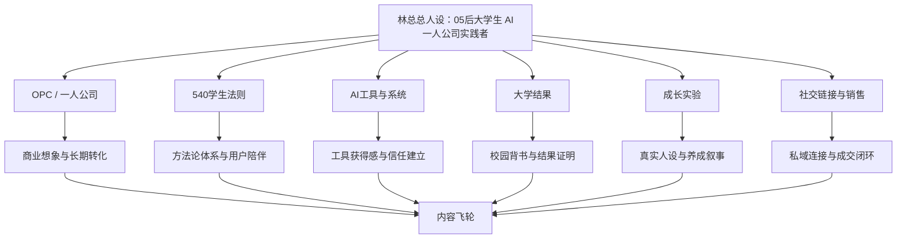

# 内容项目主题地图 v1

> 项目：林总内容创作长期发展项目  
> 日期：2026-05-19  
> 状态：长期内容资产 / 主题地图初版  
> 用途：统一林总后续选题、文案、平台分发、数据复盘与商业转化的母题框架。

---

## 0. 总定位：从 AI 工具号升级为「05后大学生 AI 一人公司实践者」

林总的内容项目不是单纯做 AI 工具教程，也不是泛泛讲大学生成长，而是围绕一个长期人设展开：

> 一个 05 后大学生，如何一边在大学系统里拿关键结果，一边用 AI、内容、社交、销售和项目交付，把自己训练成一人公司的雏形。

核心关键词：
- AI 杠杆
- 大学生现实能力
- OPC / 一人公司
- 540学生法则
- 保研 + AI商业双线推进
- 真实成长型 IP
- 从象牙塔走向市场

内容系统的底层逻辑：

---

## 1. 六大一级母题总览

| 一级母题 | 核心表达 | 内容角色 | 主要平台 | 商业作用 |
|---|---|---|---|---|
| OPC / 一人公司 | 用 AI 把自己经营成一家公司 | 顶层趋势与商业叙事 | 抖音、视频号、公众号 | 承接咨询、陪跑、资源合作 |
| 540学生法则 | 课内拿结果，课外练真实世界能力 | 自有方法论 | 视频号、公众号、小红书 | 承接工具包、社群、陪伴产品 |
| AI工具与系统 | AI 不是聊天玩具，而是普通人的杠杆 | 获得感与流量入口 | 抖音、小红书、公众号 | 承接资料包、工具教学、智能体服务 |
| 大学结果 | 用 AI 和系统方法最低成本拿关键结果 | 背书与校园信任 | 小红书、公众号、视频号 | 承接保研/大学规划咨询 |
| 成长实验 | 真实记录从象牙塔走向市场的养成过程 | 人设温度与长期陪伴 | 抖音生活号、视频号、小红书 | 增强信任、拓展同频社交 |
| 社交链接与销售 | 被看见、被信任、被选择，是必须训练的能力 | 转化闭环与现实能力 | 抖音、视频号、公众号 | 承接私域、咨询、合作、成交 |

---

## 2. 母题一：OPC / 一人公司系列

### 2.1 核心定位

核心表达：

> 用 AI 把自己经营成一家公司。

林总版 OPC 有两层：

1. **狭义 OPC**：一个人借助 AI 工具运转自己的盈利系统。
2. **广义 OPC**：超级个体、供应链、后端产品、甲方需求、合作机会之间形成的生态圈。

安全表达边界：

> 不是鼓励退学创业，而是让大学生在校园里提前训练真实世界的价值创造能力。

### 2.2 二级栏目

| 二级栏目 | 栏目说明 | 典型选题方向 |
|---|---|---|
| OPC认知科普 | 解释一人公司是什么、为什么 AI 后更值得关注 | 一人公司到底是什么？为什么 AI 之后它突然火了？ |
| 大学生与OPC | 把 OPC 翻译成大学生能理解的低成本试错路径 | 大学生才是最该了解一人公司的人 |
| AI员工系统 | 展示一个人如何用 AI 扩大产能 | 我用 AI 给自己配了哪些虚拟员工？ |
| OPC生态圈 | 讲供应链、分销、资源撮合、超级个体生态 | 一人公司背后真正值钱的，是这套生态圈 |
| 林总实战记录 | 记录从 AI 工具号转向 AI 一人公司实践者的过程 | 大三下，我为什么一边保研一边搭一人公司？ |
| 反割韭菜与清醒判断 | 防止用户把 OPC 理解成课程包装或躺赚神话 | 别被割了，真正的 OPC 不是交999学一人公司 |

### 2.3 目标受众

- 核心受众：18-24 岁大学生，想搞钱、想变强、对 AI 和副业敏感，但不知道怎么开始。
- 扩展受众：初入职场青年、轻资产创业者、内容创作者、服务型个体。
- 潜在合作方：有产品/供应链/后端服务但缺前端信任与分发的人。

### 2.4 平台适配

- **抖音/视频号**：观点冲突 + 个人故事，如“你不一定要创业，但你要学会把自己当公司经营”。
- **小红书**：清单型、方法型、校园副业入门，如“大学生做一人公司，从这 5 个动作开始”。
- **公众号**：深度解释 OPC 定义、生态、商业模型、个人转型路线。
- **朋友圈/私域**：记录正在搭建一人公司的日常，形成信任与咨询入口。

### 2.5 内容风险提示

避免表达：
- 找工作是最笨的选择
- 大学没用
- 所有人都应该创业
- 不做 OPC 就会被淘汰

建议表达：
- 除了等机会，大学生还可以训练创造机会的能力。
- 大学不是没用，但只靠大学系统不够。
- 我不是反学校，而是想多准备一套 AI 时代的能力杠杆。

---

## 3. 母题二：540学生法则系列

### 3.1 核心定位

核心表达：

> 课内用 AI 高效拿结果，课外用 540 训练现实世界能力。

540 = 3个100 + 4个60：

- 3个100：AI工具使用、目标推进、优质信息输入。
- 4个60：健身、社交表达、内容输出、销售成交。

这是林总最应该长期占有的自有方法论。OPC 是商业趋势，540 是林总自己的解释系统。

### 3.2 二级栏目

| 二级栏目 | 栏目说明 | 典型选题方向 |
|---|---|---|
| 540总纲 | 解释为什么大学生不能只卷绩点 | 540学生法则：大学生该训练的 7 种能力 |
| 3个100 | 搭建底层系统：AI、目标、信息 | 为什么我说 AI 使用满 100 小时，大学生会明显分层？ |
| 4个60 | 训练现实能力：身体、表达、内容、销售 | 内容输出和销售成交，才是大学生最缺的两门课 |
| 被看见能力 | 承接已发内容《锻炼被看见的能力》 | 锻炼被看见的能力，是 OPC 的第一步 |
| 校内外双线成长 | 保研与市场能力并行，不互相否定 | 我为什么不反学校，但也不只待在学校系统里？ |
| 540实践日志 | 记录每周执行、打分、复盘 | 这一周，我在 540 七项能力上分别推进了什么？ |

### 3.3 目标受众

- 大学生：不知道大学除了绩点还该练什么的人。
- 高中毕业/大一新生：想提前规划大学四年的人。
- 同龄成长型用户：想变强但行动混乱的人。
- 家长/教育业务相关人群：对 AI 与大学生成长路径感兴趣。

### 3.4 平台适配

- **视频号**：更适合体系化观点与中长口播，建立成熟可信形象。
- **抖音**：用强观点切入，如“大学生最缺的不是课，而是现实反馈”。
- **小红书**：做图文清单，如“540学生法则打卡表”。
- **公众号**：沉淀完整方法论、周复盘、长期成长文章。

### 3.5 与其他母题的关系

- 与 OPC：540 是大学生版 OPC 训练系统。
- 与大学结果：课内结果是 540 的基本盘。
- 与成长实验：健身、形象、表达是 4个60 的现实记录。
- 与社交销售：被看见、表达、成交是 540 后半段的关键闭环。

---

## 4. 母题三：AI工具与系统系列

### 4.1 核心定位

核心表达：

> AI 不是聊天玩具，而是普通人的杠杆。

这个板块负责提供“看得见的获得感”，让用户因为工具、案例、流程关注林总，再通过人设和方法论留下来。

### 4.2 二级栏目

| 二级栏目 | 栏目说明 | 典型选题方向 |
|---|---|---|
| AI工具实测 | 真实使用工具，不做空泛快讯 | 这个 AI 工具到底适合大学生做什么？ |
| AI学习提效 | 用 AI 处理课程、论文、英语、资料整理 | 我怎么用 AI 把保研材料准备效率拉满？ |
| AI内容创作 | 用 AI 选题、写稿、剪辑、排版、分发 | 一条短视频从选题到发布，我让 AI 做了哪些部分？ |
| AI工作流 | 多工具串联，形成稳定流程 | 我的内容创作 AI 工作流长什么样？ |
| AI智能体/知识库 | 展示本地知识库、智能体、自动化系统 | 我为什么要搭一个自己的 AI 一人公司系统？ |
| AI避坑认知 | 反对工具收藏癖，强调解决问题 | AI工具会过时，但解决问题的能力不会 |

### 4.3 目标受众

- 想学 AI 但不知道从哪里开始的普通人。
- 大学生、职场新人、自媒体创作者。
- 对效率工具、智能体、知识库、自动化感兴趣的人。
- 后续可能购买资料包、工具包、咨询或工作流服务的人。

### 4.4 平台适配

- **抖音**：短平快工具技巧、提示词、前后对比、真实使用场景。
- **小红书**：收藏型教程、工具清单、学习/保研/副业场景应用。
- **公众号**：深度工作流拆解、工具组合方案、知识库系统搭建。
- **视频号**：口播解释 AI 对普通人的长期意义。

### 4.5 与商业转化的关系

AI 工具板块是最直接的引流入口，可承接：
- 免费 AI 通识手册
- AI 工具包
- 保研/学习提效资料
- 内容创作工作流咨询
- 智能体/知识库搭建服务

---

## 5. 母题四：大学结果系列

### 5.1 核心定位

核心表达：

> 课内用 AI 和系统方法拿关键结果。

这个板块不是传统学习博主路线，而是提供林总的硬背书：专业第一、SCI、竞赛、保研准备、六级 572、保研与 AI 商业双线推进。

表达重点：

> 不反学校，不贬低象牙塔，而是讲“我如何在大学系统内外双线成长”。

### 5.2 二级栏目

| 二级栏目 | 栏目说明 | 典型选题方向 |
|---|---|---|
| 保研材料系统 | 自我介绍、文书、PPT、论文展示 | 保研材料别拖到最后，我准备用 AI 先做通用底稿 |
| 论文与科研展示 | 讲清论文问题、方法、贡献、局限 | SCI 论文讲解 PPT 应该讲什么？ |
| 竞赛与成果包装 | 把竞赛、项目、实习转化成可展示资产 | 大学生不是缺经历，是缺包装经历的系统 |
| 专业课策略 | 数字经济 + 国贸/国商双线准备 | 保研跨方向，专业课怎么用最小投入覆盖？ |
| 英语与硬指标 | 六级、雅思、夏令营语言门槛 | 六级 572 对经管保研够不够？接下来还要不要雅思？ |
| AI提效学习 | 用 AI 提升学业结果的投入产出比 | 我不是摆烂，我是在用 AI 把学习 ROI 拉满 |

### 5.3 目标受众

- 大一到大三，想保研/升学/拿奖的学生。
- 经管类、商科、数字经济方向学生。
- 想用 AI 提效但担心影响学业的学生。
- 想做大学规划咨询的潜在客户。

### 5.4 平台适配

- **小红书**：保研材料、PPT、论文展示、学习方法，搜索流量强。
- **公众号**：长文沉淀保研策略和 AI 学习系统。
- **视频号**：可信、稳重、适合讲“大学系统内外双线成长”。
- **抖音**：选择少量冲突选题，例如“大学生不是只要绩点”。

### 5.5 风险边界

- 不说“学校没用”“保研形式主义没意义”。
- 可以说“我不想把人生耗在低 ROI 的形式主义上，所以用 AI 提效”。
- 强调“保研要做，而且要做得更聪明”。

---

## 6. 母题五：成长实验系列

### 6.1 核心定位

核心表达：

> 真实记录一个大学生从象牙塔走向市场的养成过程。

这个板块是林总从“教程号”变成“活人 IP”的关键。它不一定每条都负责直接转化，但负责让用户觉得：这个人真实、有变化、有故事、能陪着看。

### 6.2 二级栏目

| 二级栏目 | 栏目说明 | 典型选题方向 |
|---|---|---|
| 形象升级 | 穿搭、皮肤、健身、镜头表现 | 为什么我最近开始认真做形象管理？ |
| 表达训练 | 口播、镜头感、社交表达 | 我拍短视频，不只是为了流量，也是为了练表达 |
| 执行力修复 | 自媒体断更、英语拖延、保研材料启动 | 过去断更不纠结，从今天开始恢复节奏 |
| 线下社交 | 每1-2周参加社交局、链接同频人 | 大学生不能只待在寝室里刷信息 |
| 情绪与边界 | 情感止损、拒绝被工具化、边界感 | 我为什么选择断联：不是冷漠，是学边界 |
| 生活号联动 | 工作号讲认知，生活号展示真实状态 | 工作号负责信任，生活号负责真实 |

### 6.3 目标受众

- 喜欢看成长型 IP 的同龄用户。
- 对形象、表达、社交、执行力焦虑的大学生。
- 潜在同频朋友、合作伙伴、社交资源。
- 从生活内容进入，再被 AI/OPC/540 转化的人。

### 6.4 平台适配

- **抖音生活号**：形象、健身、穿搭、日常社交、碎片化成长记录。
- **抖音工作号/视频号**：把成长实验上升为认知方法论。
- **小红书**：形象改造、大学生自我提升、保研+副业真实记录。
- **公众号**：阶段性复盘，比如“我大三下真正要修复的不是方向，是执行力”。

### 6.5 注意事项

- 情感线可以写成长反思，不建议写成攻击具体对象。
- 形象线不要变成自恋炫耀，要和镜头表现、社交名片、现实反馈相连。
- 执行力问题要真实承认，但结尾必须落到动作和系统，不停留在情绪。

---

## 7. 母题六：社交链接与销售系列

### 7.1 核心定位

核心表达：

> 被看见、被信任、被选择，是大学生必须训练的能力。

这个板块承接已发内容《锻炼被看见的能力》，也是 540 法则里的“社交表达、内容输出、销售成交”的深水区。

### 7.2 二级栏目

| 二级栏目 | 栏目说明 | 典型选题方向 |
|---|---|---|
| 被看见能力 | 从内容输出、形象展示、公开表达开始 | 锻炼被看见的能力，是大学生最该补的一课 |
| 社交破圈 | 线下局、链接贵人、同频伙伴 | 为什么大学生要每1-2周参加一次高质量社交？ |
| 私域连接 | 公域内容如何导向微信、资料包、咨询 | 内容不是发完就结束，而是信任入口 |
| 销售启蒙 | 销售不是割韭菜，而是识别需求和完成交付 | 大学生为什么要早点理解销售？ |
| 合作与分佣 | 后端资源、教育业务、AI课程、家教公司合作 | 有产品的人找流量，有流量的人找产品 |
| 边界与筛选 | 拒绝工具化、筛选客户和关系 | 不是所有人都值得你交付情绪和资源 |

### 7.3 目标受众

- 不擅长表达和链接，但想被机会看见的大学生。
- 想做内容、咨询、副业、社群的人。
- 对私域、成交、合作变现有兴趣的普通人。
- 未来可能成为咨询客户、社群成员或合作方的人。

### 7.4 平台适配

- **抖音/视频号**：观点型口播，容易引发讨论，如“大学生为什么要练销售？”
- **公众号**：深度解释销售、信任、合作、交付闭环。
- **小红书**：社交表达、大学生破圈、被看见能力清单。
- **朋友圈/私域**：真实互动、用户反馈、咨询案例、合作记录。

### 7.5 表达边界

- 销售不是“收割”，而是“识别需求、建立信任、解决问题、完成交付”。
- 社交不是舔资源，而是“价值互换 + 信息交换 + 长期关系”。
- 边界感不是傲慢，而是“不把自己的时间和资源无底线送出去”。

---

## 8. 平台矩阵定位

| 平台 | 主要任务 | 最适合内容 | 更新原则 |
|---|---|---|---|
| 抖音工作号 | 破圈、测试选题、真人口播 | OPC、540、AI工具、争议观点 | 真实、有冲突、但不踩保研红线 |
| 视频号 | 建立可信人设、同步深度观点 | 540、大学结果、OPC解释、社交销售 | 稳定、成熟、适合私域转化 |
| 小红书 | 校园搜索流量、资料收藏 | 保研、AI学习、大学成长、清单图文 | 标题具体、结果导向、可收藏 |
| 公众号 | 方法论沉淀、长文资产 | 540总纲、OPC深度、保研策略、复盘 | 每篇都进入长期资产库 |
| 抖音生活号 | 展示真实生活和形象变化 | 健身、穿搭、社交、日常成长 | 轻量、真实、和工作号互相导流 |
| 朋友圈/私域 | 信任经营与转化 | 过程记录、案例、资料包、咨询 | 少装，多记录真实动作和结果 |

---

## 9. 内容类型分工

| 内容类型 | 作用 | 对应母题 | 示例 |
|---|---|---|---|
| 流量型内容 | 破圈、引发评论和关注 | OPC、AI工具、社交销售 | 大学生，你才是最该了解一人公司的人 |
| 观点型内容 | 建立立场和识别度 | 540、OPC、大学结果 | 大学不是没用，但只靠大学系统不够 |
| 故事型内容 | 建立真实感和长期陪伴 | 成长实验、大学结果、OPC实战 | 大三下，我为什么一边保研一边做 AI 一人公司 |
| 干货型内容 | 提供获得感和收藏价值 | AI工具、大学结果、540 | 保研材料通用底稿怎么用 AI 搭出来 |
| 产品型内容 | 承接转化 | AI工具、社交销售、OPC | 资料包、咨询、陪跑、工作流服务介绍 |
| 复盘型内容 | 沉淀方法论，反哺选题 | 全部母题 | 《锻炼被看见的能力》为什么反馈好 |

---

## 10. 第一阶段内容优先级建议

### P0：必须优先启动

1. **OPC / 一人公司**：负责账号转型和商业想象。
2. **540学生法则**：负责建立林总自己的方法论护城河。
3. **社交链接与销售**：承接《锻炼被看见的能力》的反馈，形成连续内容。

### P1：同步推进

4. **AI工具与系统**：负责流量入口和工具获得感。
5. **大学结果**：负责校园背书与保研安全叙事。

### P2：持续记录

6. **成长实验**：不追求每条爆，但要长期记录，服务真实人设。

---

## 11. 主题之间的组合公式

后续选题不必单独属于一个板块，可以用组合方式增强厚度。

| 组合 | 内容方向 | 示例 |
|---|---|---|
| OPC + 大学生 | 趋势翻译成大学生机会 | 大学生才是最该了解一人公司的人 |
| OPC + AI工具 | 用 AI 搭建个人最小公司 | 一个人做公司，需要哪 6 类 AI 员工？ |
| 540 + 社交销售 | 方法论落到被看见和成交 | 锻炼被看见的能力，是 540 的关键一环 |
| 大学结果 + AI | 保研材料、论文展示、学习提效 | 我怎么用 AI 做保研材料通用底稿？ |
| 成长实验 + 内容输出 | 真实记录复更和表达训练 | 我恢复短视频更新，不是为了爆，是为了练表达 |
| 社交销售 + OPC | 从信任到成交闭环 | 一人公司第一步不是注册公司，而是让别人知道你能解决什么 |

---

## 12. 内容资产归档规则

每条内容生产后必须进入以下状态之一：

1. **选题池**：只有标题、方向、钩子，尚未写稿。
2. **草稿库**：已经形成口播稿、图文稿、长文，但尚未发布。
3. **已发文案**：用户明确说明已发布，或提供发布时间/平台/链接后再归档。
4. **数据反馈**：记录播放、点赞、评论、收藏、转发、涨粉、私信、咨询/成交线索。
5. **复盘沉淀**：提炼有效钩子、评论洞察、选题规律、可复用结构。

红线：未发布内容绝不进入已发文案目录。

---

## 13. 后续待办

1. 基于本主题地图，分别建立：
   - 540体系选题池
   - 社交链接与销售选题池
   - AI工具与系统选题池
   - 大学结果选题池
   - 成长实验素材池
2. 优先复盘《锻炼被看见的能力》，把它拆成 540 / 社交链接 / OPC 三个方向的衍生选题。
3. 将 `outputs/OPC一人公司选题池重构-v1.md` 与本主题地图联动，形成 OPC 专题内容路线。
4. 建立平台模板库：抖音/视频号口播、小红书图文、公众号长文、朋友圈短文。
5. 建立统一发布数据记录表和每周复盘机制。
